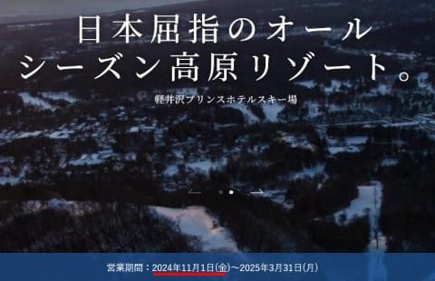
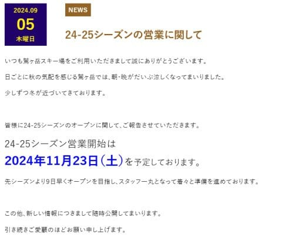
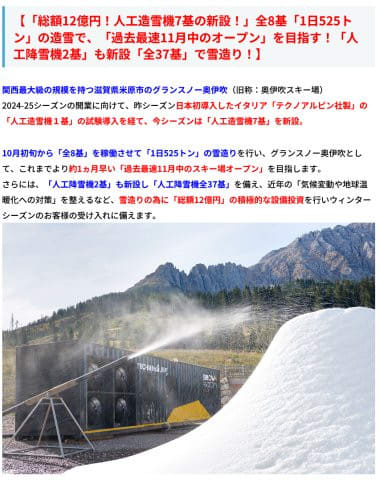
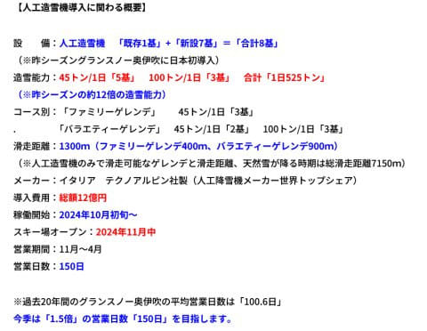
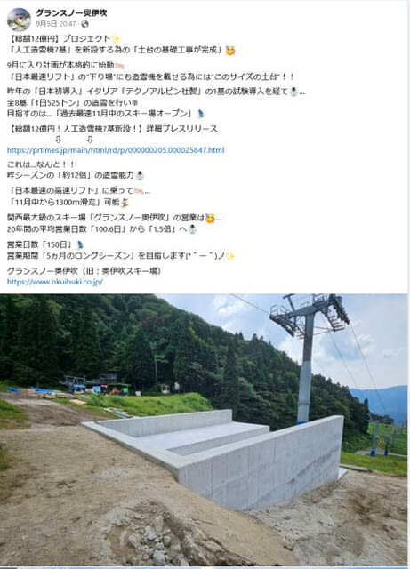
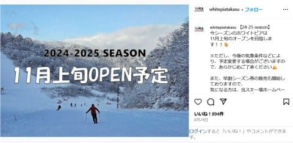
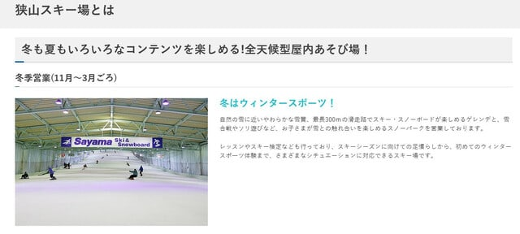

# 今シーズンから奥伊吹もアイスクラッシュシステム本格導入！アイスクラッシュがある菅平，奥伊吹，ホワイトピアたかす，鷲ヶ岳スキー場はいつオープン？

📅 投稿日時: 2024-09-16 02:58:01

🏷️ カテゴリ: [スキー雑談](c1f9d2cb7478308da16419928ea3945e9.md)

ということで．

早くも9月も後半に突入し，

イエティのオープンまで約1か月ちょいと

なってきたので…

そろそろ，いろんなスキー場のオープン時期が

気になり始める時期になってきました…！

ってなことなので．

今日は徒然スキーヤー日記という名前に

ふさわしいネタで．

アイスクラッシュを備えて早期オープンが

可能なスキー場のオープン日程

をまとめてみましょう…！！

まず．

アイスクラッシュを導入しているスキー場で，

今シーズンの正確なオープン日を公表している

のは，

軽井沢スキー場の11月1日

と…

（軽井沢スキー場ホームページより）

あとは，鷲ヶ岳スキー場の11月23日

ですか．

11月23日だと，アイスクラッシュじゃない

人工降雪でオープンするスキー場が

出てくる時期になっちゃいますね…

（[鷲ヶ岳スキー場ホームページ](https://ski.washigatake.jp/news/2024/09/05/5655/)より）

それ以外のスキー場は，正確な日時がまだ発表

されていませんが．

まず，今シーズンから本格的にアイスクラッシュを

導入した，グランスノー奥伊吹を見てみると．

なんと今シーズン，

総額12億円でアイスクラッシュを本格導入，

高速リフトの11月中からのオープンを目指す…

ということのようです…！！

（[グランスノー奥伊吹ホームページ](https://www.okuibuki.co.jp/news/7595/)より）

いや…12億円の投資か…

この時期にすごいな…

そして，10月初旬から雪を作り始めて，

これまでより1か月早い11月中オープンを

目指し，営業日数150日を目指すといって

ますが…

オープンを1か月前倒しするようで．

昨シーズンは12月18日オープンだったよう

なので，今シーズンは11月半ばを目指すん

でしょうね…

（[グランスノー奥伊吹ホームページ](https://www.okuibuki.co.jp/news/7595/)より）

ただ．

奥伊吹のFacebookを見ると．

まだ，アイスクラッシュシステムの土台を

工事している段階なので…

これで10月上旬までに造雪開始できるのか？？

…まぁ，この状況なら11月上旬は難しく，

やはり11月半ばごろのオープンかな…

（[グランスノー奥伊吹Facebook](https://www.facebook.com/okuibuki/posts/pfbid02pNH6d9AmRKZEbspad3Z3qvwS3t3hrzXc5Kct2xv6u4sV6zE7uBzhv1xwaCeHaBZnl?ref=embed_page)より）

しかし，関西圏で唯一の11月オープンだから…

かなり混みそうな感じ…

そして．

次のスキー場は．ホワイトピアたかす．

ここは，割と早めの11月上旬のオープンを

目指すようです…！

（[ホワイトピアたかすInstagram](https://www.instagram.com/p/C_C8Yy0SYfI/)より）

…ちなみに，ご存じのように，岐阜エリアで

ホワイトピア，鷲ヶ峰と争っていた

ウイングヒルズ白鳥．

アイスクラッシュが故障したあと修理できず，

今シーズンも修理されることはなかったようで…

こちらは12月中旬のオープンと，早期

オープン組から脱落です．

で．

あと，アイスクラッシュと言えば．

昨年は10月中のオープンを目指しながら，

導入初年度の機械の不具合などに悩まされ，

11月末にようやくオープンした菅平スキー場．

今シーズンも10月オープンを目指すのか…？

と思ったら．

今年は控えめに，11月中旬オープンという

アナウンスですね…

（[菅平高原スノーリゾートホームページ](https://sugadaira-snowresort.com/)より）

昨シーズンの痛い思いから，無理をするのは

止めたようですが．

昨年は事前申し込みあり，人数制限での

リフト券販売だったアイスクラッシュゲレンデ．

今年は何のアナウンスも出ていないので，

人数制限しないのかな…？

で．

かつてはイエティと日本最早のオープンを

争った狭山スキー場ですが．

今シーズンはまだアナウンスが出てません…．

まぁ，リニューアル後はオープンも

おそくなり，11月に入ってからになったし．

ホームページにも，ウインターシーズンは

11月からと書かれているので，10月の

オープンはないでしょうね．

今シーズンも，早くても11月2日からで

しょうか…．

（[狭山スキー場ホームページ](https://www.seibu-leisure.co.jp/ski_web/about/)より）

最後に．

おそらく今シーズンも，シーズン最早の

オープンを目指すであろうイエティ．

まだ全くオープン日を発表する気配はありません

全く何もアナウンスされてません．

…まぁ，いつもオープン日を公式に

発表するのは10月に入ってからなので，

オープン日の公式発表はまだまだ先だと

思いますが…

で，今シーズンはいつオープンするかを勝手に

推測すると．

かつての狭山のように，10月中にオープンする

ライバルがいない現在．

10月に営業開始すれば日本最早での

オープンはもうほぼ安泰なので．

たぶん，10月25日の金曜日．

これでも2位の軽井沢より1週間早いので，

25日だろうなぁ…その1週間前はないよなぁ…

ってなことで．

オープン予定を並べると．

イエティ：たぶん10/25

軽井沢：11/1

狭山：11/2またはそれ以降

ホワイトピアたかす：11月上旬

奥伊吹：11月中旬

菅平：11月中旬

鷲ヶ岳：11/23

というところでしょうか…

ちなみに，アイスクラッシュじゃないけど，

11月23日より早いオープンを狙っているのは，

横手山：たぶん11月上旬

熊の湯：11/16

です！！

さぁ．

あり得ないほど暑い9月が続き．

1か月予想を見ると，10月上旬も

気温が高くなりそうですが…

果たしてアイスクラッシュの各スキー場は，

予定通りオープンできるのか？？

あるいはこの異常熱波が11月まで続いて，

11月も最高気温が35度を越える日が

続くのか？？←それはない

とりあえず．

温暖化がこれ以上進まないように，

全力で寒いギャグを言い続けたいところ

だけど…

ここ数日疲れているからか，

「ワニが輪になる」

くらいしか思いつかないので．

皆さんの方で，寒いギャグを考えて

くださいますよう，よろしくお願いいたします…
