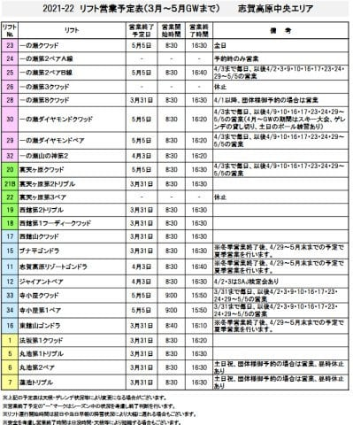
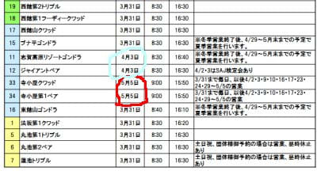
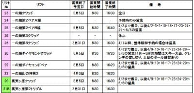
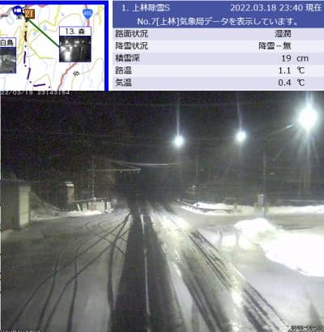
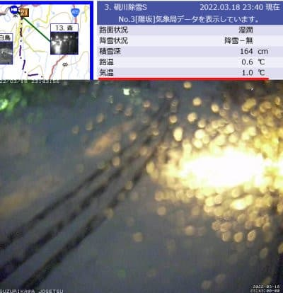

# この3連休の志賀高原，19日は雪で下地はガチガチ，20日は冷えて曇り→晴れ，21日は冷えて晴れ！

📅 投稿日時: 2022-03-19 00:33:24

えー．

志賀高原中央エリアの春営業案内が

ホームページに出てましたが…

（[志賀高原中央エリアホームページ](https://shigakogen.co.jp/wp-content/uploads/2022/03/%E3%83%AA%E3%83%95%E3%83%88%E5%96%B6%E6%A5%AD%E4%BA%88%E5%AE%9A2.pdf)より，以下同じ）

これをみると…

大体例年通りの営業終了予定ですね．

東館，西舘より下は，水色で括った

リゾートゴンドラ，ジャイアントが4/3まで

なのを除いて，3月末で終了（涙）

まだ雪がいっぱいなのに，勿体ない…

そして，上の表で赤く括った寺子屋エリアと，

下の表に示す一の瀬・高天ヶ原エリアも

例年通り，GWの5/5までの営業ですね…

ただ，タンネの第8クワッドは3月末に

終わっちゃうのね（涙）

…そして．

肝心な山の神のリフトですが…

うがーー！

やっぱり今年も4月上旬に終わるのか！！！

中央エリア，

焼額＆奥志賀エリアとの行き来を

4月4日以降は拒否するようです（涙）

うーん．

4月になっても一の瀬・焼額・奥志賀の

広いエリアを滑れるのが志賀の魅力の

はずなのに，ここをぶった切るとは…

いつもながら悲しい…

とりあえず，全山滑れるのもあと2週間弱．

今週末の3連休はいいコンディションで

滑りたいところ．

で．金曜から土曜朝は高温になって

雨になる悲しい予想だったところ…

意外なことに今日の午後は志賀高原も

雪だったようです！！

ライブカメラでも，上林チェーンベース，

雪が積もってますね…！！

（[北信建設事務所道路状況カメラ](http://hokushin.pref-nagano-roadcamera.jp/)より）

…でも．

硯川の気温が今は+1度らしく．

道路に雪が積もっているけど

カメラに水滴がついていて…

何だか雨っぽくなってきた感じ（涙）

おそらく，これから明け方にかけて

山頂まで雨になって，そのあと

みぞれ→雪と変わり，リフト営業開始の

頃には，ちょっと湿っぽいけど雪に

なってそう！！

そして，昼にかけて冷えて行きますが…

…残念ながら雪はそれほど積もらず，

パラパラ降る感じで終わりそう．

とりあえず，

19日(土)：夜中雨．明け方からみぞれ→雪．

　営業開始時はバーンは水を吸ったのが

　固まりかけたカリカリした上にわずかに

　重い雪．

　天気は湿った雪→昼ごろには冷えた雪が

　パラパラ降ったり曇ったり．

　下地は硬めに固まっていく．

20日(日)：朝は曇り~雪がわずかにぱらつく．

　夜のうちに1-2cm雪が積もるか？

　1-2cmでも積もればあさイチはいい感じ．

　積もらなければアイスバーン(涙)

　朝から-9℃と冷え冷え！昼間も

　マイナスキープ．

　バーンは終日下地は硬い．

　天気は曇り→晴れと良くなっていく

21日(月・祝)：朝から晴れ！！

　あさイチの気温は-7~8℃と

　いい感じの冷え冷え．

　バーンは朝イチはかなり硬め．

　昼間も気温は低いままなので

　バーンは緩まない．

　日差しのあるバーンは昼間は

　表面だけちょっと緩んで滑りやすく

　なるかも．

　急斜面は表面が磨かれた

　ツルツルバーンになるところも…

ってな感じでしょうか．

ここ数日クリティカルだった私ですが，

なんとか3連休も無事志賀高原で滑れそうです…

志賀高原でお会いしましょう！

（そしてまた3時間半後に出発．3時間しか寝られない…）

## 💬 コメント一覧

### 💬 コメント by (ヒータロゥ)
**タイトル**: Unknown
**投稿日**: 2022-03-19 17:41:41

今日はご一緒させていただきありがとうございました。

現在土曜の夕方ですが結講ヤケビは本降りです。明日のコンディションに大期待です。

### 💬 コメント by (レインボー74)
**タイトル**: Unknown
**投稿日**: 2022-03-19 22:27:44

土曜日の志賀高原情報

夜の雪でてんやわんや。湿った雪が凍りついて、ゴンドラはストップ。身動きできない人が続出で、やけびを諦めてパルスへ。ジャイアントは硬めで悪い圧雪だったけど、まずまず。

一本滑ったら相方が「もう車でまつわ」

もっとすべりだかったけど、本日は、終了。

でも、エス様は、こんな日でも最後まで。

おかしいでしょ！

### 💬 コメント by (Skier_S)
**タイトル**: 明日，混まなきゃいいな…
**投稿日**: 2022-03-19 23:50:21

＞ヒータロウさま

今日はこちらこそありがとうございました～！

明日の朝，10㎝くらい積もってくれればかなりいい感じになりそうです．

積もってくれるかな…

＞レインボー74さま

1本で終了とは…

でも，今日の午前は残念な感じでしたね（涙）

