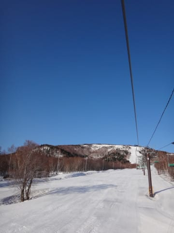
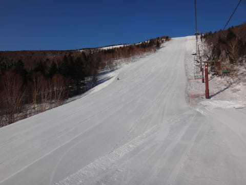
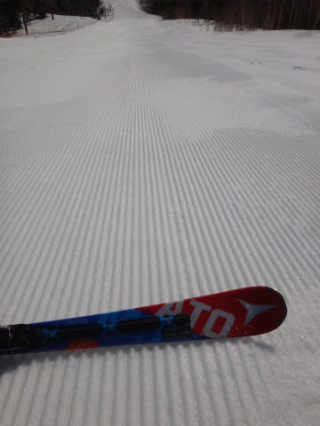

# 5月2日の志賀高原は晴天だったけど…詳細レポートは明日昼頃更新…かな？

📅 投稿日時: 2017-05-03 01:50:18

えー．

本日．

朝6時の早朝から奥志賀高原で滑っていたはずなのに．

昼頃までスキー場にいたはずなのに．

…5時間かけて，午後5時ごろにK奈川の自宅に帰宅．

自宅で家族をピックアップ，

そこから7時間運転し．

…なぜか現在，関西某所にいます．

いや，家族を連れて実家に帰省なのですが．

かなりの強行日程だったので．

志賀高原詳細レポートは明日…

おやすみなさい～

## 💬 コメント一覧

### 💬 コメント by (Goku)
**タイトル**: Unknown
**投稿日**: 2017-05-03 08:47:14

相変わらずの行動力、さすがとしか言いようがありません。

で、明日からもう志賀に帰ってくるのですか？？？

す・す・凄すぎです。

### 💬 コメント by (はなげ親分)
**タイトル**: さすがと言うか凄いと言うのか…
**投稿日**: 2017-05-03 10:08:27

やはり御札を授ける神様のなせるわざですなぁ……

### 💬 コメント by (Skier_S)
**タイトル**: 皆様の予想を超えるところが神のゆえん？
**投稿日**: 2017-05-03 11:26:37

＞Gokuさま

朝5時起床から関西某所到着深夜2時まで，21時間．

全く休まずの行動でした…

でも，そのおかげで最高の奥志賀滑れて

満足です…

明日深夜に自宅帰宅，4時間後に

志賀へ出発予定です．

…また強行プランアゲインです（笑）

＞はなげ親分さま

いや，もう．

毎年GWはこんな感じの移動日程なので．

このGWの移動距離は，2500㎞．

車も消耗します…（笑）

