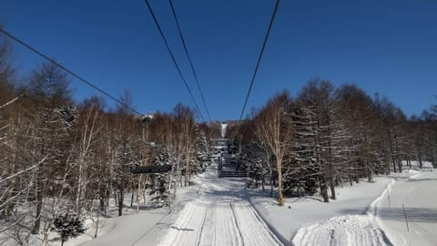
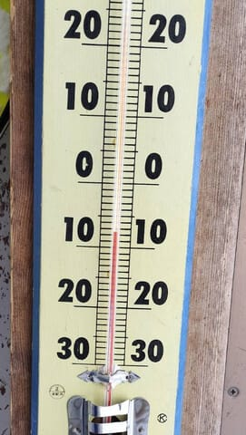
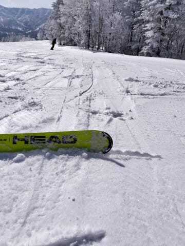
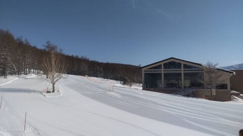
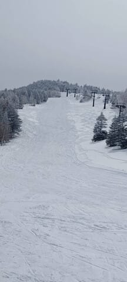
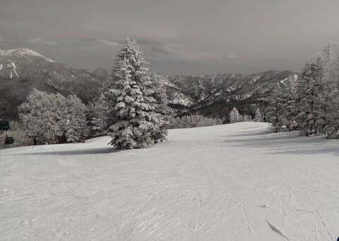
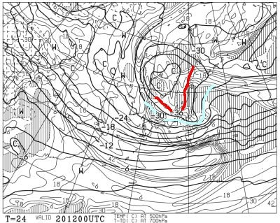
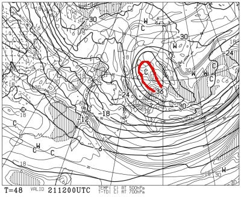
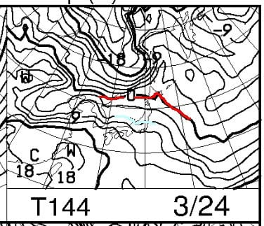
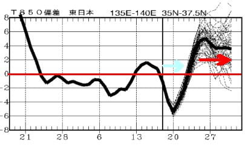

# 20，21日の志賀高原は降るよ！！！積もるよ！さらに特派員によると3月19日の志賀高原は良かったみたいだけど…でも明日の祭日日帰り志賀はあきらめた（泣）

📅 投稿日時: 2024-03-20 03:17:24

🏷️ カテゴリ: [日記](cc4b5682fb7b8b144980957a978653fb0.md)

ってなわけで．

明日は春分の日の祭日で．

何とか休めそうな気配だったので，

かなり強引な日帰り志賀チャレンジ

をしようかと思っていたのですが．

…いや．

睡眠時間4時間弱で朝4時前に家を出て，

一人で往復600㎞運転して，

8時間滑って夜12時に帰ると

普通に死ぬし，次の日仕事にならないけど．

今回うれしいことに，一緒に志賀まで

日帰りしてくれるという貴重な

生贄スキー仲間が見つかったので，

ほとんど往復の運転をやらせて運転を

一部手伝ってもらって，志賀まで日帰り

しよう…

と思っていたけど．

水曜はかなりの大雪，強めの風の

予報になり…

午前中はいいけど，午後は吹雪の中

ゴンドラが止まり吹き曝しのリフトで

滑ることになる

とか，

帰りの高速が積雪ですごいことになる

とかの可能性が高くなったため…

生贄スキー仲間も

「今回は止めておく…」

という直前の判断で

泣く泣く日帰りスキーをあきらめました…

午後は多少荒れ気味天気とはいえ，

明日の午前中は冷え冷え最高の雪質で，

そこまで雪や風もひどくなく，

朝は結構いい感じだろうし．

いい雪質のゲレンデを楽しめそうだけど…

…そもそも，本日も夜10時半まで会議を

やっていたのに，その翌日に日帰り

志賀高原に行こうというのが無理

だったんだよな…

と，自分を慰めて．

明日は少しでも足りない睡眠時間を

稼いで，さらに家でちょっと仕事を

やっつけて，

木・金の睡眠時間を削らなくても

週末にスキーに行けるよう，

家で過ごします…

ちなみに，今日3月19日(火)の志賀高原.

特派員からのレポートによると…

朝から晴天じゃないですかっ！！！

うーん．

今日は曇りだと思ってたけど…

こんなにすっきり晴れるとは…！！

そして，あさイチの気温は-8℃と

結構冷え込んでいて．

あさイチのGSコース，

どうやら昨日もまだダメ押しの

人工降雪を打っていたみたいで…

（3月下旬でまだ人工雪を打ってるのがすごい)

わずかにコロコロがあったものの，

最高だったっていうじゃないですか！！！

今日は午後は曇り空だったものの，

午前中はすっきり晴れで，それでいて

気温が低く，さらに人も少ないので

雪も全く荒れず…

奥志賀エキスパートもよかった

みたいだし．

GSコースも夕方になっても全く荒れず．

かなりいい感じの一日だったみたいです…

う，うらやましい～っ！！！

平日スキー，やりたい～！！！

…せめて明日日帰りスキー行きたかった…（涙)

ってなことで．

スキーに行かない明日の祭日ですが．

TVの天気予報とかでもやってるように，

降りますよ～！

積もりますよ～！！！

まぁ，本格的に降ってくるのは昼から

ですが．

20日午後9時の500hPa気温図，

TVとかでは上空5000mの気温って言ってる

やつを見ると…

そこそこの雪が降る目安の水色の-30℃線

どころか，ドカ雪になる目安の赤い-36℃

線が志賀高原にかかってますよ！！

…これは降る…っ！！！

さらに真冬でもそうそうやってこない

-36℃の寒冷渦は，珍しいことに

丸一日以上滞在し…

21日の夜9時になってもまだ志賀高原

近辺に残ってます…

これは21日まで降り続けます！

積もります！！

…なのに．

20，21日と冷えて積もるのに．

なぜ，23日から極端に気温が上がるのか（涙）

特に24日は，850hPaの0℃線が北海道

まで上がり，志賀高原にかかるのは

水色の+6℃線という，5月並みの

暖かさなんですけど…！？？？

この週末は，かなり暖かい，危ない感じに

なりそう…（涙）

ヘタすると，日曜は夕方あたりに

空から液体が降る危機が…（泣）

で．さらに．

24日以降の高温はしばらく続きます．

このグラフを見ると，3月いっぱいは

高温が続きそうな気配…（泣）

うーん．26日はほぼ間違いなく

空から液体が降ります．

いや…降り注ぐレベルかも（激泣）

とりあえず．

23日(土)の午前中が，20・21日に積もった

冷え冷え雪で滑れるラストチャンス…

つまり，冷え冷え雪で滑れる，

今シーズンのラストチャンスかも？

明日は滑りに行けなかったけど，

今週末こそ，志賀高原に滑りに行くぞ！！

## 💬 コメント一覧

### 💬 コメント by (レインボー76)
**タイトル**: Unknown
**投稿日**: 2024-03-20 11:20:38

水曜日の志賀高原情報

朝の６時から、湯田中では重～い雪がしんしんと降っています。午後は大雪予報。仲間の帰宅もあるので、滑るのは少しだけにと出発。蓮池-3℃。ニゴンパーク積雪10cm。

パノラマ→唐松はふわふわ足首パフ。だけど重い雪なのか、2回も足をとられた。きょうが最後の三高は雪質最高で、大満足の滑りができました。こんな最高のリフトを動かさないなんて！

みんなの声がないと、もう動かさないらしいので、是非お願いいたします。

今夜の大雪が果たしていか程か？ドキドキします。

それとエス様、ラスリフまで滑り続ける呪縛から解放されれば、身体をむしばまなくてすみそうだということを、学習されてはいかがでしょうか？でもそれがまたこのブログの魅力でもあるんだけど、、、

### 💬 コメント by (だい)
**タイトル**: Unknown
**投稿日**: 2024-03-20 17:37:47

今日は寺小屋～ジャイアント～西館～高天ヶ原と緩く一周したのですが、雲多めながら晴れ間もある最高のコンディションでした。何より不安になるレベルで人がいない…11時頃の高天ヶ原、滑走人数は5人くらいでした。

そして15cm程の新雪がある、まさに今GT85があればなぁというコンディション。ぐぬぬ…

最後にnaoちゃんご一行様とお会いしたので、軽くご挨拶して私の今シーズンは終了です。今シーズンも皆様にはお世話になりました。

### 💬 コメント by (Skier_S)
**タイトル**: 今日は意外とよかったみたいですね…
**投稿日**: 2024-03-21 02:01:51

＞レインボー76さま

今日は良かったみたいですね～

滑りに行けばよかった…

この週末，3高動かないのはつらい．

読者の皆さんも「3高動かして～」とリクエストの声を上げてください…

＞だいさま

うーん．そんなにいいコンディションだったとは…

午前中はある程度いいコンディションなのは想像していたけど，

まさか晴れ間もあるとは思わず．

行きたかった…

で，これで今シーズン終わりですか！？？

まだまだすべれますよ～！

### 💬 コメント by (ねも)
**タイトル**: Unknown
**投稿日**: 2024-03-23 07:37:39

Ｓさん　お久しぶりです！

出禁にされそうですが(笑)、やはりスキー場に転職されては？

たしかに土日は仕事に駆り出されそうですが、暇な平日は空いているゲレンデを楽しめるようです👍

初めての台湾をのんびり歩いています。日本のGWくらいの陽気(^^;)

### 💬 コメント by (Skier_S)
**タイトル**: ＞ねもさま
**投稿日**: 2024-03-23 21:44:03

ををを！

お久しぶりです！！

スキー場で仕事したら，スキーしたくて職場放棄しちゃいそうです…(笑)

台湾はいかがですか？

