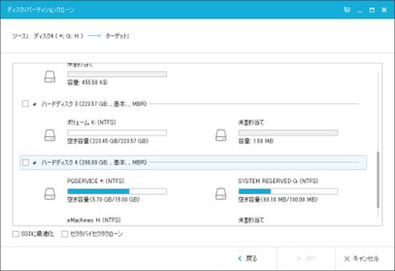

# 5年前のeMachinesのPC，E732-F32CをいまさらSSD化してみた　その3

📅 投稿日時: 2016-11-12 01:58:32

🏷️ カテゴリ: [PC,カメラ&小物](c0d8caed13e597efe97b661a8ae56bed0.md)

うーーむ．

やはり，今日は一日気温が高かったようで．

山の雪はかなり解けちゃったようですね…（泣）

また，今晩は気温も高く，夜中になっても

人工雪が打てないようで…

…これから数日，こんな感じの気温が続きそう（涙）．

うーむ．

やはり．

かぐらやアサマ2000，19日オープンは厳しいのか…

という感じで．

昨日は天気予想の記事で，一日スキップしましたが．

本日のメイン．

SSD換装レポートです←スキーブログなんだからスキーネタをやれ，というツッコミは聞こえないフリ

では，どうぞ～！

---

無事，ノートPCからハードディスクが取り出せたので…

次は，このハードディスクの中身を，

まるっとSSDにコピーするわけですね．

ちなみに，私は自作デスクトップPCがあるので．

こいつにこんな感じで，ハードディスクとSSDを

接続してコピーしました…

このように，内蔵HDDを直接接続できるPCを持っていない

場合は，[こーゆー](http://kakaku.com/item/K0000089850/)のとか，

[こーゆー感じ](http://www.kuroutoshikou.com/product/case/25hdd/gw2_5cr-u3/)の，600円とか700円

くらいのHDDケースを買ってきて．

これにSSDを入れて，USBで元々のノートPCに繋ぎ，

元々のノートPCからSSDにデータをコピーする手もあります．

私の場合．

こんな感じで，デスクトップPCに

HDDとSSDの両方を接続した後．

コントロールパネル＞システムとセキュリティ＞管理ツール＞ハードディスクのパーティションの作成とフォーマット

から確認すると…

ディスク3として新しいSSDが，

ディスク4としてノートパソコンから引っこ抜いた

ハードディスクが見えます．

ノートパソコンから引っこ抜いたディスク4は，

H:ドライブとして見えてますが．

ディスク3の新しいSSDは，ボリュームが作成されていないので，

ドライブとしては認識されていません…

だもんで．

ディスク3の「未割り当て領域」を右クリックして，

「新しいシンプルボリューム」を選び，

領域確保しましょう．

領域確保がされると，PCからドライブとして認識できるように

なります．

こんな感じで，新たにドライブK:に新しいSSDが

見えるようになります．

ここまでできたら，次は中身の丸ごとコピーなのですが…

ここで活躍するのが，無料コピーツール．

「Easeus Todo Backup Free」という

ソフト．

[ここ](http://jp.easeus.com/backup-software/free.html)からダウンロードできます．

こいつをインストールすると．

こんな画面が出てくるので…

右上の「クローン」を選びましょう．

すると，「コピー元（ソース）を選べ」と，

PCにつながっている全ドライブがこんな感じで表示されます．

だもんで，コピー元．

この場合，ハードディスク4ですね．

こいつを選んでやります…

そうすると，今度は「コピー先（ターゲット）を選べ」と

出てくるので．

この場合，SSDであるハードディスク3を選びましょう．

…これを逆にすると，

これまで使っていたディスクに空白のディスクをコピーして

すべて消してしまうという悲劇

に見舞われるので，くれぐれも間違わないようにっ！！！

これで，コピー元とコピー先が選ばれました．

あとは，この画面で「実行」をクリックすると…

こんな感じで，ひたすらコピーが実行されます．

約200GBのデータをコピーするのに，私の場合は2時間

掛かりました…

2時間，この状態でじっと待ちましょう．

2時間待って，「完了」の画面が出てきたら…

ハードディスクが完全クローンされたSSDの完成です！

これで，OSやアプリを再インストールする必要無く，

これまでと全く同じ環境が立ち上がるSSDの完成です…

（続く）
