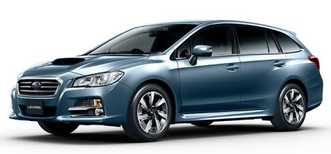

# スバル レヴォーグ，B型公開！さっそく，LEVORG 1.6 GTに乗ってきた…試乗レポート！

📅 投稿日時: 2015-05-20 00:58:28

🏷️ カテゴリ: [車試乗](c07dec5709d34bd74e1f6cb9c8291061b.md)

えー．

ってわけで．

昨年発表されたばかりのスバルのレヴォーグですが．

1年経ったので，早くも年次更改の時期になったわけですね…

今回の年次更改で，初代型のA型からB型になったわけですが．

このLEVORG B型．さっそく日曜日に試乗してきましたので．

その試乗インプレッションをば…

（スバルHPより）

ブログネタにするつもりがなかったので，

乗ってきた車の写真を撮ってこなかったのが悔やまれる…

で．

B型で変わったところは．

・アイサイトなしモデル抹消（チーン）…売れなかったみたいですねぇ…

・サンルーフがオプションで選べるように！…意外と希望が多かったみたいで…

・下記5機能がパックになった，アドバンスドセイフティパッケージっつーオプションが追加に！

　→レーンチェンジの斜め後方警戒，バック時の後方警戒を警報で知らせてくれるよ！

　→ハイビームアシスト（対向車がいると自動的にロービームに切り替わっちゃうよ！）

　→自動暴言防眩ミラー

　→サイドビューモニター（左ドアミラーについてるカメラで，左フロントタイヤ付近が見えるよ！）

　→アイサイトアシストモニター（アイサイトの状況で色が変わるライトが，フロントガラスに映るよ！）

…ってあたりが，大きなところでしょうか…．

とりあえず．

試乗車のグレードは，1.6GT Eyesight．

サンルーフもアドバンスドセイフティパッケージもついてる，

フルオプション仕様でした…

で．

乗り込んだ瞬間に感じたのは．

あー．

サンルーフがある…

…私にとって．

サンルーフとは，ルーフボックスの底面を日々眺めるための

窓にしかならないので．

まぁ，こんなもんいらんわな．

とりあえず．

座ってみたところ．

うーん．ステアリング，シートなど．

内装は，A型と全く変わってないように見えるなぁ…

で．

走り出してみますが…

…

あれ？？

あれ？

足が，変わった？

かなり変わった？

A型のときに多少感じた，段差乗り越え時のコツコツ感が，

消えてるんだけど…

まぁ，A型で試乗したのはGT-Sだったので，それとの差かも

しれないけど．

ブッシュが一段階柔らかくなった感じで，ハーシュネスが

かなり弱まった気が…

ブッシュを柔らかくしたのかな？と，車を左右に揺すってみたけど…

左右の動きでは，ブッシュがつぶれてから動き出すような嫌な感じはなく．

ラテラル方向の剛性が落ちてる感があまり感じられないなぁ．

…異方性の強いブッシュに変えた？

あるいは，ダンパー変わったのかな？

とりあえず．

段差の乗り越えた時の突き上げ感，路面のうねりをそのまま伝えるような

揺さぶられ感がかなり抑え込まれてます．

＃後でA型のGT-Sと乗り比べてみたけど，明らかに違う…

＃GT-SとGTの違いなのか，A型とB型の違いなのか…

＃B型のGT-Sがなかったのが残念．

タイトに攻めた時はどうなるかわからないけど．

私が使うような領域では，ライントレース性は十分だし．

タプタプしたような，妙な柔らかい乗り心地ではないし．

長距離の高速運転が多い私にとっては，ガンガンに締め上げられた

感のない，滑らかに感じるB型のGTの足，これ，かなりいいな！

…って感じで．結構気に入りましたね～！

で．

エンジンの方ですが．

…ふむ．

A型の1.6Lモデルの，ちょっとアクセルを踏んだだけでガバッとスロットルが

開くように感じる，スロットルペダルの過剰な非線形感が

無くなったかな？

アクセルの操作感と車の反応が，A型より素直になってる気がします．

…でも，アクセル開度20～30％程度の領域で，十分なトルク感

を感じますね～．

結構な上り坂も，それほど回転数が上がることなく

ブーストが上がっていくだけで，ぐいぐい引っ張っていって

くれる感じ．

私の乗ってるBR E型レガシィより，トルクが厚い感じがしますね～．

気のせいでなければ，レガシィより全体的に低い回転数で

車を引っ張っていってくれるかな…？？

ただ．

ちょいとこのトルク感というのが曲者で．

…例えば．

アクセルペダルのリターンスプリングをむちゃくちゃ

弱くして，さらにアクセル開度10％でスロットルが

90％開くようにしたり，アクセル踏み込み速度が大きい

領域で多少オーバーシュート気味にスロットルを

制御するとか，いろいろ味付けすれば．

「この車，パワーがある！」と感じてしまうのが，

人間というもの．

昔のスロットルリンケージからのワイヤー駆動の

スロットルボディならともかく．

アクセルペダル開度やその他もろもろのパラメータをもとに，

スロットルやらEGRバルブやら

燃料噴射タイミングやら（直噴ではすごい大事…）

カム位相やらCVTやら何やらをすべて制御して，

車を動かす現在の統合電子制御エンジン＆トランスミッションでは．

…結局プログラムをどうするかで，トルク感が有るように

感じさせたり，車のレスポンスを良く感じさせたり…

ってことで．

このような味付けでごまかすことができない，

エンジンのリアルな出力を試す方法があるのだ．

行けっ！

アクセルベタ踏みテストっ！

＃この方法は，エンジンの持てる能力（全開トルク）は体感できるが，

＃普段使う領域のテストにはまったくなっていない．

＃CVT制御が入らないよう，CVTはマニュアルモードを忘れずに！

…

…

…

うむ．

やっぱり，2.5Lのレガシィより速い気がする．

これだけあれば，不満は無い．

とりあえず，普段使いのアクセル開度領域においても．

かなり味付けが熟成されているのか，突然のどっかん

飛び出しもなく，微妙なアクセルワークにも意のままの

出力が出てくれてる感じで．

トルク感も十分感じさせてくれるし．

実に気持ちいい．

…なーんだ．

LEVORG，1.6GTで十分じゃないか…

…でも．

アドバンスドセイフティパッケージ．

他のグレードはオプション10万円アップなんだけど．

1.6GTだけ，23万円くらいのアップになるのは，なぜ？？

意外とこのアドバンスドセイフティパッケージ．

最初は「こんなもん，いらんだろ」と思ってたけど．

実際に乗ってみると．

斜め後ろに車がいれば，常にミラーにライトがついて分かるし．

（実際にレーンチェンジをしようとすると，警報が鳴る）．

センターコンソール上のディスプレイの切り替えレバーを押し込めば，

マルチインフォメーションディスプレイにななめ左前が写って，

意外と使えそうだし．

…アイサイトモニターははっきり言ってあんまり役立たんな，とは

思ったけど．

意外といいじゃん…

と感じ始めていたところ．

うーむ．

10万ならいいけど，23万だとつけらんないな～…

…

…はっ！！！

いかん！！

いかん！！

もう，LEVORG買う気でいる自分がいるっ！

買わない，買わないぞ～！

まだ，買わないぞ～っ！！！！！

＃でも，現在[レガシィ君](eb1b0e385b422753c3e3aad5a58c12234.md)1年11か月にして6.3万km突破．

＃来年車検時は10万kmだなぁ…

## 💬 コメント一覧

### 💬 コメント by (miya)
**タイトル**: ご無沙汰です
**投稿日**: 2015-05-21 23:16:34

BRのA型に乗って二度とA型を買わないと

誓ったmiyaです。。

熱があったように感じましたが、試乗してきたんですね！

レガシィではあまりB型では変化が少ないと思いましたが

LEVORGは結構変わったんでしょうか。

うちのレガシィくんは、5年半でまだ4.5万kmくらいなので

買い替えはまだまだです。

買い替えもLEVORGはちょっと後席が狭いので、

OUTBACKがいいなー。

高くてでかいけど。。

ちなみにこちらはGWでシーズン終了です。

まだまだブログ楽しませてもらいます！

### 💬 コメント by (Skier_S)
**タイトル**: miyaさま
**投稿日**: 2015-05-22 01:35:58

お久しぶりです～．

熱を出しながらも，試乗してきました（笑）．

LEVORGも，外見＆内装はA型→B型はほとんど

変わってません…

アドバンスドセイフティパッケージ＆サンルーフの

オプションが選べるようになった以外，

装備も変化なしだと思います．

カタログ見たり，外から見た目には

変わっていると分からないと思います．

ただ，1.6GTの足の味付け．

これは大きく変わった気がします．

スバルは年次更改で結構足回りの

チューニングを変えてくるので，

今回も変えたんじゃないですかね～．

ここは，カタログにも出てこない違いなので，

実際に乗ってみないと違いが

分からないと思います…

我が家も，miyaさまと全く同じ理由で，OUTBACKと

どちらにするか悩んでいたのですが．

この1.6GTの足が結構気に入ったので．

安く上がるLEVORGにしちゃいそうです．

…いや．

買わない．

まだ，買いません（笑）．

### 💬 コメント by (丸沼でお友達になった元オデッテイ乗り)
**タイトル**: 買ってしまった
**投稿日**: 2015-08-24 22:52:46

お久しぶりです。

どうしても、レヴォーグがおいらのこと呼んでたんですよ！

オデッテイは15万km近く乗ったんですが、同じレガシィは4万kmちょっと超えたくらい。

上期末で下取り高め、値引き多めだったんで、1.6GT-S ASP買ってしまいました！

タワーバー、下部リンク、ラテラルリンク付けました。オデッテイから履き続けたホイールは16インチだったので、SAAの17インチとBSのREVO-GZも一緒に買いました。

納車10月上旬なので、毎晩レヴォーグのカタログ見てます！

### 💬 コメント by (Skier_S)
**タイトル**: 丸沼でお友達になった元オデッセイ乗りさま
**投稿日**: 2015-08-25 01:12:29

あれれれれ～っ！！！

BRレガシィから乗り換えですかっ！！！

うーむ．

しかし，1.6GT-S．

私も見積もり取りましたが．

見積もり時点ですでに7万km近く走っていることもあり

（現在はすでに7万km突破）

かなりの追い銭が必要になり，

買うとしても1.6GTかなぁ…

それもB型が中古ででたら，それを狙って…

って感じです（笑）．

＃新車を買うお金がない（涙）．

でも，今注文しても2か月待ちなんですか！

売れてるんですね…やっぱり．

レヴォーグ買い替え，いいなぁ～！！！！！

また納車されたら，どんな感じか教えてください！

### 💬 コメント by (丸のかつてのオデッセイ乗り)
**タイトル**: レヴォーグ来たよ～
**投稿日**: 2015-10-04 21:17:57

昨晩来ましたよ～レヴォーグ!

そんで今日、妻と埼玉から川場の道の駅まで、黒保根～

根利経由で行ってきました。

昨晩は、最低限の荷物を引っ越すのと給油で時間使い切り

ました。

Dの担当営業から、乗った瞬間から、足の良さが分かると

言われていましたが、わずかな時間の試乗を3回やっただけ

なので、まぁ基準はBRレガシィとで、これとの比較になります。

なお、私のレヴォーグは1.6GT-S ASPに

　- フレキシブルタワーバー

　- フレキシブルドロースティフナー

　- STIラテラルリンクセット

　- STIカーボンエンブレム(走りには関係ありません)

　- ビルシュタインエンブレム(これも走りには関係ありません)

をつけたものです。

昨日の午前中まで乗っていたBRレガシィは、

2.5iアイサイトに、フレキシブルタワーバーを後付け

した仕様です。エンブレムないので、ちょっと遅いです。

皆さんが盛んに言っている、ギャップ越え後のリアの

収まりが悪いという現象は、感じられませんでした。

ラテラルリンクの車体側取り付けが、ゴムブッシュか、

ピロボールかの違いなのでしょうか?

運悪く、まだ慣らしなのに、根利の峠で、前後を

1960-1970年代の箱スカとZのチューニングカーの

大集団に挟まれまして、彼らのツーリングのペースで

走ることになりました。上限3000rpm縛りで・・・・

私の技術では、限界性能は分かりませんが、足は、

かなりいいです。BRレガシィよりも、コーナーリング中の

安定度が大変高く感じます。ぐいぐい曲がっていきます。

BRレガシィKのADVAN A-10より、

レヴォーグのDUNLOP SPORT MAXXの

方が、簡単には鳴かないようです。

妻は、ひっくり返る、ひっくり返ると言ってましたが、

そんな感じはなく、とても安定していました。

峠道、かなり楽しいです。箱スカ、Zの皆さんありがとう。

燃費は、約300km走り、峠越えのお遊戯もあっても、

リッター15.3kmでした。まぁまぁでしょう。

それとFB25よりFB16DITの方が、私も妻もスムーズに感じ

ました。静かです。妻はFB25の発進飛び出し感が嫌い

だったようです。

2000rpm～3000rpmは加給が入るので、ぐぐっと力が出ます。

街中だと、おっとっとと感じるときがあります。

その上は、慣らし中なので、経験できていませんが、

最高回転数や、最高出力から考えると、あまり期待しては

いけないようですね。

BRレガシィにくらべて全体的に狭くなりました。

助手席の下に、おしいしい水を汲み取るために、ペット・

ボトルを入れてましたが入りません。

運転席の下には、サンダル入れてましたが、これも

入りません。

助手席の後ろに保冷庫を積むと、レヴォーグでは、

助手席を後ろに動かせなくなりました。

荷室は、床面と、トノカバーの隙間が狭くなり、

寝袋の置き場所に困るので、トノカバーは収納して

しまいました。

ドアポケットも小さくて不便です。今まで入っていたもの、

かなり入れられなくなりました。床下収納は広くなったかと。

まぁスペアタイヤから、パンク修理キットになったので、

当然かと。パンク修理キット使わないでしょう。JAF呼んだ

方が安上がりです。

逆に、うちのマンションの立体駐車場への格納は楽に

なりました。今まで全長がギリギリだったので、10cm

短くなったのは助かりました。以前、ナンバープレートを

立体駐車場に引っかけて、飴のように曲げていたXTRAILの

方がおりました。かぐら帰りだったようですが。

ドアが全体的に軽いです。強風のときは隣に当てないように

気を使わねば。

レーンキープは、平坦で緩い曲率の高速道路までです。

佐野SA近くでは、気持ちよいラインを走ってくれませんでした。

岩槻～佐野までの好調が嘘のようです。なので北関東道も、

太田桐生までは、レーンキープオフです。

アイサイトは、確実に進化しています。止まり方がスムーズに

なりました。アイドリングストップに入るのも早くなったし、

解除も早くなりました。

シートは、オデッセイアブに近くなりました。私も妻も、

こちらの方がお尻や腰が固定されて、安定していると感じ

ました。

今回のレヴォーグは、久々にどうしても欲しい車として

購入したので、長く乗りたいと思います。

ちなみに42,000kmのBRレガシィは、下取り160万円、

レヴォーグ1.GT-S ASPは、車両値引き 31万円、

付属品値引き 15万円でした。

これにASPのキャッシュバック7万円が加わります。

STIカーボンエンブレムと、ビルシュタインエンブレムは

無料サービスです。

これとは別に、SAAのホイールとBS REVO GZを買いました。

やや、ゴテゴテ感が感じるくらいの装備になったので、

しばらく、このままの仕様で乗り続けます。

ベースキットに、サイドモールディング(私もドアパンチを

月山Pで受けたので)、コーナーコントロールしかつけて

ないのに。濃いです。

でも濃い顔はすごく気に入っています。色はシルバーです。

ナビはBRレガシィのビルトインPanaが非常にバカだったので、

楽ナビにしました。ETCぱDSRC対応にしました。便利です。

まだ楽ナビが楽に感じるところまでいってません。

今月にはスキー場がオープンするので、私もそろそろ

準備をしなければ。SKIDから帰ってきた板のベース剥がし

から始まります。来月にはスタッドレスへ・・・忙しい。

### 💬 コメント by (Skier_S)
**タイトル**: かつてのオデッセイ乗りさま
**投稿日**: 2015-10-05 01:46:57

詳細レポート，ありがとうございます～．

うーむ．我が家でも，次の車の第一候補なんですが．

### 💬 コメント by (かつてのオデッセイ乗りさま)
**タイトル**: 慣らし運転終わりました。
**投稿日**: 2015-11-03 23:13:01

Skier_S様。

レヴォーグ1.6GT-S ASP慣らし運転終わりました。1か月点検も終わりました。やっと3000rpmの限定解除です。

フレキシブルタワーバー、フレキシブルドロースティフナー、ラテラルリンクセットは付けて大変良かったと思います。高速コーナーでの安定感抜群です。今日も、首都高で妻と実感しました。

その後、フォグとハイビームをPIAAのLEDに、ドアのフロント/リアのスピーカーを安物2way PIONEER製に交換しました。

シルバーの加飾パネルは、シルバーカーボンを、ステアリングのT字の付け根部分をWRX STIのものに変更しようとDに取り寄せてもらっています。

さて本題です。

BRレガシィ2.5NAの夫婦共通の課題は、S#モードにしても満足できない追い越し加速でした。高速道路で、走行車線から数台抜こうと追い越し車線に出て、追いついてきた後続の速い車にご迷惑かけてしまうなど。。

1.6GT-SのFB16DITはカタログ上では、BRレガシィのFB25のちょっと上の性能という雰囲気ですが、実際にはかなり良好な加速が得られると私は感じました。

特に通常の加速時に使われる頻度が高い2000rpm～4000rpmで気持ちの良い加速が得られると感じます。

ただし、それより上を回しても、特に爆発的なパワーを感じることもなく、4000rpmまでの延長として加速が続くだけと感じました。

街中でトロトロしているときは、2000rpm以上も必要としないことが大半です。高速道路も100km/h巡行ならば1900rpmを下回ります。(昔乗っていたB16Aは3000rpmくらいだったかと)

街中は極低速トルクが細いFB16DITのレヴォーグほうが、妻からはなめらかな車だと好評です。私もそう感じます。必要ならば、2000rpm以上回してトルク出るのですし。

レヴォーグの2.0GT-Sも試乗したんです。普通に街中を流すなら、1.6GT-Sと大差ないと感じました。しかし、S#でベタ踏みすれば、それは途方もない加速をしました。

私的には、1.6GT-SのSモードでの加給ゾーンでも、「うひょ～」なんですが、2.0GT-Sでは「うひゃ～」と、ちょっと悲壮感入りました。

結論としては、1.6GT-Sで、スキー場やその他ポイントなど私の行動範囲には十分な性能を持っているとの結論に至りました。長く乗りたいと思います。

そうそう、Skier_Sさんは、後部座席の狭さへの奥様の反応を気にされていましたね。うちの妻は助手席または運転席後部に設置された寝台スペースなのですが、GT-Sの助手席のシート形状は、体がゴロゴロしないので気に入ったそうです。寝ていても体がズレておきたりしなくても良いと。よく口開けて寝てます。

ちなみにビル足の硬さにも妻の不評はありません。逆にテールのビルのバッチとか、STIのバッチは不評です。ごちゃごちゃしていると。。。

### 💬 コメント by (Skier_S)
**タイトル**: かつてのオデッセイ乗りさま
**投稿日**: 2015-11-03 23:53:36

慣らし終わりましたか！

B型レヴォーグ，いいなぁ…

1.6DITは，高速に乗ったことがないので

高速域の追い越し加速テストをしてないのですが，

BRのFB25に比べて速いんですね…

同等くらいかなぁ…と想像していたんですが．

で，助手席は娘の指定席なので，妻は

後部座席専門です．

レヴォーグは後部座席が狭いという指摘が

出ていて，「アウトバックが広くていい」などと

言っています（涙）．

ちなみに，我が家で買うとしたらGT-Sは無理ですので，

素のGTになります（笑）．

助手席は，たぶんそんなにホールドしないのかも．

…でも，BRレガシィよりはいいのかな？

ちなみに，やっぱり気になるのは燃費なんですが…

これもBRレガシィと同等くらいでしょうか？

カタログ値はえらいいいんですが…

また，燃費も教えてください！

### 💬 コメント by (かつてのオデッセイ乗り)
**タイトル**: 燃費レポートだよ～♪
**投稿日**: 2015-11-08 17:15:49

Skier_S様。

レヴォーグ1.GT-S ASPの燃費レポートのリクエスト頂いたので、報告させていただきます。

ずばり、街中:11km/リットル、遠出:13～14km/リットルです。この1か月のだいたいの雰囲気です。

今まで乗ってた、FB25のレガシィ2.5ESとほぼ一緒です。

1.6GT-Sなので、カタログでは16km/リットルですね。

一方レガシィ2.5ESは、14.4km/リットルでした。しかしレガシィも10,000km超えたあたりから、燃費も良くなった感じでした。

レガシィの最初の頃は、エコラン・チャレンジとして80km/hで高速道路巡行して、平地での瞬間燃費14.0km/リットルだったので、どんなに頑張ったってカタログ燃費出ないじゃん!　とDの担当営業に文句言ったくらいでした。

しかし、10,000km超えあたりから燃費良くなってきて、夏タイヤで遠出すると16km/リットルくらい出るようになりました。最高は18.2km/リットルです。

ちなみにカタログ燃費より優秀だったRBオデッセイアブでは16.2km/リットルが最高記録でした。おぉレガシィ優秀だなぁと感じたもんでした。

うちのレヴォーグは、まだ1,300kmです。きっとレヴォーグも、来年の初夏を感じるころには、良い燃費をたたき出してくれるのではないか?と期待しています。

### 💬 コメント by (Skier_S)
**タイトル**: かつてのオデッセイ乗りさま
**投稿日**: 2015-11-08 23:56:50

あ，やっぱりBRレガシィと同じくらいなんですね…燃費．

そういう意味で言うと，レガシィはやっぱり燃費いいですよね．

わがレガシィ君も，長距離なら100km+α巡行で

16km位行きますし…

RB2オデッセイ（アブではないです…）だと，

4WDだったからか，13kmが限界でしたが．

カタログ14.4km/Lのレガシィが16km行くんですから，

レヴォーグ君には18～20km頑張ってほしいものですね（＾＾；

これからの燃費の伸びに期待でしょうか？

燃費レポート，ありがとうございました～！

### 💬 コメント by (かつてのオデッセイ乗りさま)
**タイトル**: 雪が降らない
**投稿日**: 2015-11-20 00:11:36

Skier_S様

しばらく仕事が忙しいので、早めにスタッドレスに交換してみたけど、毎日暑いです。お山に雪ありません。まぁ新品スタッドレスなので、皮むき期間と考えています。ハンドル、めちゃめちゃ軽くなってしまいました。

ハイビームとフォグがPIAAのLEDに変わったことは妻は知っています。しかし、それに工賃込みで\50,000かかったことを妻は知りません。

足回りにSTIのパーツ入れて、150km/hでも安定した高速コーナーリングができることは妻は知っていますが、それに10万円近くかかったことを妻は知りません。

スピーカーが変わって、音質が良くなったことも、それに\30,000かかったことも妻は知りません。

レヴォーグにお化粧してくるからねと、ドアとシフトのパネルをシルバーカーボンに変更し、ステアリングもSTIのバッチ付きになって、これに\40,000かかったことも妻は知りません。しかも、その模様替えに気が付いていません。

かなり、貯めていたお小遣いが減ってしまいました。お家のお金を使っていないから、怒られることはないけど、世の中知らなくてハッピーなことありますね。

すごくレヴォーグを気に入っていることは、良く理解されています。私とどっちが好きなの?には、もちろん妻の方が好きだと言っています。これは隠し事ありません。

### 💬 コメント by (Skier_S)
**タイトル**: かつてのオデッセイ乗りさま
**投稿日**: 2015-11-20 01:04:02

ををを！

かなりレヴォーグに愛情もお金もつぎ込んでますね（笑）

レヴォーグはスタッドレスもスペシャル品が

必要ですし…

新品スタッドレスは異常にハンドルが軽くなりますよね…

しばらく走ると安定しますが，私は新品が慣れるまでしばらく，多少低めのエア圧で走ったりします（＾＾

しかし，雪，降りませんね～（涙）．

懐かしの丸沼もオープンしませんし，

また今週もYetiです…（泣）．

そちらは初滑りの予定はいつでしょうか？

