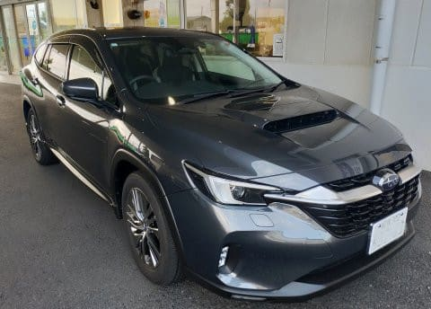
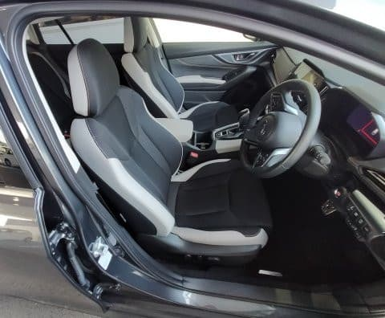
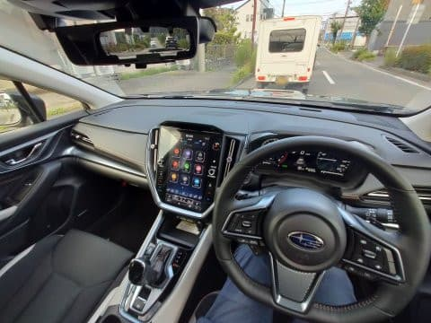
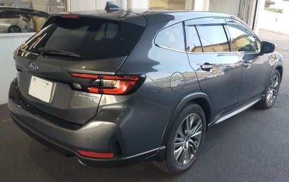

# SUBARU LAYBACKに試乗してみた

📅 投稿日時: 2024-07-01 01:43:07

えー．

我がVMG LEVORG君も，そろそろ購入後

6年ということで．

この度ディーラーに寄ったついでに，

かねてより試乗してみたい…と思っていた

レイバックに乗ってきてみました！！

だもんで．

今回は久しぶりの車試乗ネタです…！

…でも．

最近，車に試乗に行く時間が取れず，

ディーラーに寄ったついでの試乗しか

してないので，最近の試乗者はスバル車に

偏りすぎてる気が…

日産とかトヨタとかマツダとか，乗って

みたい車が結構あるんですけどね～

ってなことで．

昨年秋に発表になったレイバック．

LEVORGの車高を上げてSUV化したという

モデルですが…

見た目，あんまりSUV色がないですね．

そして，このノーズのデザインのために

全長がLEVORGよりわずかに伸びてます．

…うーん．

見た目はLEVORGの方が好きかな…

で．

内装はほぼLEVORGのままで．

シートの色が違う以外は，ほとんど

同じですね．

ドライビングポジションもLEVORGと

同じですが，車全体の車高が上がった分

視点がちょっとだけ高くなってます．

LEVORGに乗ってる人は，そこまで

違和感を感じない高さですね．

…この視点の高さで最低地上高200mm

あるのか…！！！

というのがちょっと驚きではありますが．

とりあえず，走り出してみると…

乗り心地が優しい！

段差乗り越えとかの衝撃が，LEVORGより

かなり少ない…

段差を乗り越えるとき，新型LEVORGだと

トンという感じの衝撃をボディ全体で

しっかり受け取り，「段差を乗り越えました！」

というのを，心地よい感じで伝えてくれる

ような感じがあったけど．

レイバックだと，衝撃自体がかなり丸まって，

段差を乗り越えた衝撃がボディまで伝わる前に，

柔らかいゴムで吸収されるような感じといえば

いいでしょうか…

…これ，たぶんタイヤのエアボリュームの

大きさが効いてますね．

タイヤが225/45 R18から，225/55 R18と

背の高いタイヤに変わったので，

このタイヤがかなりかなりの衝撃を

吸収してくれているんでしょうね…

LEVORGのようなスポーツ志向のタイヤ

じゃなくてオールシーズンタイヤってのも

あって，トレッド面も比較的柔らかいん

だと思います．

新型LEVORGの段差の乗り越える時の，

素直なサスペンションの動きは好きだけど．

レイバックはサスが動く前に結構タイヤで

衝撃を吸収してくれて，かなり柔らかく

段差を乗り越えていきます．

サスも，私が乗っているVMG LEVORGから

比べると，バネレートとダンピングが抑え

られている感じだけど…

SUVとして車高を上げてサスストロークを

伸ばした分，バネレートを落としてある

だろうな…

と思ったら．意外と落としてない感じ．

だもんで．背が高いし，サスストロークも

長い分ロールが大きく出るんじゃないかな…

と思ったところ，普通のコーナーならそこまで

大きくロールが出ずに通り過ぎていきます．

前のBRレガシィ君のかなり大きなロール

に比べると，圧倒的にロールは小さい！

BRレガシィ君は，山道でちょっと攻めると，

左右に続くコーナーでのロールの揺り返しで

ステアリングのタイミングが決まらない

時があったけど…

そこまでひどいロールは出ない感じ．

試乗だったので，限界まで攻められて

ないけど…普通に走っている分には

全く気にならないレベルですね．

ただ，タイヤのエアボリュームもあるし，

重心も上がっているし．

サスジオメトリー自体はLEVORGと

変わらないように，サブフレームと

ボディの間に下駄をかませている

みたいなので，タイヤ中心に対するロール

センター高さが変わっておらず，

そのため，下駄の高さぶんロールセンター

～重心のモーメントアームが伸びている

はずなので，理論的にロールは大きく出る

はずなのですが…

スタビを結構太くしているのか．

ロールはLEVORGより大き目ながら，

そこまで大きなロールが出ない感じ．

ただ，タイヤの柔らかさやバネレートを

ちょっと落としたところもあり．

横Gに対するこらえ感が，やっぱり

LEVORGよりは弱いです…

まぁ，その代わり．

全体的に足回りも優しいし，段差を

乗り越えるショックはLEVORGより

ずっと少ないし．

おそらく，後ろ座席や助手席に乗っている

人には，LEVORGより好評だと思います．

で．

サスも思ったよりしっかりしていて，

乗り心地とのバランスを追及して

ダルとクイックの妥協点に上手く落とし

混んでいる感じはあるんだけど…

運転しててちょっと気になったのは．

ステアリングが軽い！！！

EPSのアシストが結構強く入っているようで．

とくにニュートラル付近，LEVORGに比べ

軽くステアリングを回せるようになってます．

その影響とタイヤの影響なのか…

ステアリングのニュートラル付近のダルさが

ちょっとあって，ちょっとニュートラル付近に

締まりがない感じ…

ステアリング反力が軽いのはいいけど．

LEVORGと比べるとニュートラルを

感じにくく，ステアリングがびしっと

安定している感じがちょっと弱いのが

惜しい．

高速とかは走ってないけど，

スピードを出すと反力を上げるプログラムに

なっているのかなぁ…

だといいんだけど．

で．

それ以外のブレーキペダルのフィーリング

とかはいいし．

現行VN LEVORGの初期型で不満がいっぱい

出たのか，ウインカーレバーも常時中立位置

ではなく，ちゃんと右ウインカー時は下側，

左ウインカー時は上側に固定される

レバーになったし．

操作パネルの深いメニューをたどらないと

操作できなかったアイドルストップとAVHの

ボタンが常時画面表示になるなど，

細かなところが改良されてきています…

そして．

エンジンですが…

現行LEVORGと同じですね．

味付けをLEVORGと変えている

感じはなく．

普通の街乗りでは，スタートから

不満のないトルク感があり．

先代の1.6Lから比べれば，アクセルの

踏み量は少なくて済みます．

ただ，ぐっと加速したいときは．

Iモードだと，やはりわずかなターボラグを

感じます…

おっと，パワーが出ないかな…

と思った直後にトルクが盛り上がってくる

感じ．

あ，でも．ブーストと回転数が上がれば

「この車体で，こんなにパワーなくてもいいや」

と思うほどのトルク感があります．

思いっきり加速したいと思った時に，

フルパワーが出るまでにわずかに遅れが

あるのが惜しい…

でも，

私が乗っているVMG LEVORGのターボ

ラグに比べれば，圧倒的に少ないラグですし．

普通のGo/Stopとかの，街中で乗っている分

には全くターボラグを感じず走れますし．

普通に走っている分には十分ですね…

ってな感じで．

200mmの最低地上高を保った4WDで，

深い雪道や登山道の入り口までの石が

ゴロゴロの荒れ荒れ未舗装路なんかを，

LEVORGのようにバンパー下を擦る

心配なく走れる車なのに．

そこそこスポーティーに走れ，

ハンドルを握らない人にとって，

LEVORGより乗り心地が良い

という，面白い車ではありますが．

やっぱり，ハンドルを握る人の

走った時のワクワク感というか，

楽しさはLEVORGの方が上だし．

LEVORGの方が安いので…

うーん．

買い替えるとしたらどっちか，

悩む感じ…

