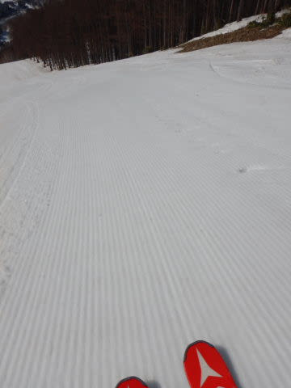
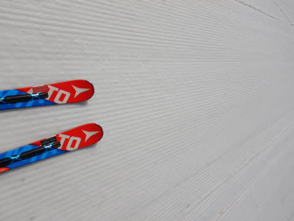
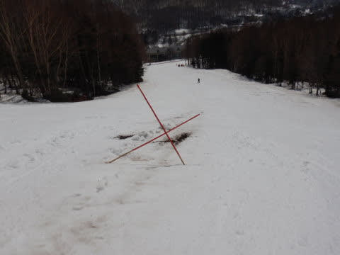

# 2021/4/3(土)の志賀高原スキー場は…晴天高温だけど雪は滑って楽しかったよ

📅 投稿日時: 2021-04-04 02:36:54

えー．

本日も，志賀高原にやってきてます～！

ってなわけで．

なんとか本日朝の焼額．

6:30から早朝営業は始まってますが．

8:30からの通常営業に間に合うように

やってきますが…

志賀高原までの登り坂．今日は

夏タイヤでも問題なく突っ切れるレベルで，

道路の積雪や凍結は全くなしでした～！

そして．

焼額の1ゴンが終わってしまった今週末．

2ゴンで山頂に登りますが…

通常営業の8;30の朝一で登った，

2ゴン山頂の気温は…+7℃．

朝から高温です(涙）

だもんで．

早朝は硬かったらしいバーンも，通常営業開始時には，

ちょっと緩み気味のバーン(涙）

とはいえ．

さすが朝イチは，硬い下地がしっかりした

感じで．

表面は緩いながらも，エッジが食い込む

いい感じのシマシマバーン！

あさイチからシットリ気味では

ありましたが．

エッジが食ういい感じのシマシマバーンを

楽しめました～！！

そして．

あさイチから第2ゴンドラはちょっと混んだものの．

第2高速リフトはガラガラで…

気持ちよく第2高速リフト沿い．

唐松コースをグルグル！！

ただ…

この一週間．

無茶苦茶雪が減りましたね(涙)

唐松コース上，早くもところどころ土が

出始めてきて…

先週は全然問題なかった唐松コースの

コースのど真ん中に穴が開いてます！

普段なら，こんな穴が開くのはGWの

ころなのに…！！

…これは．

今年は，例年より2-3週間雪が

消えるのが早まっている感じ…(激涙）

先週まではそこまで早く感じなかったのに，

この1週間に雪の消え方，半端ない(涙）

唐松コース，明日営業終了ですが．

それでちょうど良かったのかも…

でも，パノラマーサウスコースはまだ

全く土が出てくる気配はなく．

結構いい感じで滑れます！

…が．

1ゴンが動いてないので，2ゴンに集中して．

午前中はゴンドラ，ちょっと混みましたね…

最大15分待ちくらいまで行ったでしょうか．

うーん．

第2高速は終日混まず．

ゴンドラも，11時半を過ぎると

1-2分待ち．

午後は待ちなしになりましたが．

で．

すっきり晴天の本日．

昼間は気温が+10℃を超えてきて…

当然のごとく，雪はしっとりと水を含んだ

重い雪になっていきます…(涙）

そして，ところどころ表面に汚れが

浮いた，茶色い雪になって来た

ところもありましたが(泣）

でも，終日ストップスノーになることなく，

板がいい感じで滑ってくれたのが

良かったかな！

さすがに夕方になると，ちょっとバーンは

荒れてきたけど．

営業終了まで，板が走って大回りできる

バーン状況だったので．

いい感じで楽しめました～！

…しかし．

この1週間の雪の消え方が半端なかったです…(涙）

まさか，ここまで雪が減ってようとは！

うーん．

この3月はダメダメだったけど．

冷え冷え奇跡の4月になってほしい…

けど．

また日曜は．

昼頃から降ってきそうです．

液体が…（泣）

これで，5週連続週末に雨．

なんで週末を狙って雨が降るかな～

今シーズンは，いろいろ呪われている…（激涙）

## 💬 コメント一覧

### 💬 コメント by (レインボー73)
**タイトル**: Unknown
**投稿日**: 2021-04-04 06:43:02

土曜日の志賀高原情報

朝の上林７℃　蓮池６℃。駐車場確保のため早めに着くも満員御礼。早朝ファーストをやってたんだ。

朝一はツルンツルンだったとか。でも通常営業開始時には丁度いいバーンに。ついてる。でも10時には寺子屋に。

シーズン始めには抱っこだった３歳の天才キッズは、もう年長組のお姉ちゃんよりも速い。あの子には恐怖という感覚がないのか。

天才キッズは凄い！

『5＋3は？』『はちっ』

『10−2は？』『はちっ』すげえ！

『4×2は？』『はちっ』まてよ

『1＋1は？』『はちっ』

なるほど、、、

銀嶺で出会った、かのレジェンドゆ○○ん様は、奥志賀からタンネへバス移動。すると、数日間故障で止まっていたリフトが動き出した。夢中で滑ったそうな。うらめしやー。

午後は賞味期限切れのタンネで遊んで、レインボー前に終了。そろそろいいかなって感じ。

### 💬 コメント by (AK)
**タイトル**: Unknown
**投稿日**: 2021-04-04 07:46:37

S様今日は試乗会なのですね。

試乗レポート楽しみにしています。

ぜひOGASAKA TC-STのレポートを。

### 💬 コメント by (ikkun)
**タイトル**: Unknown
**投稿日**: 2021-04-04 09:37:49

おはようございます❗確かにあの消え方は半端ないですね あっという間ってこんな時に使います(笑)でも春の朝の雪っていいですね❤️青空Withが条件ですが(笑)  野沢温泉晴れたらと今から願いますよ✨

### 💬 コメント by (m&t)
**タイトル**: Unknown
**投稿日**: 2021-04-04 15:20:51

ヤケビオールスターズの皆様、お久しぶりです。

本日でホームアサマ2000営業終了です。

雨もザーザー降ってます。

我々もどうやら今日で滑り納めの様です。

3月に入ってからいつ志賀高原に行こうかと、ずっと思っていたのですが、週末はずっと雨・・・。

皆様にあいさつ出来ないうちにシーズン終了です。

奇跡のＧＷが来れば復活するかも・・・!

### 💬 コメント by (アリス)
**タイトル**: 雪があり滑れれば楽しい
**投稿日**: 2021-04-04 15:30:20

Skier_S様

お世話になっております。

申し訳ありませんでした、土曜日は都合によりヤケビの早朝を滑って帰途に付きました。

朝一のカリカリバーンも、前日中の湿気の多い雪でもスキーが出来る幸せを感じました。

土曜日の早朝に親分様ご夫婦とご一緒させていただきました。奥様は骨折のリハビリ中との事でしたが、『あのスピードは骨折中治療の滑りか』って思うくらい早かったです。

S様少しお借りしますね

ゆみ様、金曜日はゴンドラ一番機を譲っていただき、ありがとうございました。

また、乗車前に貴重な情報をいただき午後に活用できました。

楽しさ倍増できました。ありがとうございました。

### 💬 コメント by (Skier_S)
**タイトル**: 無事帰宅
**投稿日**: 2021-04-05 02:07:57

＞レインボー73さま

今週末…というか，今シーズンもお世話になりました！

あと残りわずかの志賀滞在，楽しんでください．

そして，また来シーズンお会いしましょう！

＞AKさま

TC-ST，プレート違いで2種類乗りました～！

また後日レポートします！

＞ikkunさま

いや…すごい消え方です．

志賀高原も，通常より3週間くらい雪解けが早い感じで，

GW前くらいの雪の量に減ってます…（涙）

＞m&tさま

あ，アサマ2000ラストに参戦されてたのですね．

雨の中お疲れ様でした．

5週連続，週末雨でしたね(泣）

志賀高原はGWまで滑れますので，まだまだシーズン終了には早いですよ！！

＞アリスさま

あ，土曜早朝で切り上げられたのですが．

で，早朝参加の濃いメンバーに混ざってきたのですね(笑)．

ヤケビ常連さんは，「スキーはギプスです」に代表される

おかしな人たちの集まりですから(笑)

