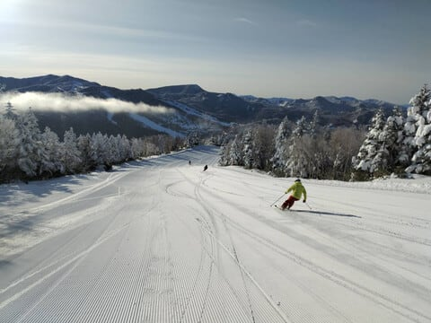
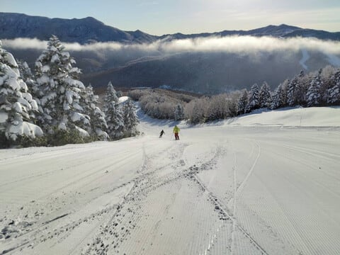
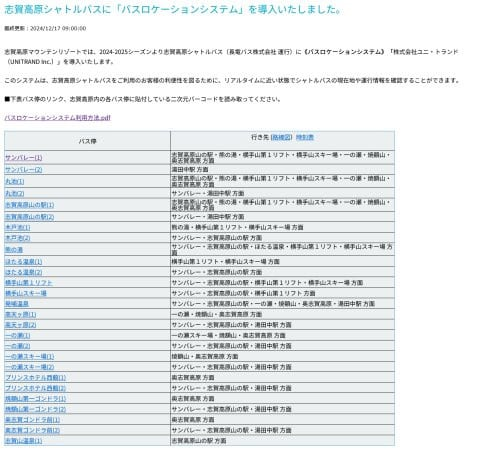
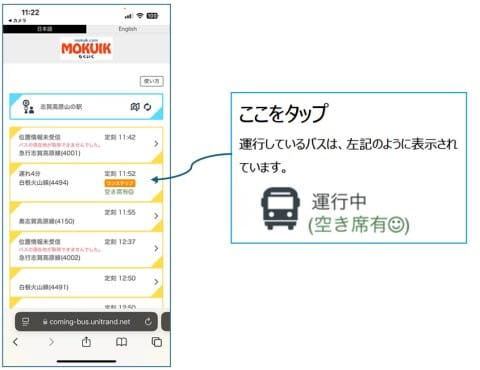
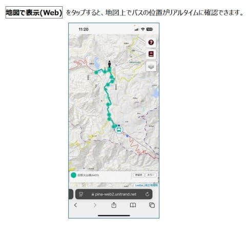
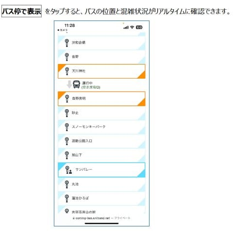

# 志賀高原スキー場のシャトルバスにバスロケーションシステム導入！そしてこの週末，土曜は晴れ，日曜は終日かなりの雪降り！今週も志賀で滑ってます～！

📅 投稿日時: 2024-12-21 01:19:49

えー．

本日も，志賀高原特派員から写真が送られて

来ましたが…

うはーーーー！！！

最高のシマシマバーンじゃないですか…っ！！

ぐほー！

うらやましい…

うらやましすぎる！！

とりあえず今日の志賀高原は，前日の冷え冷え

フレッシュ雪が圧雪されて，最高だった

ようですが…

大丈夫！明日も朝から晴天で，

焼額は1ゴンも動いて，

晴天シマシマのGSコースが滑れるから，

明日も最高のはず…っ！！

で．

志賀高原で明日動くリフトは，横手・熊方面を除くと

サンバレー

丸池トリプル

西舘クワッド（フーディーはまだ動かない．下部のみ）

ブナ平

東舘山ゴンドラ（連絡用のみ，東舘は滑れず）

高天ヶ原クワッド

一ノ瀬ファミリークワッド・ペア

一ノ瀬ダイヤクワッド・ペア

一ノ瀬山の神

焼額1・2ゴン，2高，4ロマ

奥志賀全リフト

という感じで．

逆に滑れないのは

蓮池・ジャイアント・東舘

西舘上部・寺小屋

と，滑れないエリアの方が少なくなって

来ました…

…でも．まだ寺小屋動かないのか…

ということで．

奥志賀から一ノ瀬方面まで滑って移動

できるようになってきましたが…

まだ，西舘下部方面には滑っていけないし．

横手山方面へ移動したいという人もいて．

そういう人はバス移動することに

なると思います…

そういう時，これまでは時刻表頼りで，

時刻表通りにバスは行っちゃったんだろうか，

まだ間に合うんだろうか…

という心配をしたことがある方が多いと

思います…←そこまでバスを使い込んでいる人いっぱいいるか？

いや．

多いはず．

いっぱいいるはず…！

そういう人のために．

今シーズンから役に立つのが．

テッテレー

「バスロケーションシステム～！！」（懐かしの大山のぶ代の声推奨）

なんと．

[志賀高原索道協会のWebページ](https://shigakogen-ski.or.jp/winter/news/2024/12/post-38.html)にアクセスすると…

こんな感じでバス停一覧が表れて．

（[志賀高原索道協会，バスロケーションシステムページ](https://shigakogen-ski.or.jp/winter/news/2024/12/post-38.html)より）

上のページのバス停の名前をクリックすると，

今運行しているバスが表示されます…！

（[志賀高原索道協会，バスロケーションシステム利用法王ページ](https://shigakogen-ski.or.jp/winter/news/ArticalImages/1c8876636f99a2899a4b03fde4f89128c77e8ee4.pdf)より，以下同じ）

この運行しているバスをタップすると．

地図表示かバス停表示かを選べて．

地図表示にすると，地図のどこにバスが

いるか見られるし…

バス停表示にすると，どことどこのバス停の

間にいるかがわかります…！！

うーん．

バスが遅れているのか時間通りなのか，

もうバスが行っちゃったのか，まだ間に合う

のかがわかって，これは便利…！！

とりあえず，志賀高原に行く皆さんは

バスロケーションシステム，使ってみて

ください～！！

そして私はまた明日から志賀高原で滑って

ます～！

土曜は晴天，朝は放射冷却で冷えて

冷え冷え最高シマシマバーン，

昼間は天気が良く暖かさを感じるほどの

絶好のスキー日和．

土曜の夕方，リフト営業終了のころから

雪が降りはじめ…

そのまま月曜までひたすら降ります．

日曜は一日雪．

日曜朝までに30cmくらい積もるか？

脛パフくらいのパウダーになりそう！

昼間も終日降って，-10℃くらいの

冷え冷えモフモフ．根性の無いスキーヤー

ふるい落としデーになりそう．

とりあえず，日曜は太板持っていっても

いいレベルかも…

ってなことで．

今日も帰宅が深夜12時近かったので．

もう深夜1時過ぎ…（泣）

4時出発なので，あと2時間半後に

出発です～！！

明日はまた睡眠不足で滑ってます～！

## 💬 コメント一覧

### 💬 コメント by (副院長)
**タイトル**: Unknown
**投稿日**: 2024-12-21 08:30:02

おおお、バスロケーションはよさげですね、これで風で、ゴンドラ（特に奥志賀）止まりそうな時でも、今までは早めに撤退していましたが、コースにねばれそうですね。僕は正月予定なく、バスの込み具合見ながら、「そやろ、混んでるやろｵ～」となぐさめます。

### 💬 コメント by (レインボー77)
**タイトル**: Unknown
**投稿日**: 2024-12-21 12:56:11

土曜日の志賀高原情報

土曜日だから混雑を覚悟していましたが、あちこちがオープンして分散したのか、快適な環境でした。冷え込みも緩かったのでバーンも硬くならず、滑りやすい勘違いバーン。いつものパノラマ→サウスは絶好調。今日からオープンした白樺はふっかふか。だだブナがまだなので、林道経由のニ高はちとつらい。

所用で10時終了。

### 💬 コメント by (Skier_S)
**タイトル**: 今日は良かったよ…！
**投稿日**: 2024-12-21 21:55:22

＞副院長さま

バスロケーションは便利だと思います…

ぎりぎりまでゲレンデで粘れますよね！！

あと，バスに空席があるかどうかもわかるも便利です！！

＞レインボー77さま

今日は土曜なのに混みませんでしたね～！！

明日は寒いと思いますが，新雪パフパフですよ～！！

