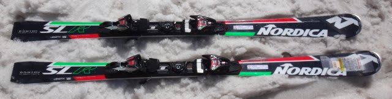
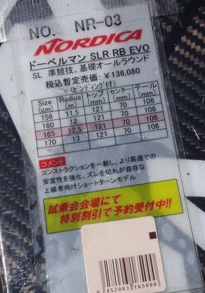
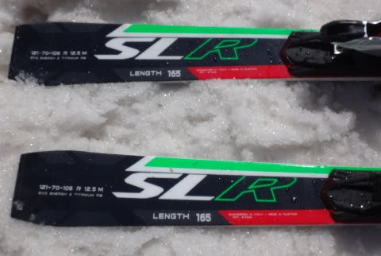

# 2017シーズンモデル，スキー試乗レポート第8回…NORDICA編

📅 投稿日時: 2016-05-27 02:54:02

…今日も．

帰宅がかなり遅く（涙）．ちょいと疲れているので，

試乗レポート，1機種のみ．

ノルディカ編です．

では，どうぞ～！

○NORDICA DOBERMANN SLR RB EVO 165cm

SL競技・基礎小回り

…去年の「SLR EVO」の継続モデルだと思うのですが．

名前に「RB」ってのがつきました．

これは，RaceBridgeの略で．

トップとテール部にトーションを強める

カーボンシートを入れてあるのですが，

これを「Race bridge」と呼んでるようです…

で．構造が今シーズンモデルより多少変わって

いるようですが，

見た目はあんまり今年モデルと変わらないな～．

見た目通り，サンドイッチの板です．

滑ってみると．

SL競技用っぽい感じの，エッジグリップが強く，

返りがすごく速い板です．

しっかりした踏み応えのあるフレックスで，

板に圧が溜まり，強いバネ性があります．

すごく速い返りが，ドカンとやってくる，

かなりじゃじゃ馬的な感じの板です．

フレックスは強いけど，

コアが突っ張る強さというより，ばね感が

強く．踏むとたわむけど，そのたわんだ分

確実にばねが返ってくる感じです．

それも，ビョン！って返ってきます．

ゆっくり滑っても面白くなく．

トップ荷重気味にトップを抑えて行くと．

圧が溜まって，ビュンビュン跳ね返ってくるような

返りが来ます．

この強い返りで板を切り替えていくのが面白く．

ハイスピード出した時に気持ちいい板です．

ひたすらハイスピードで落ちていきたい板．

VOLKLのSDに近い印象かな…

＃SDの方が板は圧倒的に軽いけど

強めの体力と，早い返りを処理できる

技術を持った人なら，リズムの早い小回りを

楽しめると思います．

…が，乗り手を選ぶ板だなぁ…

と思いました．
