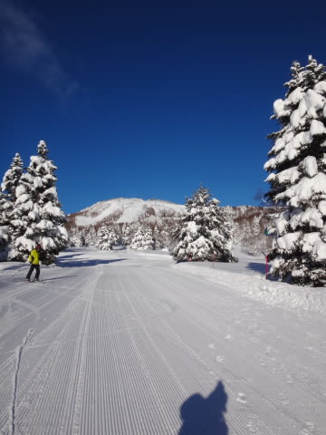
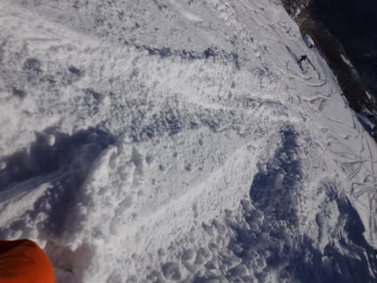

# 1月2日の志賀高原はすっきり晴天，最高のお天気！…予想外れたってことだけど（涙）

📅 投稿日時: 2015-01-02 20:54:24

というわけで．

本日の志賀高原は．

なんと．

朝から超すっきり晴天で．

夕方まで日差しが降り注ぎ続け．

…最高の一日でしたっ！

…

…

私の「終日雪」の予想は，見事に大外しだった，

ということになりますが…（泣）．

とりあえず．

朝イチゴンドラに乗ったところから…

すっきり晴天っ！

でも．

朝まで雪が降り続けていたので．

コース上は新雪も積もってますね～

山頂の気温はマイナス13度と，冷えてますよ～

そして，朝一ゲレンデは…

うははっはは！！

シマシマだっ！

圧雪のかかっていないコースは，昨日からの雪で

ブーツ～ひざパフっ！！

圧雪コースも，

新雪コースも…

どっちも最高で，一日で2度楽しい感じの雪質っ！

なんにしろ，ピカピカ晴天の下滑れるのは，

最高ですな～

…と，思っていたら．

いつもどおり，朝10時ごろにはコース上の人が

増えていき…

やはり，ゴンドラは待ち時間が…（涙）

でも，コース上の人は多いとはいえ

いつもどおり，11時半にはゴンドラ待ちはほとんど

なくなったし．

気温は冷えひえで，昼を過ぎても雪質は最高のままっ！

ここまで天気がよく，雪がいいゲレンデって，

シーズン何回あるかな～

ただ．

やはり．

今日も夕方には，大勢が滑ったゲレンデは．

大勢のスキーヤーに荒らされてぼこぼこになって行き…

圧雪コースでも，かなりバンピーな疲労蓄積コースと

化していきます…

そして．

予想外に，夕方まで晴天は続き．

雪が降り始めたのは，午後4時過ぎ…

そして，午後5時ごろにはかなりの雪となってきました

って感じで．

おそらく私の日ごろの行いがありえないぐらい良すぎたため，

神様が終日晴天にしてくれた今日←天気予想が外れたのをごまかしまくっている

かなり満足の一日でした．

…本日，晴天の志賀高原を満喫した皆さん．

私の日ごろの行いに感謝してくださいっ！！

…

…あぁっ！皆さん，石を，石をぶつけないでっ！！

（読者にぼこぼこにされるSkier_S）
