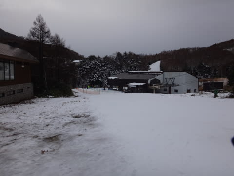
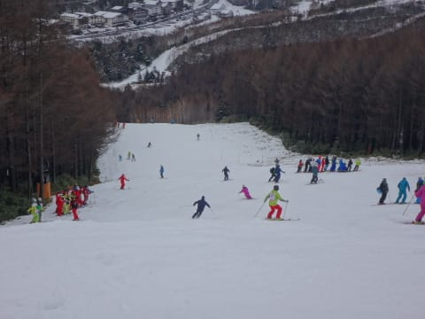
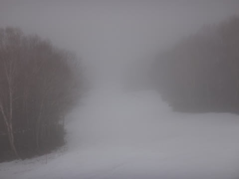

# 12月13日，日曜日の志賀高原焼額山のコンディション，速報モード！

📅 投稿日時: 2015-12-13 23:50:38

ということで．

本日も志賀高原を滑っていたわけですが．

夜が遅いので，日曜恒例の速報モードにて…

えー．

本日日曜日．

朝から気温が高く，早朝からプラス気温（涙）．

さらに，時々ぽつぽつと，水滴が空から落ちてくるような

天気で始まりました…

当然，人工降雪機が動かせるわけはなく．

雪は昨日から1mmも増えていないどころか…

当然のごとく，減っています（泣）．

そんな状態の焼額ですが．

指導員研修会のため．コース上は結構混んでおり…

さらに，午前中は，せいぜい「ぽつぽつ」程度だった雨が．

午後1時半ごろからは，パラパラと降りだすという

仕打ちを受け…

そのおかげで，

コース上のブッシュエリアが拡大という目にも会い…

雪も重く，コースも荒れ荒れでかなり微妙な感じの

ゲレンデでした…

うーむ．

なんだか．

今日はちょっと残念な感じでした…

また，詳細は明日！

## 💬 コメント一覧

### 💬 コメント by (まいる)
**タイトル**: 初滑り行ってきました
**投稿日**: 2015-12-14 07:02:41

土曜日に初滑りでした。箕輪は雨で雪が無くなったので猫魔に変更。全日の雨のあとゲレンデが凍結し、カリカリジョリジョリ(>_

### 💬 コメント by (Goku)
**タイトル**: Unknown
**投稿日**: 2015-12-14 21:47:33

土曜日の朝一はかなり良かったみたいですね～♪羨ましい・・・

でも土曜は用事があって行けませんでした(T_T)

日曜はＳさん予報が雨が降るかもだったのでやめときました。

で、やっぱり関西からの『赤い使者』でゲレンデが赤く染められていますね。

### 💬 コメント by (Skier_S)
**タイトル**: 今週末は冷えるかな～
**投稿日**: 2015-12-15 00:44:53

＞まいるさま

初滑り，行ってきましたか！

土曜の朝は雪が積もらなかったんですね…

志賀は朝イチは柔らかくて最高だったんですが…

猫魔はガリガリでしたか．

ちょいと残念な初滑りでしたね．

今週からの，ゲレンデ状況の改善に期待です！

＞Gokuさま

土曜朝イチは最高でしたよ！

日曜は，予想の悪いほうに行ってしまい…

かなり残念な感じでした…

赤い軍団の皆さんが講習を終えた日曜

午後がチャンスだ！

…と，思ったら．

日曜午後が一番ひどい雨に…（涙）．

土曜と比べ，天国から地獄の日曜でした．

来週こそ…

