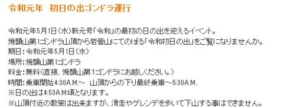
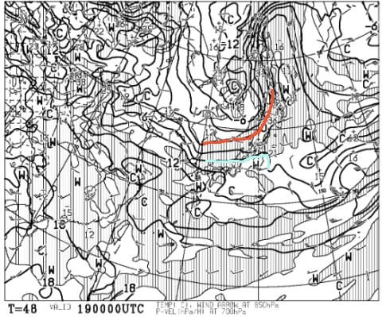
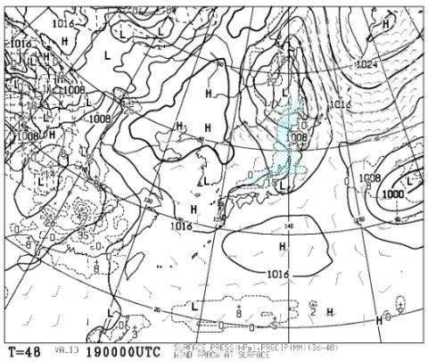
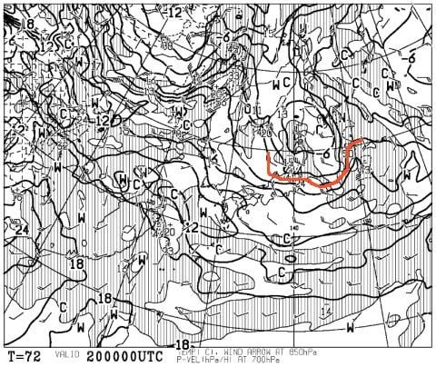
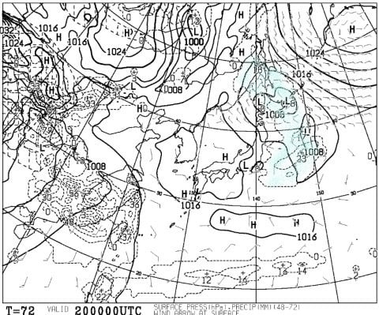
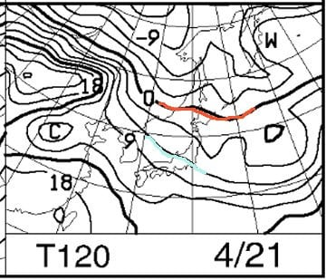
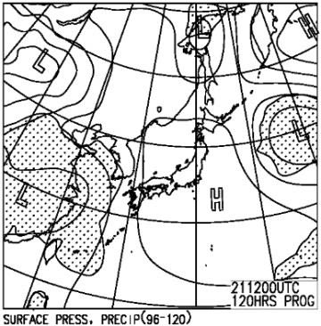

# 4月20，21日の週末の志賀高原スキー場の天気は…土日とも晴れ！土曜朝は冷えるけど，雪は積もってなさそう．日曜は高温（涙）．

📅 投稿日時: 2019-04-18 06:44:39

🏷️ カテゴリ: [スキー天気予想](c6554f5c3c106093b511a8daae23757e8.md)

ということで．

そろそろ4月も後半に入り．

GWも近づいてきましたが…

そういや．

GWの5/1は，新元号初日じゃないですか！

…ってことで．

わがホームゲレンデの焼額．

こんなイベントをやるようです…

（[焼額山HP](http://www2.princehotels.co.jp/page.jsp?id=227672)より）

なんと！

5/1は，朝4時半からゴンドラ運転！？？

…でも．よーーく見てみると．

下山はゴンドラのみで，

スキーで滑って降りられないのか…

うむ．

滑れないなら，

私にとっては何の魅力もない

イベントですね．

ってなことで．

本題の今週末の志賀高原の天気予想へ…

まず．

金曜19日の850hpa気温図は…

うげげげげ．

赤い0℃線はかなり北に行ってしまい．

志賀高原には，水色の+6℃線が

かかってます…

そして．

地上天気図では，降水域が志賀にかかって

いるので．

…これは．

19日の金曜．

朝は雨が降りますね（涙）

ただ，リフト営業開始のころには

雨は止んでくれそうですが…

19日は，朝から雨で雪が緩んだ

コンディション（泣）

そして．

週末土曜日．20日の850hpa気温図は…

をを！

この日は，赤い0℃線は志賀高原にかかってますね…

土曜朝は，冷えそうです！

しかし，地上天気図を見ると．

降水域は志賀高原にかかっていないので．

残念ながら，雪が積もることは無さそう…

だもんで．

前日の雨で緩んだゲレンデが，

土曜の朝は冷え込んで，朝イチは

ガチガチバーンになりそう…

まぁ，昼間は+5℃くらいまで

上がりそうで．

さらに，この日は終日晴れそうだから．

昼前には雪は緩んじゃいますね…

まぁ，午後は典型的な春スキーの

感じですね．

で．

21日日曜の850hpa気温図ですが…

うーーーーむ．

赤い0℃線は北海道まで北上し．

志賀高原には，水色の+6℃線が

かかってます…（涙）

この日は，昼間は+10℃近くまで上がるかも

そして．

日曜の地上天気図を見ると．

見事に高気圧に覆われているので．

すっきり晴れの一日ですね．

でも．

晴れて気温が上がるとなると．

…たぶん，この日の雪はかなりクリーミーな，

板が潜るような柔らかい雪になっちゃいそう（泣）

…あぁ…4月ですね…

ってことで．

まとめると．

20日（土）：朝から晴れ！

　朝の気温は-3℃程度とそこそこの冷え込み．

　早朝はもう少し冷えるかな？

　早朝のバーンはガッツリ硬いガリガリバーン．

　天気はいいけど気温は低めなので，

　固まったバーンはなかなか緩まず，

　早朝の間はずっと硬い．

　通常営業が始まると，日が当たる部分は

　ちょうどいい緩み具合になってくる．

　昼前には日差しで結構雪が緩むか．

　午後は気温がぐんぐん上がり，

　晴天の日差しと相まって　

　ザブザブした春の雪になる．

　

21日（日）：この日も終日晴天．

　朝から気温は高く，早朝ですでに

　プラス気温かも…

　早朝は表面がちょっとだけ固めだけど，

　早朝営業のうちに緩み始め，

　通常営業開始時には，すでに緩んだ

　春の雪に．

　午前中から，板が潜っていくような

　柔らかい雪になり，昼間は+10℃を

　超える気温でたっぷり水気を含んだ

　ずっしり重い雪に．

　暑いくらいに暖かく，日差しも強い

　春スキーな一日

って感じでしょうか．

…もうこの時期ですから，いい雪質は

期待できませんが．

2日間晴れて，暑いくらいの春スキーの

一日になりそうです．

…あぁ．

もう一度冷え冷えパウダーが滑りたい…

土曜朝は冷えそうなので．

どっさりパウダー積もってくれない

かな…←ありえないから

## 💬 コメント一覧

### 💬 コメント by (NorthFox)
**タイトル**: Unknown
**投稿日**: 2019-04-18 23:42:16

こんばんは。

20、21日は一の瀬の試乗会に行く予定なので、壊滅的な天気ではなさそうで一安心です。

久しぶりのスキーなので楽しみたいです。

しかし、また物欲に悩まされることになるのかなぁ。

### 💬 コメント by (Skier_S)
**タイトル**: NorthFoxさま
**投稿日**: 2019-04-19 00:04:12

私も20，21日と試乗会参加予定です～！

壊滅的な天気ではなさそうですが，

板の性能が分かるコンディションかどうかというと

微妙な感じがします…

でも．いろいろ試乗して，物欲にまみれてください！

