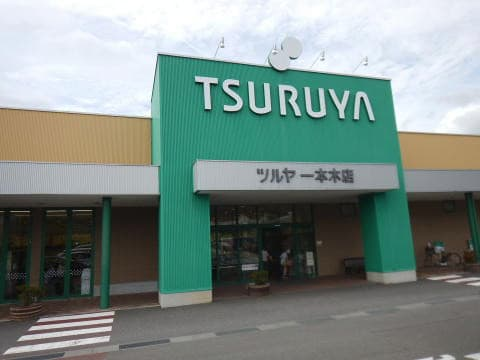
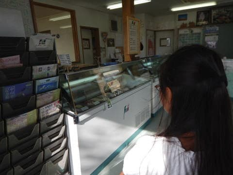

# 夏の志賀高原に行ってみたラスト…志賀高原を後にして

📅 投稿日時: 2017-09-06 02:44:25

ってことで．

思わず6回も続いてしまった，

夏の志賀高原レポート，

本日でやっと最終回です…

しかし．

だんだんと，モアルボアル旅行記が遅れていく…！！

昨年8月の旅行記，もう9月だというのに

まだ2日目が始まったばかりなんですが…！！

いろいろ車の試乗レポートやらなにやら

書きたい記事があるので．

気づいたら，昨年のモアルボアル旅行記が

終わらないうちにスキーシーズンに突入し．

モアルボアル旅行記が終わるのが来年になる

という，2年越し連載パターンが目に浮かぶような

今日この頃←今から諦めてたらダメでしょ

とりあえず，本日は志賀高原レポート，ラストです～！

------

ってことで．

十分にゆるキャラと触れ合って満足した娘．

ミス志賀高原のコンテストが始まると，

それには全く興味がないらしく．

「もう帰ろう～」

…あなたは，興味が無いものになると

すぐ飽きるのね…

とりあえず，

私もこの会場に来てから3時間も経ち，

そろそろ帰ってもいいかな～，

とは思っていたので．

コンテストの結果を観ずに，会場を後にします…

その後，蓮池をちらっと眺めて．

そして，下山しますが．

このままでは帰らない．

まだ帰らない．

次は，渋温泉そばにある，

「玉村本店」に立ち寄ります．

ここは，日本酒の「縁喜」の醸造元．

蔵をのぞくことができますが…

最近では，志賀高原ビールの醸造元として

の方が有名かも？？？

私も大好きな，味わいが濃く，飲み応えのある

志賀高原ビール．

こいつをGet！

普通の店では買えない限定品の志賀高原ビールが

あったり，

日本酒の試飲もかなり種類が多くて，いろいろ味見が

できて面白いし．

日本酒も原酒系のしっかりした味わいの日本酒が多く．

…玉村本店，ビールの醸造元だと思っていたけど，

意外と日本酒もおいしいじゃないか！←逆だから！日本酒の蔵がビールも作ってるんだから！

お酒好きなら，行ってみる価値はありますね～！

さらに，

山道を下りきって，中野の町中で道路が

4車線になるところ．

そこにある，長野ではメジャーなスーパー「ツルヤ」．

ここは，ツルヤオリジナルの商品がいっぱいあり．

どれも安くて面白いものばかりなので，

わが夫婦そろってファンなのですが．

長野に来ないと買えないので，

スキーに来ない夏のシーズン．

この機会に，オリジナルジャムやら

ドライフルーツやら，

その他もろもろを大量買い込み！

で，そのツルヤ一本木店の真横にあるジェラート屋

「フィオーレ」

に立ち寄ります…

高天ヶ原ホテルのピザ屋のジェラートが

ここのやつのはずなんだけど…

高天ヶ原ホテルに比べると，種類も20種類

くらいあって，すごい目移りします…

いや，やっぱりここのジェラートは

おいしい～！！！

…って感じで．

2日目も盛りだくさんだった，夏の志賀高原．

うむ．

冬の間は，スキー場しか寄らないけど．

それ以外も，見どころたくさんあるよな…

なんだか，大蛇祭りに絡めた志賀高原ツアー．

来年以降も我が家の定番化しそうです．

PS.

最近，[ごく一部で流行り始めた](http://red.ap.teacup.com/gokurakuskier/729.html)，こいつ．

うちの娘が，これを一度ご馳走になってから．

「次に長野に行ったときは，絶対買って～！」

と聞かなかった，むさしやのジンギスカンのロース．

今回．こいつも無事Getして帰りました～！！

やはりツルヤでは売ってなくて，他のスーパーで買いました…

さっそく食べましたが…マトンと思えないほど

柔らかくておいしいです…

## 💬 コメント一覧

### 💬 コメント by (Goku)
**タイトル**: Unknown
**投稿日**: 2017-09-06 21:37:07

うふふ、すっかり羊肉ロースの虜になりましたね（笑）

ジンギスカンを志賀高原ビールで流し込む・・・最高ですね～。

### 💬 コメント by (Skier_S)
**タイトル**: Gokuさま
**投稿日**: 2017-09-07 00:53:14

もう，はまりました．

少なくとも，家の娘は．

志賀高原に行くたびに

「ロース買って！ロース！」

と言い続けるに違いありません…

ホントに，羊肉ロースで志賀高原ビール．

最高ですね～！！

