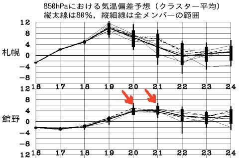
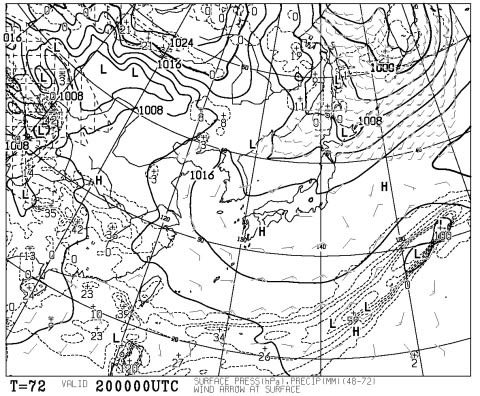
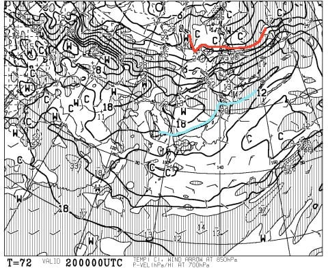
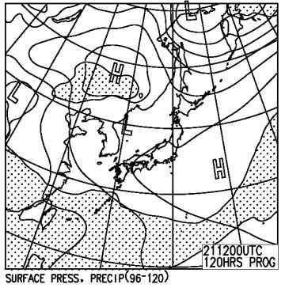

# え？まだ続くの？今週末の志賀高原＆かぐらスキー場の天気は…土日とも晴れそう．気温はすごい上がるよ！

📅 投稿日時: 2017-05-18 02:37:33

🏷️ カテゴリ: [スキー天気予想](c6554f5c3c106093b511a8daae23757e8.md)

ということで．

私の志賀高原通いも終わり．

今週末・来週末の2週間は

かぐらスキー場へ行くことになるわけですが．

…そう．

志賀高原通いが終わっても，まだ続く，

スキー場天気予想．

とはいえ．

いつもながらこの時期は．

雪質は言うまでもない春の雪だし．

降れば確実に雨なので．

今週末は雨が降るのか降らないのか？

…という，1ビットの情報を伝えれば

事足りるため．

…冬の間の天気予想のような盛り上がり（？）に

イマイチ欠けますが…

で．

今週末ですが．

気温が上がりそうですね～．

赤矢印で示した，今週末の20，21日．

平年比+4℃ほど気温が上がる予想ですね…

暑いくらいで，雪がガンガン解けそうな予感…

ということで．

土曜の地上天気図ですが．

…志賀もかぐらも，高気圧に覆われて．

基本的に晴れそうです…

で．

この時期は「雨か？雪か？」と悩むことが無いので，

基本的には見る必要のない850hpa図．

あえてみてみると…

うむ．

赤く印した0℃線，樺太よりかなり北まで行ってしまい．

さらに，水色で示した+15℃線が，志賀やかぐらの

そばにいるので．

…まぁ，この日の昼間は．

志賀高原，かぐらとも，山頂でも

+15度を超えそうな感じですね…（涙）

晴れの日差しと相まって暑く感じる一日で．

雪が一気に解けるか…（泣）．

で，日曜の地上天気図を見てみると．

まぁ，この日も高気圧に覆われて晴れそう．

気温はほぼ前日と変わらずでしょうね…

暑い一日になりそう．

ということで．

まとめると．

土日とも：朝から晴れ！気温は朝から高く，

　雪は朝からザブザブでしょう．

　昼間は気温が上がり，さらに日差しがあるので，

　暑いくらいに感じるかな．

　春スキーというよりも，夏スキーを感じさせるような

　天気になるかな…

ということで．

この週末は．

スキー場に行ったが強風で滑れない

という悲劇に見舞われずに済みそうです．

ええ．

かぐらが強風で全面運休で，

横手に移動して滑らなきゃならない…

とかいうことはなさそうなので，

安心してください！←そんなことするの，他にいないから．あなただけだから

…でも．

晴れるので．

かなり混みそうな予感…
