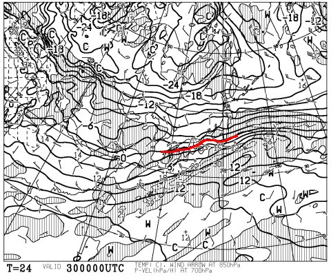
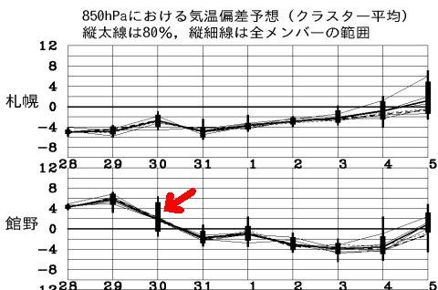

# 明日から，いつも通りの志賀高原…土曜は曇り．日曜は冷えて，曇り時々雪

📅 投稿日時: 2016-01-29 22:02:03

🏷️ カテゴリ: [日記](cc4b5682fb7b8b144980957a978653fb0.md)

はい．

そうです．

みなさんが踊り続けたおかげで．

なんと！

土曜の天気図，劇的に改善しました！

30日の朝の850hpa気温は，こんな感じで．

-3℃線が，志賀高原よりさらに南に下がりましたっ！！

そこそこ冷えた朝になりそう．

土曜に雨が降ることは，絶対ありません！

いやー．しかし．

なんてったって，30日の850hpaの気温が．

こんな感じで，平年比+2度程度に収まるという…

だって．

月曜時点の30日の気温予想，これですよ！

この，グラフを突き抜けるレベルの，

平年比+10℃の予想から，

8℃も予想気温が下がりましたっ！！！

すごい…

すごいよ．

気温が冷える踊りの効果！！！←違うから．踊りのせいじゃないから

とりあえず．

土曜は朝まで雪が残り，道路は完全積雪路面だと思うので，

ご注意を．

朝のゲレンデの雪も，かなり重いと思うので

お気を付けください…

激烈な天気図の変化により，

土曜は，一日中雪降りの予想から，

朝9時までには雪が止む予想になりました…．

基本的に曇りの一日ですが…

午後は，風向きによっては晴れ間もあるかも？？

日曜は…大体昨日の予想通り，冷え冷え．

曇りベースの天気で，朝はうっすら積雪もあるかも．

…ただ，昨日の予想より雪は少なそうで，

10cmも積もることはなさそうな感じ．

午後は…晴れる可能性は低くなりつつあります…

とりあえず．

最悪の雨の予想が回避できて，良かった～っ！！

また，明日から志賀高原に行ってます～！

## 💬 コメント一覧

### 💬 コメント by (げん)
**タイトル**: 家族で冷え冷え踊り
**投稿日**: 2016-01-30 01:28:48

いつも欠かさず拝見してます。

当方、京都在住で、毎年、正月休みに八方尾根、2月の子供の日にはブランシュ、3月3週目あたりに志賀高原のオリンピックホテルを定宿として泊まりのスキーを楽しみながら、日帰りで岐阜県奥美濃やジャム勝に行き、1シーズン20日ほど家族五人で滑ってます。

今シーズンは正月の八方が雪不足でキャンセルしてから毎日積雪状況確認する中でskiU+2013sさんのブログを発見しました。

正月リベンジで今週末に八方予約してたんですが、雨予報に愕然としてたんですが、家族総出での冷え冷え踊りの効果か30日午前1時現在八方尾根咲花ゲレンデは大雪になってます。

3月の志賀高原も楽しみなんですが、今年は難しそうですかね？

### 💬 コメント by (Skier_S)
**タイトル**: げんさま
**投稿日**: 2016-01-30 17:48:54

初コメありがとうございます～

いつもご愛読感謝です…

しかし，京都在住でシーズン20日家族スキーって，

なかなかですね～．

今日は，朝雪が積もってよかったですね！

これがなかったら，朝から一面のアイスバーンで

ちょっとまずかったかも…

でも，今日が雨でなく雪になったのは，

家族の皆さんの冷え冷え踊りがきいたに

違いありません！！！

…3月の志賀高原ですが，

3月なら雪不足ってことはないかと思います．

…ってか，そう信じます（祈）．

今のところ，2月は異常に気温が高いってことは

なさそうですけど，2月前半，あんまり降水量が

なさそうで，積雪の積み増しが期待できない感じ…（涙）

志賀高原にお越しの際は，またよろしくお願いしますね！

### 💬 コメント by (デーコン)
**タイトル**: Unknown
**投稿日**: 2016-01-30 19:18:04

こんばんわ。

出雲から移動し、松江にきてます。

こちらは、冷たい雨が降ってます。

ヤケビは、雪でしょうね。

3月に向けて雪よ降れ！

### 💬 コメント by (Skier_S)
**タイトル**: デーコンさま
**投稿日**: 2016-01-30 22:24:35

ヤケビは晴れです…

朝まで雪は降ってましたが…

今日の昼間は積もってません（涙）

明日以降も，しばらくはあまり積もらなさそうです（泣）

うーん．

また，24日並みにどさどさ降ってほしいです…

