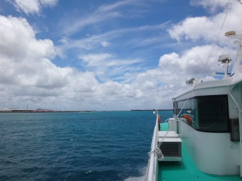
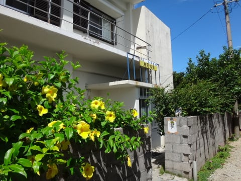

# 2016年8月　子連れ座間味ダイビング旅行記　その１…いざ，出発

📅 投稿日時: 2016-10-07 01:59:26

ということで．

やってきた，座間味旅行出発の朝．

7月も休日出勤が続き．

「…こ，これは…ホントに仕事が終わって，

　無事旅行に行けるのか…っ？？？」

…という，いつもの旅行前の心配を．

これまでより128倍くらいシビアに感じましたが．

…なんとか，完徹で出発当日の朝5時に

仕事を仕上げ．

そして，朝5:40のバスで出かけるという，

かなりのきわどい危険な綱渡り状態で．

良かった…無事出発できたよ…（感激）

ということで，朝8:40羽田発の那覇行に乗り込み，

出発！

いやーーー．

無事仕事が終わって，良かった…←終わってないものを

終わったことにしたという説が極めて有力

飛行機は，富士山を眺めながら飛びますが．

…ANAも，こーゆー機内WiFiサービスを始めたようですね～．

WiFi対応のスマホかノートPCで，機内のWiFiにつなげると．

有料インターネットだけじゃなく，無料の映像・音楽サービス

なんかも楽しめるようになってました…

…昔は．

「機内では電波を発する電子機器を使うな！

　離着陸時は，電波を発しない電子機器も止めろ！」

って言われて．

離着陸時にデジカメすら使えなかった時代も

あるというのに…

機内で電波をガンガン飛ばすWiFiが使える時代に

なったとは．

時代も変わったものよ…←オヤヂの過去振り返りモード

しかし．

完徹明けの私には．

こんなエンターテイメントを楽しむ間もなく．

沖縄までの2時間半，完全熟睡…

気づくと，もう沖縄上空，到着直前．

そして．

午前11時ごろ，那覇に到着っ！

…8歳のわが娘．

これで，確か9回目の沖縄だよ…

ってことで．

那覇空港からタクシーで15分ほどで，

泊港へやってきます．

…家族3人だと，ゆいレールに乗るのと

タクシーと，ほとんど値段が変わらないので．

歩く距離を考えると，タクシーが正解だなぁ…

泊港に着いたら．

窓口で，座間味行きの高速船，

「クイーン座間味」の乗船券を購入して…

そして，乗船！

＃しかし，窓口から船まで5分以上歩くの，何とかならんか…

＃荷物が重くて大変（涙）

…座間味までは，泊港から約1時間．

…夏の日差しの沖縄の海を，

高速船は進んでいきます…

…天気予報は悪い予想だったけど．

意外といい天気じゃなでいですか！！

そして…

わが娘．

この，座間味航路ももう5回目か…？？

慣れたもんだわな…

ってことで．

海の色がだんだんエメラルドグリーンに染まっていき．

いやーーーー．

帰ってきたよ，沖縄の海！！

…って感じになってくると．

そうです．座間味港に入港！

…去年は西表，おととしは石垣だったので…

実に3年ぶりの座間味上陸ですね～！

…でも，あんまり久しぶり感は無し（笑）

船が到着すると，ザマミセーリングさんの車が

迎えに来てくれてました．

…実は，今回泊まる座間味荘．

港まで徒歩5分と近いのもあるのか．

港から宿までの送迎がないということで．

ありゃーー！！

…ダイビング器材やらなにやらの重い荷物を

持って，徒歩5分はきついなぁ…

…

…

と，思っていたら．

ザマミセーリングさんが気を利かせて，

宿まで送ってくれました…

ショップの人「30分後に迎えに来ますので，

　ダイビングの準備しておいてくださいね～！」

ってことで．

午後2時半．

無事，今回の宿である座間味荘に到着です…

## 💬 コメント一覧

### 💬 コメント by (KENKEN)
**タイトル**: 先月初めて知ったのですが・・・・・
**投稿日**: 2016-10-07 22:50:56

先月座間味訪問時に泊港(とまりん)で高速船チケット購入のため長い列に並んでいると係の人が”予約している人は高速船乗り場近くの販売所で買えますよ(カードも可)”と教えてくれました。

自分も20年近く通ってて全然知りませんでした。＿|￣|○

というわけで次回からは高速船乗り場までタクシーで行って下さい。

### 💬 コメント by (Skier_S)
**タイトル**: KENKENさま
**投稿日**: 2016-10-08 00:49:35

えええええ～！！！！

そうだったんですか？？？

知りませんでした…

空港からの新しい道ができて，タクシーが

便利になったし，今度からクイーン座間味の

横までタクシーで行きます…

知らなかった…

