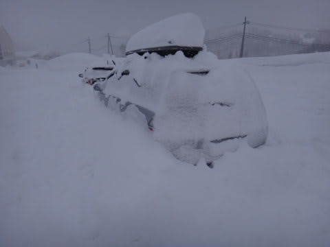
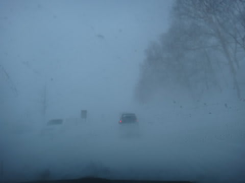
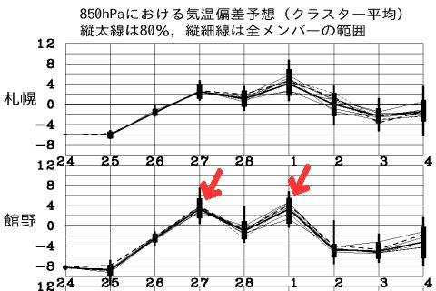
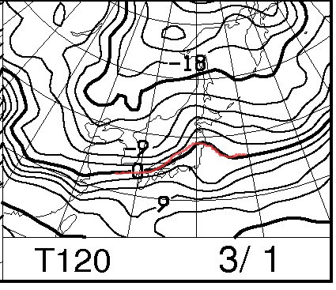
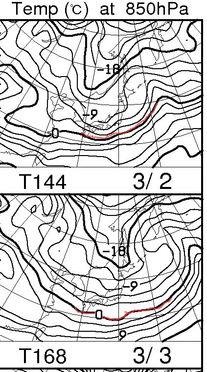

# うむ？昨日まで冷えひえだったけど，今週は暖まるなぁ…

📅 投稿日時: 2013-02-26 02:26:15

で．

昨日まではすげー冷えひえで，がんがん雪が積もっていたわけで．

日曜は，朝8時からリフトストップまでの昼間だけで…

車がこんな状況になっちゃうほど降ってたし．

地吹雪もすごくて．

こんな感じで10mほど前を走っていた車が…

うぎゃーっ！まったく見えなくなっちゃった！

…どっちが道だ？？？

まったく分からん(汗）．

＃「これはネタにしないと！」と，冷静に写真を撮りながら運転している私

って感じで．

冷えひえ＆大雪の先週だったんですけど．

でも，どうやら冷え冷え祭りは一休みになりそうな感じですね～．

今週は，

なんだか…水曜と金曜が危険な感じなんですね～．

こんな感じで，27日の水曜と1日の金曜に，気温が上がります…

FXXN519で，金曜日，3月1日の850hpa気温予想図を見てみると…

…なんだか，0度線が志賀高原より北側まで上がっちゃってるんですけど．

まずい．

ヘタすると，雨になるかも…

今のところ．

私の日ごろの行いの良さのおかげか．

水曜は何とか雨にならずに済みそうな感じです．

気温が上がる水曜は，降水量はほとんどなさそうですし．

降ってもぎりぎり雪になってくれるでしょう．

…かなり湿った雪ですが．

金曜も，降れば雨になっちゃう気温に上がりそうですけど．

何とか降らずに済みそうかな～．

…

うーん．

今週は雪のコンディション，悪化するか？？

…って心配ですが．

ご安心あれ！

こんな感じで，土日は0度線は日本の南まで南下します！しっかり冷えてくれます！

で．土曜は降ります．

そこそこ冷えたいい雪が降りそうなので．

金曜に雪質が悪化しても，土曜には復活するはずっ！！
