# 2020/12/12(土)の志賀高原，焼額山スキー場は…朝は硬め，昼間も雪はそれほど緩まず．リフト待ち最大5分くらいかな…

📅 投稿日時: 2020-12-12 22:47:44

ということで．

本日，予告通りマイホームゲレンデの，

志賀高原は焼額山スキー場で滑ってました～！

だもんで．

いつも通り，本日の焼額山レポートです…！

えー．まず．

志賀高原の登り坂はほとんど積雪なしで，

でも，最後のちょっとだけは路面積雪

が残っている感じだったものの…

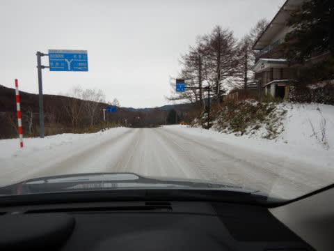

ここ3日間は温かい日が続き，天然雪が全く

積もらなかったようで，ヤケビ第2高速沿い

はまだ全然滑れない感じですね(泣)

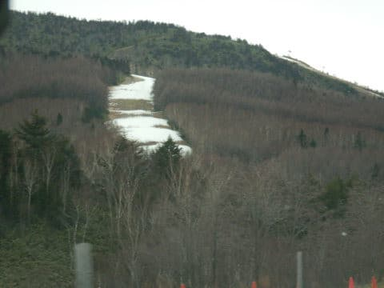

ってなことで．

焼額に到着しますが，

朝の気温は-1℃ですか…

朝の冷え込みはちょいと足りない感じ(涙)

うーん．

もっとガンガン冷えてほしいところ…

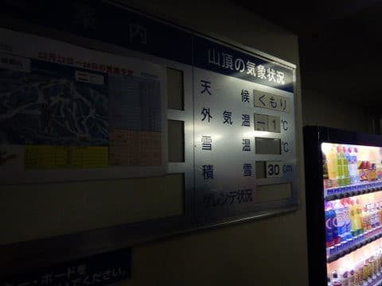

この1週間，冷えが足りなかったおかげで，

今日も焼額は第4ロマンス1本しか滑れません(泣）

熊の湯は山頂から，横手山もリフト2本滑れるので，

ペアリフト1本の焼額は，今日は混まないかな…

と思ってたけど．

先週ほどではないものの，オープン前の列は

結構並んでますね…

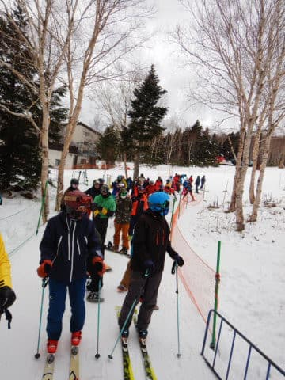

ってな感じで．

今週は冷え込みが足りなかったものの．

朝イチリフトで山頂へ向かうと…

リフトの上から見えたのは…

ぐほぅ…これは…

ピカピカ圧雪！！

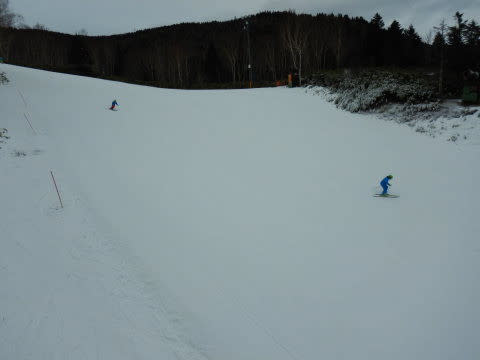

リフトを降りると…

うほーーーーー！

シマシマっ！！

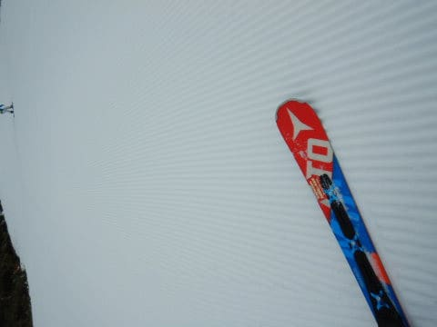

あさイチの見事なシマシマ！

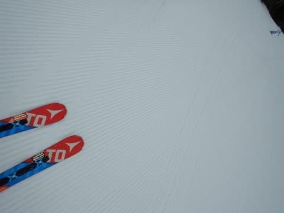

…ですが．

しばらく天然雪が積もってなかったので．

かなり硬めのカリカリした感じで，

ところどころ飛ばされるような感じも

ありましたが…

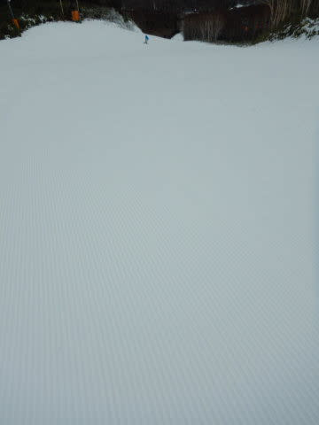

でも，スピードの乗るシマシマバーン！

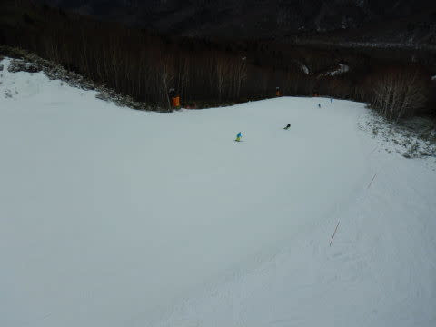

で，

朝のうちはリフトもガラガラだったものの，

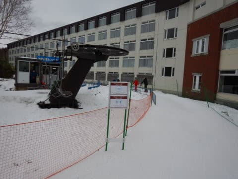

営業開始30分を過ぎた9時過ぎには，リフト

待ちの列も伸び始め…

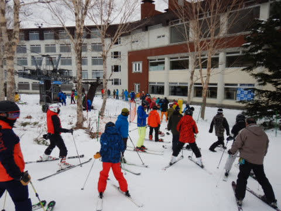

10時近くには，5分くらいにまでリフト待ち

時間が伸びました(泣)

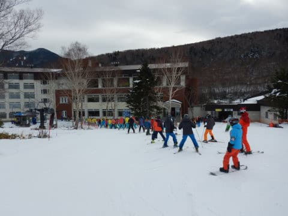

うーむ．

今日は，山頂から滑れるようになった

熊の湯やリフト2本滑れる横手に人が

集中して，焼額は混まないと読んでいたのに，

読みは外れたようです(涙)

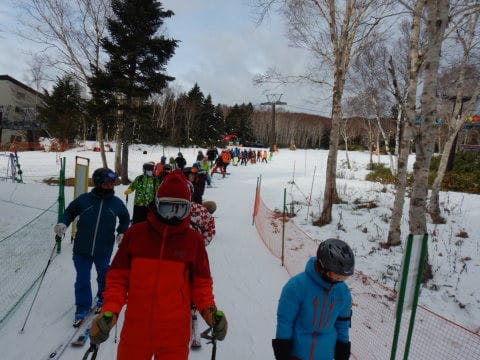

とはいえ，ゲレンデはペアリフト1本分の

輸送力で運べる人数だけで，それほど

混雑することもなく．

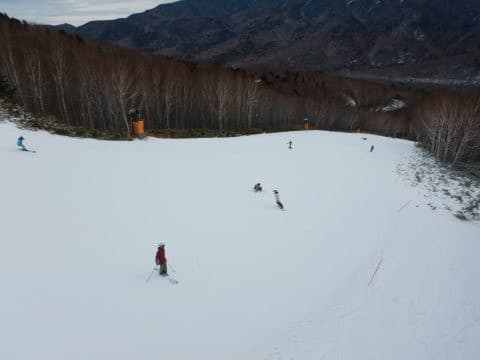

さらに今日は，昼になっても朝から

気温が上がらず．

日が射さなかったので，雪も全く緩まず…

昼になっても，結構締まった感じの

雪をキープ！

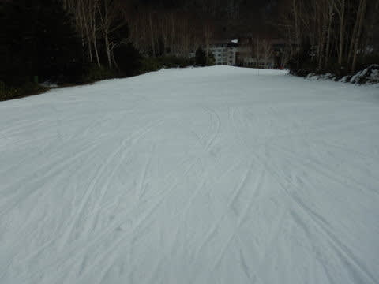

さらに，昼頃になると，リフト待ちも

短くなり…

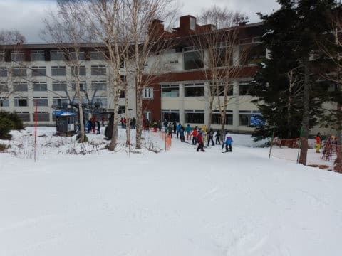

午後はほぼ飛び乗り状態！

先週の激混みに比べれば，

シアワセなガラガラ具合！

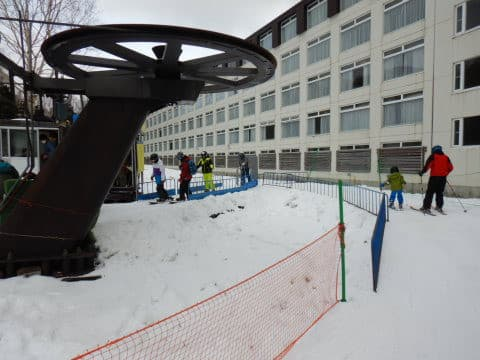

…でしたが．

午後1時ごろから，ちょっとガスが出てきて…

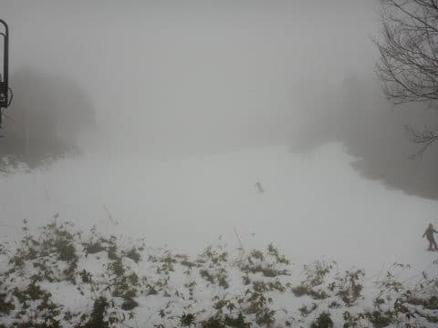

そして予想通り，積もるほどではないものの，

雪がぱらついてきました…

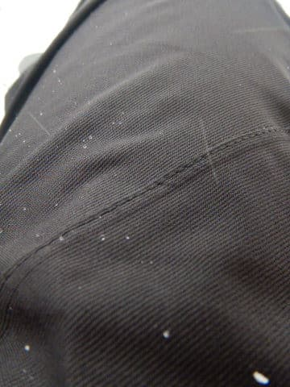

積もるほどではないのが残念…(涙）

ただ，気温が高めで，午後2時ご半過ぎには，

そこそこ強めに降って来たので．

ゴーグルに張り付いてちょっと前が見にくい

感じ…(泣）

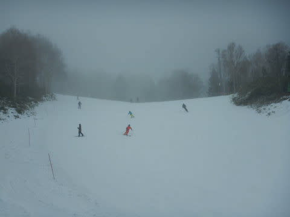

どうせ降ってくれるなら，一晩で第2高速リフトが

動いてくれるくらい，ドサドサ降ってくれれば

うれしいんだけど…

そこまでの降雪量がないのが惜しい…

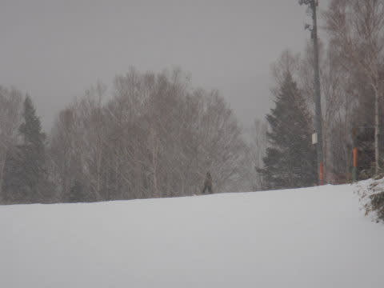

とはいえ．

今日は午後まで雪が全く緩まず，

かといって硬すぎるガチガチじゃない，

いい感じの雪をキープしてくれたし．

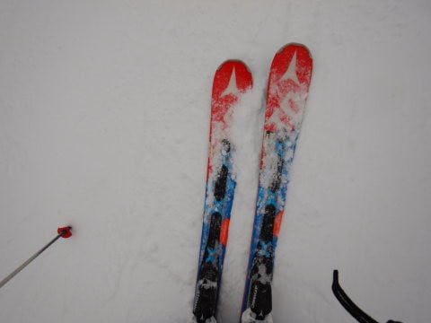

午後はリフト待ちも少なく．

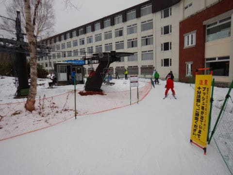

コース上もそれほどひどい混雑もなく．」

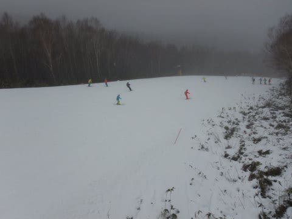

バーンも多少凸凹したところも

あったものの，それほどひどく荒れたり，

土が出てきたりするところもなかったし．

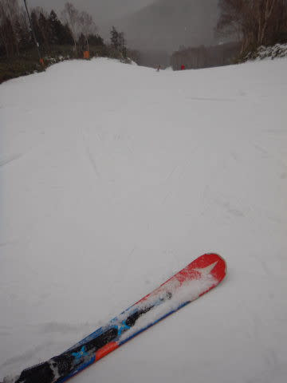

うむ．

今の時点では，他のスキー場と比べても，，

焼額は比較的いいコンディションなのでは…

と思った，Skier_Sなのでした．

…ただ．

焼額，これから明日にかけてもほとんど積雪はなく．

残念ながら，明日も第2高速は動かさない

ことがほぼ確定なのが残念…

でも．

あしたの朝までに，1-2cmは積雪がありそうなので．

明日の朝イチは，うっすら天然雪が圧雪された，

かなり気もちいい1本が滑れるかも…！

## 💬 コメント一覧

### 💬 コメント by (ikkun)
**タイトル**: Unknown
**投稿日**: 2020-12-14 20:49:01

お疲れ様です😌💓こうして雪無しの地区から来て頂くスキー大好きな方々のお陰で私し達も恩恵に預かりますm(__)mちなみに私しは７日月曜に一人熊でした(笑)

### 💬 コメント by (Skier_S)
**タイトル**: ＞ikkunさま
**投稿日**: 2020-12-15 06:27:23

平日に滑れるのはうらやましいです…

そして，片道4~5時間，ものすごい時間と高速代金＆ガソリン代金を

払ってきている首都圏在住者にとって，

スキー場が近いのはうらやましい限り…

