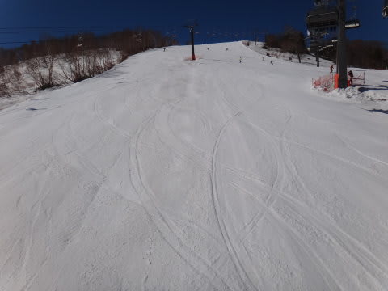
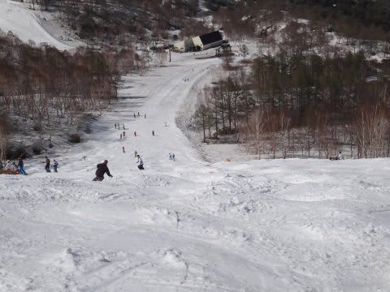

# 5月18日，土曜のかぐらは…近年まれに見る積雪量！コンディション良好っ！

📅 投稿日時: 2013-05-19 00:57:23

ってことで．

予告どおり，この土曜日にかぐらへ行ってきたわけですが…

…なんだか．

GW前に雪が消えてしまうのでは？？

と心配した3月ごろには想像できなかったことに．

豪雪の年レベルの積雪量なんですけどっ…！？

…いや，それ以上かも？？

…恵まれてる．

恵まれてます．今シーズン．

ってことで．

もう5月も下旬というのに…

まだ，みつまたロープウェーを降りたところから雪は十分にあります…

これは，来週の最終営業まで，バス移動せずに済みそうですね～！

一番やばそうなのはみつまたのクワッドを降りてから，ゴンドラまでですが…

まぁ，硫安攻撃であと1週間はもつかな～．

ってことで．

7時半の営業開始前からロープウェーに並んで，

ロープウェー→みつまたクワッド→ゴンドラと乗り継いで，かぐらまでやってきましたよ～

さらにかぐらクワッドで山頂に上り…

朝イチのメインバーンへ出てみると…

うひょう！

うほほ！

うはーーーー！

人も少なく，この時期にこれだけの幅のコースを大回りできるとはっ！

…まぁ，朝イチでも雪は結構ネットリとしたやわらかい雪ですが…

でも，5月下旬と考えれば恵まれたコンディション！

いやーー．

いいねぇ…

と，滑っていたら．

いつもどおり，9時半ごろには人が増え始め…

リフト待ち5分くらいまで伸びてきましたな…

…でも．

今日の午前中は最大でも10分，平均5分ちょい待ちってところで．

先週より待ち時間は短かったかな～．

だけど．

ゲレンデの人口密度はそこそこ高く．

雪もやわらかいので．

11時ごろにはこんな感じに…

先週は，昼前には全面コブになったけど．

今週は，全面コブ化したのは1時過ぎくらいかな～．

1時半でこんな感じでした．

…でも．

この時期に滑っている人はみんな，スキーバ○な人たちなわけで．

…よくこれだけのスキー○カが集まりますね～．

おそらく今日，かぐらに爆弾が落ちたら，日本のスキーバ○のかなりの

割合が抹消されてしまうでしょう…（笑）．

とりあえず．

テクニカルコースもまだほぼ全面滑走可能．

ジャイアントコースも…

てっぺんにわずかに土がでてたものの．

それ以外は驚くことに，まだコブ溝にも土が出てこず，ほぼ全面滑走可能です．

いやーーー．驚き．びっくり．

5月下旬でジャイアントコース全面滑走可能なんて！

うーむ．すばらしい…

で．

メインバーンは，午後2時を過ぎると完全全面コブコブ斜面と化しまして…

盛大なコブ祭りが開催されてます．

かなりのお祭り状態です

この時間になると，リフト待ちも短かったですね～

午後は最大5分待ち，平均2-3分ってところかな？

ってことで．

4時のクワッド営業終了まで滑りましたが．

下山のゴンドラコースもまだ幅十分．

みつまたコースも，来週まで余裕でスキーで下りれそうですね～．

…ってことで．

この時期にはあるまじき積雪量のかぐら．

天気も良く，かなり楽しめました．

いやー！

今シーズン，3月のダメダメを，4月下旬から取り戻している感じですね～！

なんだか，まだまだシーズン終わりとは信じられないんですけど…

## 💬 コメント一覧

### 💬 コメント by (いか)
**タイトル**: Unknown
**投稿日**: 2013-05-19 01:26:28

ほんとに「うひょう！」って感じですね。

私のシーズンは終わってしまい、道具も全部磨いて片付けちゃいました…^^;

まだまだおわってないですね！

雪山通いが終わると、僕も海に出かけます。釣りですが(笑)

### 💬 コメント by (Skier_S)
**タイトル**: まだまだ終わりませんよ～
**投稿日**: 2013-05-19 01:46:03

いやー．

この写真を見て，もうじきシーズン終了ってのが

自分でも信じられないんですが…

今年は恵まれてますよ～っ！

まだ来週まで滑れますよ～！！

…で，スキーが終わったら釣りですか…

私は海の目の前に住んでいるんですが．

目の前の海で，釣りをやっている人がいっぱい

いるんですが．

…私は残念ながら，釣りをやらないんです…

こんな私を釣りをやる人から見ると，

スキー場目の前に住んでいるのにスキーをしない人

とおんなじように見えるんでしょうね…(笑）．

### 💬 コメント by (gokuraku skier)
**タイトル**: Unknown
**投稿日**: 2013-05-20 21:22:01

なんか急にコブが滑りたくなってきました。

それにしても５月中旬とは思えない程雪が残っていますね。

### 💬 コメント by (Skier_S)
**タイトル**: gokuraku skierさま
**投稿日**: 2013-05-20 22:36:20

いやーーー．

5月下旬としては，めったに無いレベルの積雪量です…

今年のかぐらはGoodですね！

6月まで余裕でもちそうなので，6月までやってほしいなぁ～…

って思ってます(笑）．

