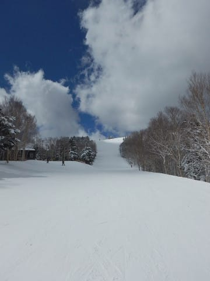

# 2019/3/31(日)の志賀高原スキー場，詳細モード！…冷え冷えトップシーズン並みの最高雪質！そして時折晴れ間もあって，かなり恵まれたコンディション！

📅 投稿日時: 2019-04-03 00:52:54

予想通り．

本日も，志賀高原は，真冬並みの

いいコンディションだったようですね…

…そして．

なんと．

今もまた，雪が降ってるようです！

（[焼額山スキー場FB](https://www.facebook.com/yakebitaiyama/posts/2110023902426278)より）

もう，日曜から3日連続で，冷え冷え雪が

降ってますよ！？？

さらに．4月というのに．

上林チェーンベースでも積雪が…！

（[北信建設事務所HP](http://hokushin-camera.org/)より）

明日3日の水曜日も，朝は-10℃クラスの

冷え冷え新雪！

朝は20cmくらい積もってるかも？？

…昼間も-5℃くらいまでしか上がらず．

雪が降り続ける，真冬の一日ですね…

あぁ…

明日も最高だろうなぁ…

ってことで．

本題へ．

今さら感がありますが，日曜の志賀高原の

詳細レポートです…！

ってなわけで．

土曜は朝3時に家を出て．

さらに夜11時半まで飲んでいたので．

死にそうなほど眠いところを

早朝スキーに参戦するために，

頑張って朝早くに起きて．←前日に飲みに行かなきゃいいのに…

朝6時に宿を出たところ…

をを！

昨晩から，そこそこ雪が積もったようです…！

そして，焼額早朝営業のゴンドラスタート

開始前に並びますが…

並んでいる人は，大体がいつもの

顔ぶれですね（笑）．

で．

ゴンドラで山頂にやってくると．

あさイチの山頂気温は-4℃と，

冷えてます！

早朝はもう少し冷えるかと

思っていたんだけど…

まぁ，大体予想通りの気温ですか．

そして．

山頂のゲレンデに出てみると

…ガスですね（涙）

でも，ゲレンデは．

圧雪後に5cmほどの新雪が積もったようで．

結構軽い新雪が，ゲレンデ全面を

覆ってますよ！

山頂ではガスだったけど．

コース途中まで下りると，視界が

開けてきて…

軽い新雪を蹴散らしながら．

早朝ガラガラゲレンデを

かっ飛ばす！

これ，ホントに明日から4月か！？？

ありえないほど最高の雪質なんです

けどっ！？？

昨日とはえらい違いだ…

早朝開始から30分ほどは，

山頂にガスが残ってましたが…

しかし．

1時間も経った7時半ごろには，

薄日も射してきましたよ！！

素晴らしいっ！

ゲレンデがはっきり見えて．

雪も3月と思えない冷え冷え新雪で．

早朝なので，ゲレンデもガラガラ…

3月末で，これだけ恵まれた

コンディションで滑れるとはっ！！

3月末では，これ以上望むべくも

ない，最高コンディションっ！！

…そして．

通常営業開始の8:30にオープンとなる，

第2ゴンドラ側のパノラマ-サウスコース側へ，

オープン直後に飛び込むと…

またまた朝イチのフレッシュバーンを

楽しめるのだ！

いや…

これ，ホントに明日から4月か？？？

そして．

天気は曇り空ながらも．

タイミングによっては，日も射す

時もあったり．

また雲がかかったり…

という天気だったけど．

うっすら日も射すので，

ゲレンデはある程度見やすく…

だのに．

昼間も最高気温は-3℃と．

早朝からほとんど気温が上がらず．

だもんで…

雪質は，昼間になっても最高のまま！！

…というより．

午後に向かっての方が冷え込んでいき．

昼を過ぎてから，さらに雪質が良くなって

行っている気がするんですが！？？

さらには．

なんだか，午後になると，

日が射す時間が増えて行っている

気がするんですが？？

すっきり晴れではなかったけど．

雲の隙間から，時折太陽が顔を出し．

ゲレンデを照らし出してくれます！！

だのに．

3月末で，日が射しているというのに．

なぜ，こんなに雪質がいいんですか！？？

トップシーズンでも，これだけ滑りやすい，

冷え冷えなのに締まっている雪って…

そうそうないですよ！？

そして．

日曜午後は，

ゲレンデの人も少なく…

そのおかげで．

バーンは夕方まで全く荒れることは無く．

というより．

夕方まで，恐ろしいほどのフラットなままで．

あぁ…

最高．

まさか，3月最終週に．

お日様のもと，夕方まで

こんな最高雪質の一日を過ごせるとは，

思ってなかったよ…（感動）

ただ．

朝に圧雪がかからなかったオリンピック

コースのみ．

ちょっと新雪がボソボソに固まったような

雪質だったのが惜しいけど…

それでも，この時期のオリンピックコース，

午後遅くになってもまったく雪が緩む

気配もないって…すごい…！

ってな感じで．

午後3時過ぎまでは，時折太陽が

射す中，エッジがガッツリ食い込む

いい感じに締まった圧雪の，

ガラガラフラットバーンを

気持ちよく滑れましたが…

残り営業時間も1時間を切った，

午後3時半ごろ．

え？雪？？？

雪が降り始めましたよ！？？

それも，冷え冷え雪が，

かなりの勢いで降り積もり

始めましたよ！？？

はっきり言って．

寒い．

とても明日から4月と思えないほど，

寒いんですけど…！？？

でも．雪質は最高！

…ってな感じで．

時季外れの冷え冷え最高雪質に

恵まれて．

ガラガラ＆フラットバーンを

一日中気持ちよく飛ばすことが

できて．

この日もいつも通りのゴンドラストップまで．

早朝からの10時間．

たっぷり楽しんだのでした…

いやーー．

土曜はひどい状況だったから，

どうなることかと思っていたけど．

日曜は想像を超えるいいコンディション

で，良かったなぁ…

うーむ．

今年は2月より，3月の方がコンディションが

いい気がするし．

2月よりも3月末の方が，間違いなく積雪が

増えてます！

とりあえず．

現時点では．

今年のGW．雪不足の心配は無さそうに

なってきたかな～．
