# 1月27日(月)の志賀高原スキー場は雲が多めながら晴れていいコンディション！そして29，30日は志賀でもそこそこ雪が降る！2日はちょっとヤバい

📅 投稿日時: 2025-01-28 02:51:23

えー．

本日も志賀高原の特派員から送られて

きた写真によると…

雲は多めながらも，青空がのぞく

いい天気だったようです…！！

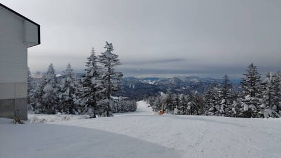

朝の気温は-10℃といい感じに

冷え冷えで…

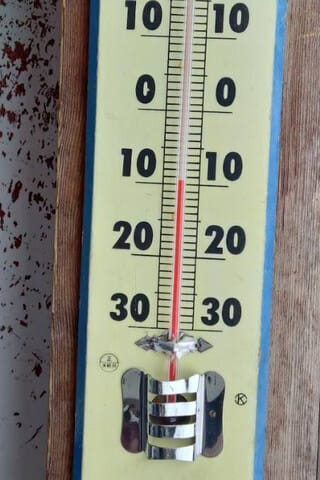

朝イチは雲が多かったものの，薄曇りで

バーンも良く見えたようですね…

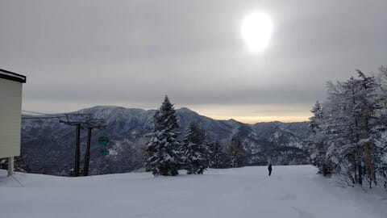

そして，かなり良さげなシマシマバーンじゃ

ないですか！！

サウスコースは人が多かったみたいですが．

白樺やパノラマコースはほぼ貸し切りだった

みたいで．

こんなシマシマバーンを，平日のガラガラの

状態で楽しめるとは…

うらやましぃ～！！

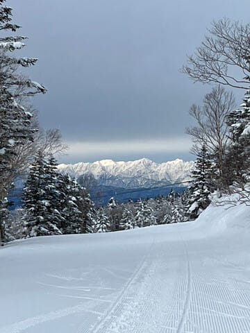

この日も，かなりいいコンディションで楽しめた

ようです…

志賀高原，今シーズンはあんまり激しく

吹雪いたりする日が無くて，割と穏やかな

いい日が続いてますね．

これで雪がいい感じなんだから，今シーズンは

結構恵まれてる感じ…！

ってなことで．

このいいコンディションが続くのか，

天気図を見てみると…

29日の水曜日の天気図はかなりはっきりした

JPCZが出てますよ…！！

これは日本海側で，結構な雪になりそうですが…

ですが．JPCZが志賀より東側に突き刺さって

いるように見えるので，かなりの西風ですね（泣）

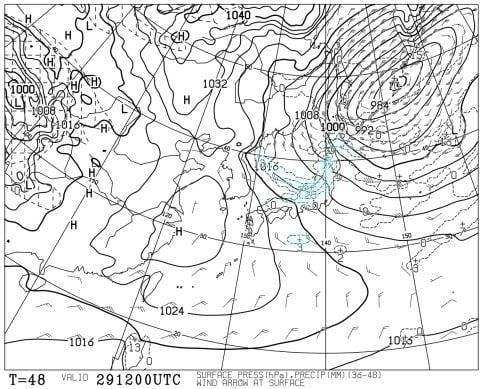

かなりの西風とはいえ，500hPa図で

豪雪の目安の-36℃線がかかりそうなレベル

なので，根性のある雪雲が北アルプスを

越えてくるレベルなので，志賀でも29日は

雪はそこそこ降ると思います…

でも，西風なので…最低で一晩で

10cmくらいかな？

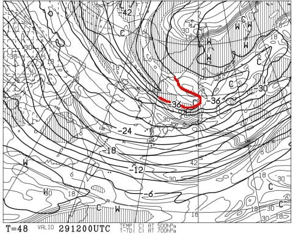

そして，30日（木）の天気図を見ても，

かなりはっきりくっきりしたJPCZが

出てます！

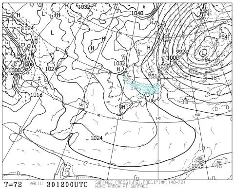

もう，拡大するとこんな感じですね．

JPCZの向きは，ちょうど志賀高原を

向くくらいの感じですね…

もう少し西に刺さるように，風が北に

回ってくれるとドサドサ積もるんだけど…

でも，JPCZが志賀よりずっと東に

行ってしまうレベルの西風じゃないので．

この日も，志賀では雪が降りそう…！！

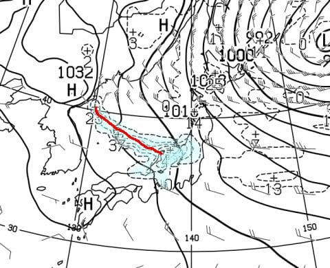

ってなことで．

29，30日はぼちぼち冷えて，雪も降りそう

ですが．

これからの850hPa気温傾向を見てみると…

ええ？？

なんだか，2月2日の気温，異常に高く

ないですか？？？

昨日までの予想よりかなり高くなってるので…

これ，ヤバくないか？？

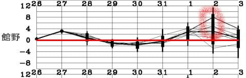

2月1日の850hPa気温図では，赤い0℃線は

志賀よりまだ南にあるので安心ですが…

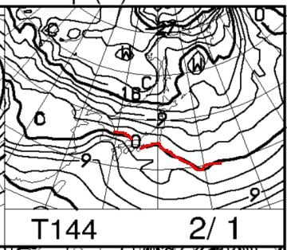

2月2日の850hPa気温図では…

うーん．赤い0℃線が，ちょうど志賀に

かかるくらいまで北上してきてますね（泣）

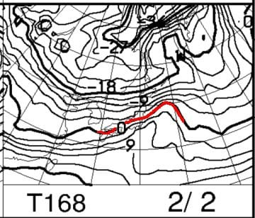

まぁ，0℃線が志賀より北まで行って

しまわないと，志賀高原に液体が降る

可能性は低いので，大丈夫と思いながらも…

降水量があったら，標高が低いところは

雨になりかねないレベル．

果たして，この日は降るのか晴れるのか？？

地上天気図を見ると…

…

…網掛けの降水域がかかっているので，

降りますね…

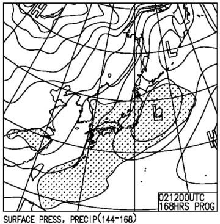

でも．

850hPaの気温のグラフを見てみると，

水色で示したコントロールランが

2日のエラーバーのかなり上にまで

行ってしまっていて…

真ん中を通る平均値を示す太線より

ずっと上に行ってます！

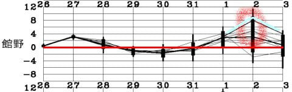

さっきも見せた，この850hPa気温はGSMなので，

気温が高めのコントロールランの予想天気図

になりますね．

実際の天気は平均値に近づくことが多いので，

実際はこの図よりも0℃線は南に下がり，

気温がもっと冷える方向に行くと思います…．

まぁ，大丈夫かな．

…ってなことで．

この土日は気温がこれまでより高めながらも

土曜は晴れ．

日曜は雨にならずに雪降りになりそうです…

そして，3日以降は．

この図を見てわかるように，冷えますよ～！

来週いっぱいはかなり冷え込んで，

雪も結構降りそう…！！

来週は毎日パウダーデーになりそうな予感…！

とりあえず．

少なくとも2月8，9日の週末までは，

志賀高原はいいコンディションが続きそうです…！

## 💬 コメント一覧

### 💬 コメント by (レインボー77)
**タイトル**: Unknown
**投稿日**: 2025-01-28 15:25:29

火曜日の志賀高原情報

朝の蓮池-4℃。曇ったり晴れたりの日。白樺はやや硬で4点/5。唐松も4点。オリンピックはフラットに削られたさらさらが乗って楽しい4点。GSは混んでなければ申し分なしの4点。パノラマも4点。サウスは激混みコロコロの2点。三高イーストは硬めで期待はずれの3点。ダイヤがこの日もベストで5点。終わりよければすべてよし。気分よく12時終了でした。

明日の午後の雪はどれだけ積もるのかなあ？

### 💬 コメント by (Skier_S)
**タイトル**: ＞レインボー77さま
**投稿日**: 2025-01-29 01:42:38

うーん．雪が硬くなってきてますか…

でも，明日から降ります！積もります！

…その代わり，雪が柔らかいので荒れるのが早いですが…

木曜，金曜は新雪ねらい目ですよ～！

