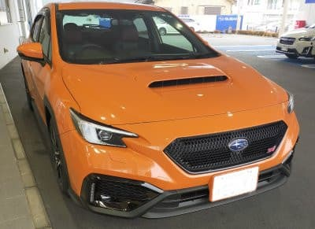
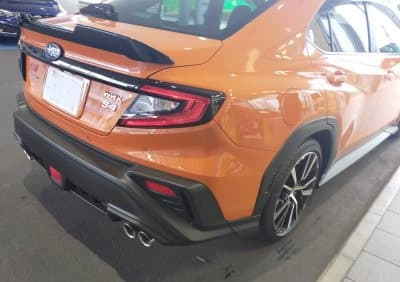
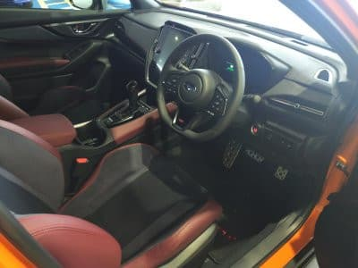
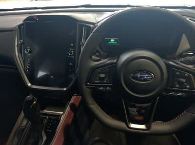

# 新型2.4LエンジンになったスバルWRX S4に乗ってきたよ

📅 投稿日時: 2022-04-30 00:09:01

えー．

今晩，志賀高原では雨が降っていて．

そして明日の朝は冷えそうなので…

今晩中に，標高が高いところは雪が

ぱらつくかも？

そして，ぬれた路面が明日の朝は

冷えて凍っている可能性があるので，

明日の朝に志賀高原に行く方は

お気を付けください…

ちなみに，志賀草津道路は，すでに

路面凍結のため通行止めになってます！

明日の朝は草津道通れないので

ご注意を…！！

…ってなことで．

スキーに行かない休みだというのに，

朝から起きてワクチン接種やら

スキー板の手入れやら車のメンテやらを

やっていた今日一日ですが．

あっという間に一日が終わってしまう…

そして，明日は午前2時出発…

というか，実質今晩出発だから．

早く寝ないと…

とりあえず，久々にスキーに行かない休日だった

今日，車のオイル交換その他にディーラーに

行っていたわけですが…

せっかくスバルディーラーまで行ったんだから，

当然，B型販売と同時にラインナップに追加された

LEVORGの2.4L，STI Sport Rに試乗したい

と思っていたところ．

残念ながらLEVORGの2.4Lの試乗車は出ておらず(涙)

Skier_S「残念…2.4L乗ってみたかったのに…」

ディーラさん「WRX S4なら同じ2.4Lエンジンだし，

試乗車がありますよ？」

S「…乗せてください．乗ります．乗りたいです！！」

ってなことで，急遽試乗させてもらうことに

なった，WRX S4．

実車は…イメージカラーのオレンジ色の

派手な車体ですね～．

セダンですが，テールランプのグラフィックは

LEVORGと共通のイメージですね…

そして，事前にWebの画面で見た時に

気になっていた，SUVっぽいホイール周りの

樹脂のクラッディングですが．

…意外と悪くない．

私は許容範囲．

早速乗り込んだところ…

室内は…LEVORGと完全に共通ですね．

シートが多少違うのかな？

でも，差分が分からん…

ってなことで．

おそらくLEVORGと全く同じだろう…

と思って乗ったWRX S4．

エンジンを始動させると，アイドリング時のエンジン音は

スポーツカー的な排気音を聞かせるような演出は無く，

高級車的な静かさ．

…最後の完全ガソリンエンジン車になる

だろうWRXなのに，お上品なこと…

と，数m動かすと．

モードセレクタはNormalなのに．

ステアリングがかなり重い！

そして，段差を乗り越えた際のショックの

減衰量もかなり高そうな感じ…

エンジン音はおとなしいけど，

LEVORGよりしっかりと重いステアリングと

減衰の強いダンパーで，よりスポーティーな

感じを出してますね．

ってなことで，走らせてみたところ．

気になる2.4Lエンジンですが．

DBWのアクセルペダルに対する非線形性を

強くして，加速感を演出してるかな？

…と思ったら，そんなことは無く．

アクセルの微小開度領域でもドカンと

スロットルを開けるような下品な制御は

していませんね．

街乗り領域の操作性は全く文句なし．

10km/h，20km/h，30km/h…と10km刻みの

定速走行もぴったり決められる，

アクセルペダル反応のリニアリティの高さは

文句なし．

エンジン音も驚くほど低く，ロードノイズの

方がよっぽど目立ちますね…

で．

2.4Lエンジンで気になるのは，やっぱり

そのパワーなので．踏んでみる！

…

…

…十分です．

私にはこれ以上のパワーは要りません…

先代2Lの300psから現行2.4Lは275psと，

カタログ馬力は落ちてますが，

下品なターボラグは全く無く，

アクセルを踏んだ瞬間からブーストが

効いてる感のトルクが出てきます．

2Lエンジンよりずっとトルクが太く，

加速初期のダッシュは圧倒的に

2.4Lの方が速いです．

私のLEVORGの2Lエンジン，Iモード時の

アクセル開度が大きな領域では，

アクセルを踏んでからかなり時間が経って

ブーストが出てくるので，ブーストが出てから

慌ててアクセルを戻すことがありますが…

このFA24エンジンは，ターボラグをそれほど

感じず，遅れて出てくるトルクにアクセルを

戻すような，下品なラグは無い！

いや…これはいい．

カタログ馬力は落ちてるけど，絶対的に

2.4Lの方が完成度は高い！！

アクセル開度が小さい領域では

普通の大人しい車と同様，

過剰なトルクが出すぎることなく

お上品に運転でき．

アクセル開度を大きくすると，

ターボラグなくしっかりトルクが提供される

という，これは結構理想的なパワーユニット＆

シフトの仕上がりですね…！！！

と，気持ちよく乗っていて．

信号待ちで止まったところ．

驚くことに．

2.4Lターボ，アイドリングストップが

ついてるんだ！！！！

ついにこういうスポーティーなモデルも，

アイドリングストップが導入されて

来たのか…

アイドリングストップからの始動は，

やはり往復慣性質量が大きい2.4Lエンジン．

かなりサイレントに始動するLEVORG1.8Lに

比べると，かすかに振動が感じられるレベルで，

「お，エンジンかかかってる」

って感じ．

でも，従来の2.5LのNAエンジン，FB25に

比べればかなり静かに始動します…

そして．

足回りですが…

Normalで十分締まった感じのダンパーですが，

Sportsモードにするとさらに締まっていきます．

が，元が硬めなので，LEVORG 1.8LのSTIより

モード切替時の変化が少なく感じるかも？

で，ちょっとコーナーを攻めてみると，

コーナリングの時のロールの少なさは

驚くレベルですね．

サスジオメトリはLEVORGと変わってないから，

ロールセンター上げたとかもないだろうし…

フロントスタビを強めたのかな？

とりあえず，Sportモードだと

ラグの少ないトルクのあるエンジンと

ロールが少ないサスで，ちょっとびっくり

するくらいのスピードでも，安心して

コーナーを曲がって行けますね…

ってなことで．

多分，同じ2.4Lエンジンだけど，WRXは

おそらくLEVORGよりスパルタンな方向の

味付けがされてるっぽいな…

と思った今回の試乗ですが．

まぁ，2.4Lのポテンシャルは分かった．

かなりすごいけど…

私としてはこんなパワー使うことは

無いから．

1.8Lで十分かな？？←まさか，新型買う気になってるのか？

## 💬 コメント一覧

### 💬 コメント by (ほっぽ)
**タイトル**: 物欲選手権ですね
**投稿日**: 2022-05-01 06:29:15

Ｓさん

これは物欲選手権開幕を知らせるネタじゃないですか？(^^;

2Lレヴォーグ、いつでも適価で下取りさせて頂けますよ☺

そして私のアウディは某氏が下取りスタンバイOK。

まるでスキー板のような流れになっていますね(^^;

私も昨日の志賀高原をblogにアップしました。

http://www2.tokai.or.jp/nana_hoppo/

### 💬 コメント by (Skier_S)
**タイトル**: ＞ほっぽさま
**投稿日**: 2022-05-01 22:09:30

いや，プロジェクトX3はまだ2年から3年は後の予定ですから～！！

