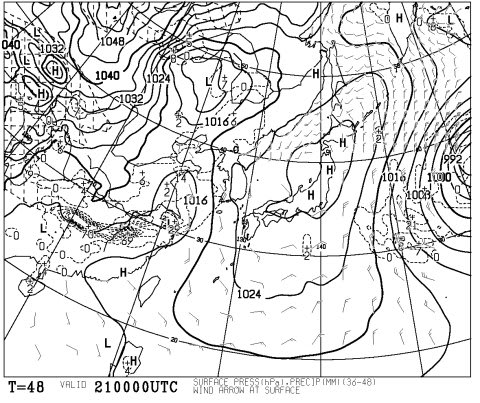
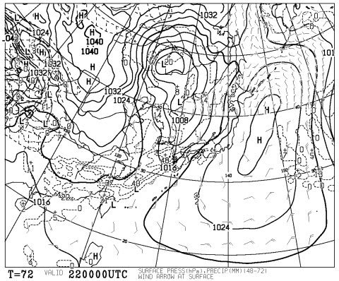

# 今シーズンも，もう半分終わってしまったのかっ！！

📅 投稿日時: 2015-02-20 01:05:01

🏷️ カテゴリ: [日記](cc4b5682fb7b8b144980957a978653fb0.md)

あー．

なんだか．

この週末．

低気圧の動きが，予想より早まりつつあり．

ちょっと予想がずれてきました…

土曜の朝は，雪がちらつくかも

と言っていたけど．

こんな感じで，土曜は朝からすっぽり高気圧に覆われるので．

どうも，土曜は朝から晴れそうですね～

土曜は一日晴天です！

土曜は，絶好のスキー日和になるかな！

ただし．そのかわり…

日曜の低気圧の接近が早まって．

日曜朝には，低気圧が日本海に迫ってきてます…

ううううううううーーーーん．

日曜は，朝から曇りそうな気配…

気温が上がる予想は変わらないので，日が射すより

曇った方が雪は溶けなくていいんだけど…

でも．

この低気圧．日曜午後には，さらに本州に近づくので…

夕方あたり，ヘタするとぽつ，ぽつと．

何か降るかも…

いや，今のところ．

降る可能性は低いんですけどね．

でも…ゼロとは言えない感じ…（戦慄）．

うーむ．

さらにそのあと．

23日の月曜日は．

なんだか，かなりの確率で，志賀高原でも

雨になりそうな感じなんですけど…（涙）．

で，そのあとは，26日まではあんまり雪が望めない

感じで．

来週のゲレンデ状況が，ちと心配になる今日この頃，

皆様いかがお過ごしでしょうか．

という，長い時候の挨拶のあと，

本題へ．←ここまでが本題だったのでは？

えーとですね．

私はシーズンに，大体65日ほど滑るわけですが．

…すでに，今シーズン滑走日数33日なっちゃってることに

気づき…

あれれれ？もう，シーズン半分終わっちゃったのかっ！！！

残すところは，あと半分しかないのか…っ！

なんだか，今シーズンがまだ始まったばかりのような

気がするんですけど．

こんなにすぐシーズン後半戦に入ってしまうなんて…

なんだか，時空がゆがんでるんじゃないかなぁ？？

早いっ！早すぎるッ！！（激涙）

で．

シーズン半分の，33日滑ったわけですが．

実は今シーズン，いまだに転倒回数0回なんですよね．←ちょっと自慢

う～む．

これまでの最高記録，シーズン開始後50日未転倒という

記録を更新できるかも…？？

そして．

[今シーズンは6回転ぶことになる](eaa8dd484de871071bee591de597d3e5a.md)…

という，忌まわしい連鎖は断ち切れるはずっ！！

## 💬 コメント一覧

### 💬 コメント by (れお)
**タイトル**: 明日はサイコーですよ!!
**投稿日**: 2015-02-20 22:16:32

今日、単身日帰り志賀高原しちゃいました(^o^)

（その代わり、今週末は行けないのですが…泣）

晴れ間もちらっと有ったものの、雪が降り気温も低かったので、明日朝の圧雪バーンは最高だと思いますよ～♪ 楽しんできて下さい～!!

で、今日、レンタルですが太板デビューしちゃいました♪

太板ヤバいですよ!!  メチャクチャ楽しかったです～!! ほしいほしいほしい…。

もう買っちゃうかもです～。

Sさんも購入どうですか～？

### 💬 コメント by (Skier_S)
**タイトル**: れおさま
**投稿日**: 2015-02-20 23:35:52

え？

単身日帰り志賀ですか…

かなり来てますね～（笑）．

でも，いいコンディションでよかったようで，

何よりです…

明日ピーカンっぽいので楽しみです．

…でも，太板デビューですか？

センター幅どのくらいの，どんな感じの

モデルでしょうか…？

セミファット的な感じですか？

また，教えてください！

### 💬 コメント by (れお)
**タイトル**: 太板の情報です
**投稿日**: 2015-02-21 22:49:50

先日レンタルした太板は、SALOMON '13-'14 ROCKER2 108 182cm／R19.2U+A0132-108-125 です。

板についての個人的な印象は、

182cmでも、それほど長く感じない。もう少し長くてもオッケーかも。

少し柔らかく感じた。もう少し硬めが好みかも。

大回りなら、そこそこスピードを出して、キレるターンもできる。

もう少し浮力があっても良いかなと思ったので、SXと二台持ちなら、太板は、割りきってもう少し太く（長く）ても良いかも。

という感じです。

ちなみに、私は、179cm、75kgです。

もう今年は、パウダー滑れそうな機会も少しだけですし、試乗会とかでしっかり乗り比べてから決めようかなとも、冷静に思い初めてます。（＾◇＾）

以上、ご参考までに～♪

### 💬 コメント by (Skier_S)
**タイトル**: れおさま
**投稿日**: 2015-02-21 23:19:31

そうなんですね…

やっぱり，センター108mmでも，

2台もちで割り切るなら，もっと太くていいと思うんですね…

そして，長さ182cmですか．

うちのルーフボックスぎりぎりですね～．

うーーーむ．

ちなみに，整地は滑ってみましたか？

どんな感じでした？

また，教えてください！

### 💬 コメント by (いか)
**タイトル**: Unknown
**投稿日**: 2015-02-22 20:05:42

板チェンジ前提で割り切るなら、固めの走る板をおすすめします！

RenegadeとかVariantなど。。。

柔らかめのファットな私は、ジャンキーには置いて行かれるので少しだけ凹んでいます、笑

### 💬 コメント by (Skier_S)
**タイトル**: いかさま
**投稿日**: 2015-02-22 23:50:08

うわーっ！

みんな，私を危険な世界に引きずり込もうとしている…（＾＾；

しかし．

固めの板ですか…

パウダーでも硬い板がいいんですか？

うーむ．

私の知らない世界ですね…（笑）

### 💬 コメント by (れお)
**タイトル**: 整地も
**投稿日**: 2015-02-23 14:50:14

大回りなら、そこそこ（自分的MAX速度の７～８割位では）、ズラすイメージも無く滑れましたので、結構楽しめたかと。

小回りも、ファットだからと割り切って滑っていたせいか、不満とかは特に感じませんでした。もちろん、ＳＸのようなオートマチックなキレはまったくないですが（笑）

ただ、もう浮遊感だけは本当に良くて別次元でした。

普段なら止まってしまうような緩斜面の未圧雪部分を、スーと表面をなぞりながら滑っていってしまうので。

午後になっても、整地脇のほんのちょっとした未圧雪部分で充分楽しめました。

午後でもファットを履き続けるスキーヤーがいるのも、何となく分かる気がしました♪

### 💬 コメント by (Skier_S)
**タイトル**: れおさま
**投稿日**: 2015-02-24 00:34:25

そうですか…意外と整地も行けるんですね～．

うーむ．

意外と，パフパフのディープ新雪じゃなくても

楽しめそうな感じですね～．

思ったより，使える範囲が広そうですね．．．

うーむ．

でも．

お金がない（涙）．

