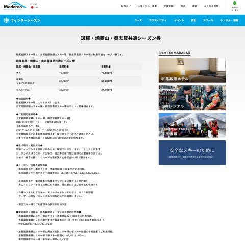
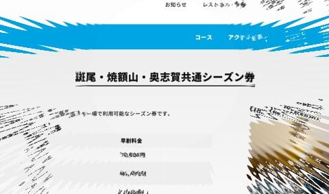
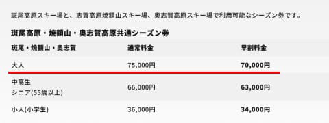
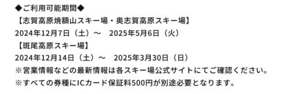
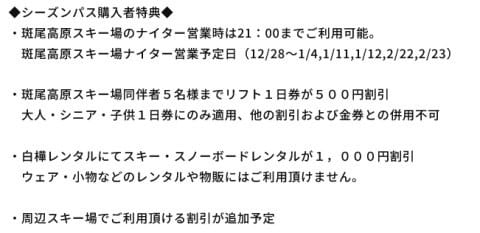
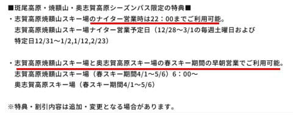
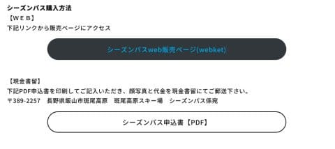
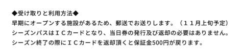

# ええ？2025シーズン，斑尾スキー場・焼額山スキー場・奥志賀高原スキー場の共通シーズン券が発売されるの！？？早割7万円！

📅 投稿日時: 2024-08-22 04:18:09

🏷️ カテゴリ: [スキー雑談](c1f9d2cb7478308da16419928ea3945e9.md)

えー．

ここしばらく，記事を書いている時間が

まともに取れず．

今日ももうこんな時間ですが…（涙）

それでも今日は意地でも更新！

ってなことで．

先日，志賀高原仲間から教えてもらったの

ですが．

[斑尾スキー場のホームページ](https://www.madarao.jp/ski/price/madaraoseasonpass)に，こんな情報が

載っていました…

（[斑尾スキー場ホームページ](https://www.madarao.jp/ski/price/madaraoseasonpass)より．以下同）

こ，これは…

ええええ！！！

なに？

斑尾・焼額・奥志賀共通シーズンパス！？？

こんなものが来シーズンからできるのか…っ！！

お値段は，10月末までの早割なら大人70000円！

うーん…高いのか安いのか微妙だけど…

焼額は次のシーズンは12月7日オープンの，

5月6日まで営業予定ですので．

焼額と奥志賀はシーズンいっぱい使える

ようですね…

斑尾も3月30日までと期間は短いものの，

スキー場の営業自体が3月30日までのようなので．

こちらもシーズンいっぱい使えますね．

まぁ，それが普通で，志賀高原の全山シーズン券

のように，スキー場がオープンしているのに

使えない日があるのが特殊なのか…

そして．

斑尾ではナイターまで使えるうえ，同伴者の

リフト一日券も最大5人まで500円割引に

なるとか，レンタルの割引があるとかの

特典があるようですが…

なんと素晴らしいことに．

焼額のナイターと，

奥志賀＆焼額の早朝に使えるようです！！！

早朝＆ナイターに使えるのは大きい…！！

…でも．

焼額のナイター営業，20時までのはずなのに…

なぜか上の案内を見ると，「22時までご利用可能」

ってなってますね…

まさか，来シーズンはナイターを22時まで営業

してくれるのか…！！？？

だとすると，めちゃくちゃうれしいんですけど！！

（単なる誤植のような気もする…）

で．

申し込みはWebか，現金書留の2通りの方法が

あるようですが．

どちらにしても，11月上旬にICカードが

郵送されてきて．

スキー場窓口に行かなくてもよい，そのまま

ゲートがくぐれるICカードが届くようです…！

…ってなことで．

昨シーズンのヤケオク券と同じ早割7万円で

斑尾のリフト券がついてくる

という，ヤケオク券の実質値下げ！！！

さらに焼額のナイターも，焼額と奥志賀の

早朝も滑りたい放題という，なかなか

よさげな券ですね…！！

志賀全山シーズン券が超早割で89000円だけど，

こいつはナイターと早朝が滑れないので．

ナイターと早朝が滑れて1.9万円安い，

この券は意外とお得かも…

うーん．

一番お安いのに焼額ナイターと早朝が滑れる

焼額限定券にするか，

焼額限定券＋1万円ちょいで奥志賀も斑尾も

滑れるこの券にするか．

ナイターと早朝は別に券を買わなくちゃならない

けど，志賀高原の全エリアを滑れる志賀全山券を

買うか．

悩ましい…
