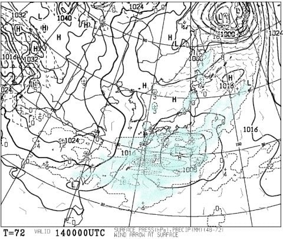

# 3月14，15日の週末の志賀高原スキー場の天気は？…土曜は曇り⇒小雪，バーンは硬いか(涙)，日曜は冷え冷え雪降り！

📅 投稿日時: 2020-03-12 00:30:52

えー．

本来なら雪が積もる予想だった本日．

…そう．

雪が積もるはずだったのですが…

強烈な西風効果のおかげで．

志賀高原は全然積もらなかったようです（涙）

うーむ．

火曜の雨＆高温＆強風の凶悪3連コンボで

解けた雪が，今日の雪で少しは回復すると

期待していたのですが…

どうやら，皆さんの踊りが足りなかった

ようです←そこを他人のせいにするのね！？？

ってなことで．

果たして，次に雪が積もるのはいつなのか？？

週末までにゲレンデが回復する

見込みはあるのか？？？

…というあたりを，

また天気図を見ながら予想していきたいと

思います…

えー．

まず．

12日，木曜の850hpa気温図を見てみますが．

うむ！！

志賀高原には，水色の-6℃線がかかっていて．

朝はかなり冷え込みそう…っ！！

で．

この日の地上天気図を見ると．

…志賀高原，昼間は全く降らなさ

そうですね（涙）

高気圧に覆われて，冷え冷え晴れの

天気になりそうです…

…いや．

雪が降った後の冷え冷え晴天なら

喜びもするけど．

全く雪が降らず，雨の後の

冷え冷えとなれば…

それが意味するのは．

山全体，春の全山アイスバーン祭り

ということですね…

今晩，わずかに数cmほど雪が積もりそうなので．

それが積もってくれれば，朝のうちはそこまで

ガチガチな感じはなさそうな感じですが．

朝イチが終わって，表面の雪が剥げてきたら，

全山，いい感じのガチガチバーン

になってくると思います…（涙）

で．

次の日，13日の金曜日ですが…

13日の金曜日ってだけで，なんだか不吉ですが．

この日の850hpa気温図を見ると．

うーーん．

この日は，赤い0℃線が志賀高原より

北まで上がってます…

冷え冷え祭りは12日一日で終わりなのね…？？

13日金曜の地上天気図は，

水色の降水域がかかってないので．

なんとなく晴れそうな感じで．

液体が降る心配はなさそうだけど．

…昼間はプラス気温まで上がり，

強い日差しで雪は緩みそう…（涙）

まぁ，逆に言うと，

木曜のように，

終日ガチガチ全山アイスバーン地獄

とならずに済むということですが…

そして．

週末の14日，土曜日の850hpa図を見てみると．

うーむ．

この日は，なんとかギリギリ

赤い0℃線が志賀高原より南．

で，地上天気図をみると．

太平洋側に低気圧がありますが．

朝9時の段階では降水域が志賀高原まで

伸びてないので．

昼間は降らなさそうな感じ…

…要するに．

本日以降，土曜の営業終了までは．

雪が積もることは無さそう

という，悲しい結果に…（激涙）

あぁ…まだ3月前半というのに．

なんということか…

次に，15日の日曜日の850hpa気温を

見てみると．

うおおお！

なんだか，すごい冷えてますよ！

水色の-6℃線が志賀高原にかかってます！！

これは，志賀高原の朝は，-10℃近く

まで冷える感じ…！

そして，15日日曜の地上天気図は．

うむ．

冬型が入って，志賀高原に降水域が

かかっているので．

これは，土曜の夜から日曜にかけて，

雪が積もってくれそう…っ！！

なんとか日曜になって，やっと

積もってくれそうな感じです…！！

ってなことで．

まとめると．

12日（木）：朝は-8℃程度と冷え冷え！

　…だけど．雪は夜中にわずかにぱらつく程度で

　せいぜい2-3cmの積雪がある程度．

　朝イチはカリカリ下地ながら，

　上にわずかに新雪が乗っているので，

　どうしようもないガリガリバーンではなく，

　硬いのが好きな人ならある程度楽しめる

　バーンになるか…

　終日気温がマイナスをキープしそうだけど．

　朝から晴れそうなので，日が射すバーンは

　昼間に表面が緩んで，いい感じの硬さの

　バーンになってくれるかも…

　日当たりが悪いところはガリガリツルツルに

　なるかな？？

13日(金)：朝はギリギリマイナス気温．

　あさイチは硬めに固まったシマシマバーン．

　ただ，朝から太陽が射し，午前中から

　気温はプラスになるので．

　日差しで午前中から雪は緩みぎみ．

　午後はバーン全面緩んだザラメ雪に．

　夕方は昼間に緩んだ雪が固まっていき

　ちょいと手ごわいバーンになるかな…

14日(土)：朝の気温は-2～3℃程度．

　朝はカリカリした感じに固まったバーン．

　天気は朝のうちは曇りだけど，午後になって

　雪がぱらつきそう…

　午後に向かって気温が下がっていき．

　夕方は-5℃程度まで下がりそうなので．

　バーンは緩まず，終日固めのバーンに

　なりそう…

15日(日)：朝は-5℃以下まで冷えそう！

　土曜の夜から雪が降り始め，朝までに

　数cm，運がよければ10cm以上積もって

　くれるかも…！

　あさイチはこのわずかに積もった新雪が

　圧雪されたバーンの上にうっすら新雪．

　朝から終日雪がぱらつき続ける天気で．

　昼間もほとんど気温は上がらず，

　寒いよ！

　雪は終日緩まず，午後は昼間に積もった

　雪で多少荒れ気味になり，

　柔らかい雪の下に硬い下地が顔を出す，

　ちょいと難し目のバーンになるかな…

ってなことで．

日曜までは，ほとんど雪が積もらなさそうという

悲しい予想ですが．

土日はそこそこ冷えてくれそうで．

雨になったりしないぶん，

許してあげましょう…←だから，なんでいつもそんな上から目線？

で．

さらに来週の天気まで，おまけに見てみますが．

16日(月)，17日(火)の850hpa気温は…

をを！！

16日は水色の-6℃線が志賀高原に

かかって，月曜も冷えそう…！

そして，17日も0℃線が志賀より

南にあるので．

そこまで気温が上がらなさそう．

そして，地上天気図を見ると．

16日は降水域がかかっているので．

そこそこ冷え冷え雪が降り続き．

そして，17日は高気圧に覆われ，

晴れそう…！

だもんで，16日の月曜は15日に続き，

冷え冷えの雪降りの一日．

そして，17日は晴れそうなので…

17日火曜は，冷え冷え雪降りの後の

晴天で，いいコンディションかも？？

とりあえず．

14，15，16日はこんな感じで，

久しぶりに平年比マイナスに冷えるので．

滑るなら，16，17日あたりが

ねらい目かな～．

…平日に休めれば，ですが…（涙）

## 💬 コメント一覧

### 💬 コメント by (ゆーき)
**タイトル**: Unknown
**投稿日**: 2020-03-12 03:36:53

土日の予想ありがとうございました。というわけで、土日泊まりを推挙された理由がさっぱりわかりませんが(笑、　1ゴンのコブが成長してれば、楽しめるかもって思えばよいのかな、、、まぁ、家族に聞いてみる、、、ふー

### 💬 コメント by (かず)
**タイトル**: Unknown
**投稿日**: 2020-03-12 06:33:22

来週月火ですか！！そこ確実に空いてますね！一応調整しておこう  Sさんとレインボーさんの週末の状況と天気次第で 笑  ご存知かもしれませんが3連休のスノーモンキーBは中止なので少しは空くのかもしれません

### 💬 コメント by (レインボー)
**タイトル**: Unknown
**投稿日**: 2020-03-12 06:47:20

かずさん、暫くは休場のはずだったのでは？

しっかり現状報告しますね。

### 💬 コメント by (レインボー)
**タイトル**: Unknown
**投稿日**: 2020-03-12 15:51:47

本日木曜日の志賀高原情報

2ゴンPで、さらさら新雪20mm

快適パノラマから1ゴンへ。ＧＳも硬めで欠点なし。

オリンピックは上手い人じゃないとだめ。得意のズリズリターンな炸裂。

すぐに目的地である奥志賀エキスパートへ。気温はマイナス8℃。な、なんと、バーン全体が無人になることが何度も。しかも、私でも快適に滑れる、極楽昇天桃源郷。誰もいないから万一のことを考えなくてもいい。おかげで昼食に遅刻する罪深い私でした。

その感激で、ダウンヒル一本の記憶がない。だからレポートなし。

正午頃のファミリーは、上手い人じゃないと難しい硬すぎバーン。私はといえば、得意技であるズリズリターンを楽しめました。

13時頃のオリンピックは、朝とは一変。ザクザクになっていました。老齢には疲れるけど、楽しめました。

ＳＧＳは緩んで普通のバーン。

三高イーストはオリンピック同様、ザクザク。

ミドルはしっかりコブが作ってありました。君子危うきに近寄らずでした。

なお、1ゴン下の非圧雪ですが、しっかりモーグルバーンになっていましたよ。危ない危ない！

空も快晴で、絶好の撮影日和。デモのかたも暇ができたので、撮影会もやってました。

### 💬 コメント by (かず)
**タイトル**: Unknown
**投稿日**: 2020-03-12 18:07:24

レインボーさんいつも志賀高原情報ありがとうございます  今地元でのみに来てます！ビールずきなんです！

### 💬 コメント by (M美)
**タイトル**: Unknown
**投稿日**: 2020-03-12 18:25:03

本日到着！一ノ瀬ファミリーですが15時頃からスタートしました。上は固めでコブもなく快適に滑れました☺️

明日はどうなるかなぁ😉

### 💬 コメント by (Skier_S)
**タイトル**: 明日はちょっと気温が上がるかな…？
**投稿日**: 2020-03-13 01:53:25

＞ゆーきさま

いや…やっぱりせっかく行くなら，いっぱい滑れる土日泊りですよね…

ってか，土日とも休みなら，絶対土日で行かないともったいないですよね…

＞かずさま

とりあえず，今のところは15，16日に強烈な寒気が入るのは

間違いないのですが，降雪量がどのくらいになるかは

まだ分からないです…

でも，少なくとも今のところ，15，16日はこの冬一番クラスの寒気が入ります．

＞レインボーさま

…意外と今日は楽しめたのですね…

でも，気温が冷えていたので午後にザクザクになるとは思いませんでした…

やはり日差しが強かった？？

＞M美さま

明日は朝から晴れ．

あさイチは硬いと思いますが，日差しで雪は緩んでいきます…

正面バーンは昼ごろまでもつかな？

下側は午前中に緩み始めるかも．

