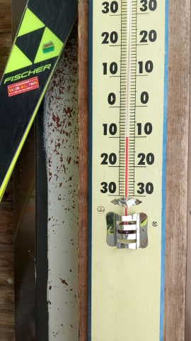
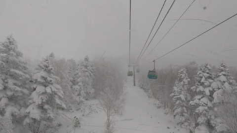
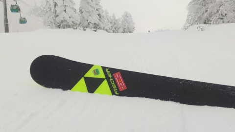
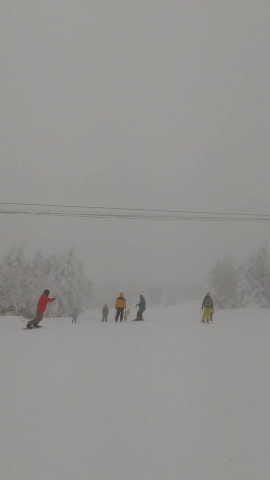
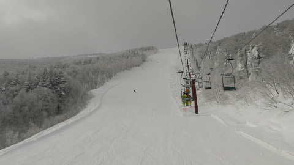
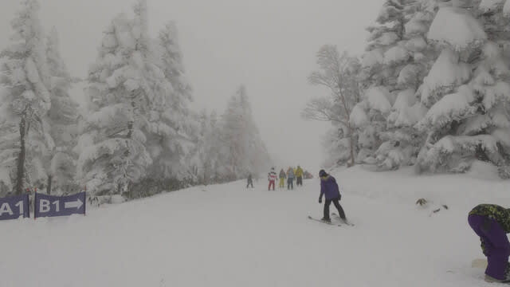
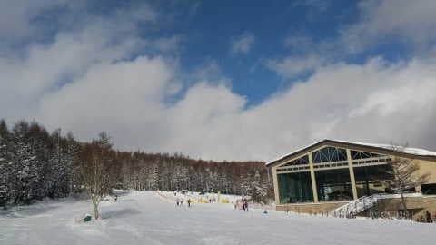
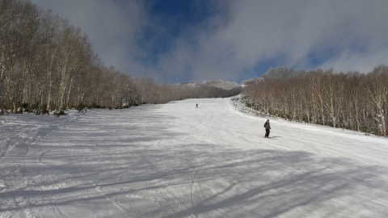
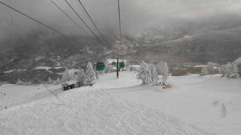
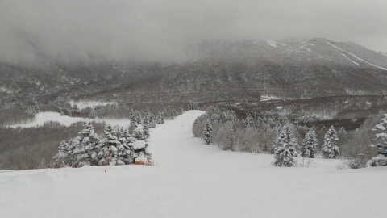

# 1月5日(木)の志賀高原特派員情報…20cmくらいは積もったみたい．コースコンディションも良くなってるよ！

📅 投稿日時: 2023-01-06 09:38:49

昨日は，仕事が終わらぬうちにまた

床に突っ伏して寝てしまい…

気づいたら朝でした(涙)

一晩，電気つけたまま床で寝てたよ…（泣）

ってなことで，更新が朝になりましたが．

昨日，特派員が1/5の志賀高原の状況を

送ってくれたので，昨日の志賀高原の

状況です！！

えー．

まず，気温はだいたい昨日の予想通り，

-10℃程度だったみたいで…

朝は雪降り！！

そして，非圧雪のオリンピックコースで

雪はちょい重めながらもブーツパフ

くらいだったとのことなので…

まぁ，20cmくらい積もったんでしょうか．

圧雪バーンは柔らかめながら，かなり

コンディションよく最高だったみたいです！！

うらやましい…

天気は基本曇りで，時折雪がぱらつく

程度で…昼間はそんなに積もらなかった

みたいです．

…昼間の積雪が無かったってところも，

だいたい予想通りですね(涙)

奥志賀も全体的にガスっていて，

基本的には終日曇り空だったようですが…

平日なわりに，意外とゲレンデには人が

多く．

ゴンドラも，時折ゲートくらいまで待ちが

伸びるほどだったようです…

昼間，一瞬青空が顔を出すタイミングも

あったみたいですが

基本的には終日曇り空だったようで…

でも，バーンは冷え冷えで最後まで

荒れることもないフラットバーンで，

楽しめたようです！

いいなぁ…

ところどころ小石が出ていたGSコースも，

だいたい石ころは隠れてくれたようです…

とりあえず，雪はまだ少なめながらも，

滑るには問題の無いレベルまで積もって

くれたようで．

この3連休は楽しめそうですね～…

特派員の方，ありがとうございました～！

## 💬 コメント一覧

### 💬 コメント by (a-island4138　ゆうさん)
**タイトル**: Unknown
**投稿日**: 2023-01-06 19:14:46

16日からを目指していますが、連休後は暖かくなりそうで少し不安ですね。　三連休に行かれる方々が羨ましいですね。

今日も貴重な情報を、ありがとうございました。　毎日、楽しいです。

### 💬 コメント by (Skier_S)
**タイトル**: ＞ゆうさんさま
**投稿日**: 2023-01-07 04:19:11

今日の記事に書きましたが…

14，15日の週末はヤバそうです．

かなりの高温の雨になりそうです（涙）

この予想が外れるよう，全力で冷え冷え踊りを踊っていてください…

### 💬 コメント by (a-island4138)
**タイトル**: Unknown
**投稿日**: 2023-01-07 16:22:07

あっはっはっはあ（笑）冷え冷え踊り☃　私は三味線弾くので、冷え冷え三味線弾こうかな＼(^o^)／

16日〜は、延期にしようと思っています。　雨後は雪質重くなりますからね💧

### 💬 コメント by (Skier_S)
**タイトル**: Unknown
**投稿日**: 2023-01-08 00:35:14

＞ゆうさんさま

冷え冷え踊りはこのblogでは恒例の踊りとなっております（笑）

冷えたりないとき、全力で踊ってください…

