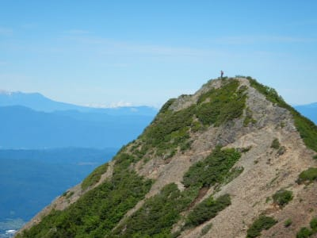

# 2021年7月，編笠山リベンジ＆権現岳へ！その7…ギボシてっぺんは絶景！

📅 投稿日時: 2021-08-27 02:12:19

🏷️ カテゴリ: [登山・旅行](c1d637a11a25b457ac978d197adbdafc5.md)

えー．

本日も，次々スキー板がヘタッていく物語を

書きたかったのですが．

ちょっと新しい記事を書く時間がなく．

書きためておいた，山登りレポートです．

…しかし，なぜか書きためておいた記事を

出すとき．

忙しくて料理ができない日の夜ご飯に，

作り置きで冷凍しておいたカレーを出す

ときのような，

「あらかじめ準備しておいてよかった…」

という，助かった感だけじゃない，

なにか手抜きのようなうしろめたさを

感じるのはなんでだろう…？

でも，記事の内容自体は，決して手抜き

じゃないはずですから～！！！←あなたの記事のすべてがそもそも手抜きなのでは？

ということで．山登りレポートをどうぞ～！

ーーー

ってなことで．

ルートをそのまま進むと巻き道を

通ってしまい，通り過ぎちゃうピーク．

ちょっとだけ戻ればてっぺんに行ける

ので，ちょっと登ってみます…

左手が切り立ってて，ちょいと

怖い感じのところをわずかに登ると…

ピークに到着！

これが，権現岳手前の，ギボシって

場所みたいです．

てっぺんの広さは数人が立てる程度

しかないけど…

もしかすると，これって絶景じゃなか

ろうか…！？？

完全360度パノラマビュー！！

これから行く権現岳も見えてますが．

この写真の一番右に見える，出っ張って

いるのが権現岳山頂．

こことほとんど標高差もないし，

もう，目の前ですね！

あとで分かるのですが，どうも権現岳

山頂よりも，ここ，ギボシのほうが

景色がいいです…！！！

皆さん，ここに登らず通過していくのが

惜しい．もったいない！！！

ということで，しばらく景色を

堪能して．

ギボシから降りて，権現小屋方面へ

向かいます…

巻き道との分岐の当たりから振り返って

見ると，ギボシのてっぺんはあんな感じで．

一見たいしたことなさそうに見えるので，

みんな通過しちゃうのかなぁ…

もったいない…

ってなことで．ギボシから5分も歩くと…

権現小屋に到着！

…ですが．

小屋もトイレも開いてませんね…

だもんで，あっさり通過して，

権現岳・赤岳分岐点へ！

…到着は，ちょうど9時．

コースタイム80分のところ，

ギボシてっぺんで20分ほど

景色を眺めていたため，

70分ほどかかりました…

ここは，権現岳山頂が目の前に見えて．

そして，ちょっとした広さがあるので．

権現岳山頂じゃなく，ここで皆さん

休憩しています…

ここも景色は悪くないけど…

パノラマ感はギボシの方が上かな？

振り返ると，ギボシがみえますが…

ここのルート，赤で書いたみたいに，

ピークを巻いているのがもったいない…

なんてったって，こんな感じの尖った

ピークだから，見晴らし良いに決まってる

じゃないですか！

…と思ったら．

ギボシのてっぺんに，人が立ってるのが

見えますね…

でも．

まぁ．

ここからの景色も，決して悪くはないです！

ってなことで．

ちょっとここで，休憩タイム…

## 💬 コメント一覧

### 💬 コメント by (m&t m)
**タイトル**: Unknown
**投稿日**: 2021-08-27 10:12:58

最新情報

ヤケビHPより

今シーズンは志賀高原 焼額山スキー場エリアシーズン券に加え、奥志賀高原スキー場との共通シーズン券「ヤケオクシーズンパス」も販売いたします。 

とあります。

### 💬 コメント by (かず)
**タイトル**: Unknown
**投稿日**: 2021-08-27 17:58:20

お久しぶりです 元気ですか？今シーズンもまさかのコロナ対策になりそうですね…外人さん来なかったら+野沢にしようと思ってましたが 僕にぴったりのヤケビ奥志賀券でるみたいですね！他の志賀大丈夫でしょうか？？

### 💬 コメント by (Skier_S)
**タイトル**: 情報ありがとうございます
**投稿日**: 2021-08-28 01:50:39

＞m&t mさま

情報ありがとうございました～！

仲良しの2スキー場，ついに共通券を出すんですね．

早朝から使えたら魅力的だったんですが…

早朝が使えないようなので，ちょっと残念．

＞かずさま

おおっと．

お久しぶりです！！

奥志賀＆ヤケビ券，早朝に使えないのが惜しい…

かずさんは奥志賀＆ヤケビ券購入予定ですか？

