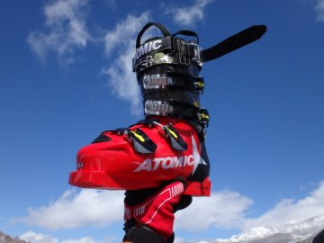

# スキーブーツのフィット感調整のため，格安自作インソールを作ってみた

📅 投稿日時: 2014-05-20 01:17:07

🏷️ カテゴリ: [スキー雑談](c1f9d2cb7478308da16419928ea3945e9.md)

えー．

昨日，日曜ですね．

久しぶりの，まったくなんの予定もない，

スキーに行かない休日だったので．

[甘いものが好きな私](e4c6cbe4a711b81e4e433e57f2cff846f.md)は．

娘を連れて，またデザートバイキングに行ったんですね～．

こーゆー，私のシアワセの世界のお皿に対し…

ケーキがそれほど好きではない娘がとってきたのは…

はぁ？カレー？？？

ケーキを食べる私の横で，ひたすらカレーを

おかわりして，3杯も食べ続けた娘．

父親と娘が食べるものが，逆なのでは…

と思わずにいられない今日この頃なのでした．

…ってところで．

本題へ．

えー．

[新入りのブーツ](e4eb8b62d644e240a6080cac72ad69416.md)，[ATOMIC Redster PRO 130](e49ba60ca83abf037c6421d52c585d288.md)ですが．

このブーツ，これまで履いていたSALOMONに比べ，

足の甲の部分が結構高く．

甲が低い私にとっては，ちょっとがばがばする感じがあり．

こぶ斜面や荒れた斜面では，ちょっと足が前後に動いちゃう

という欠点が…

うーむ．

インソールをかさ上げすればいいんだけど．

カスタムインソールを作ると高くつくんだよなぁ．

ってことで．

　・安くて

　・1mm程度の厚みがあって，重ねて調節できて

　・そこそこの柔軟性と，水に耐える耐久性があって…

という，インソールの下に敷ける中敷きを作れる，

いい材料ないかなぁ…

って探していたら．

…ありましたよ．

ぴったりの，安いいいものが．

…これです．

カーペット地．

ホームセンターとかで，1m700円くらいで切り売りしている，

幅90cm程度のやつです．

こいつを，30cmだけ買って（笑）．

締めて220円．

これをチョキチョキ切って…

こんな感じで，インソールもどきを作ってみました．

30cmのカーペットから，10枚以上作れます…

で．

こいつを，インナーブーツの中，インソールの下に

重ねて敷いてみます．

試してみたところ．

1枚ではちょっと物足りず．

2枚重ねでちょうどいい感じ，

3枚重ねだと，ちょっとつま先がきつく

なりすぎたかな…

って感じで．

フィット感を自由に調整できて．

2枚でちょうどよいフィット感になりました～．

わずか200円でできる，ブーツボリュームの調整．

ぴったり満足なフィット感が得られて，

効果バツグンっ！！

コブを滑っても，ブーツの中で足が動く感じが

無くなりました～．

レジャースキーヤーには，この程度で十分だなっ！

## 💬 コメント一覧

### 💬 コメント by (komu)
**タイトル**: 素晴らしいアイデアですが
**投稿日**: 2014-05-20 01:23:53

それよりも…

娘さんが、そっくりですな。

やはり将来スキーヤーになってしまうのでしょうか…

### 💬 コメント by (Skier_S)
**タイトル**: komuさま
**投稿日**: 2014-05-20 01:43:22

いや…わが娘．

将来ではなく．

もうすでに，かなりの

サルスキーヤーになってます（爆）

### 💬 コメント by (すぎぃ)
**タイトル**: 娘さんが・・・
**投稿日**: 2015-01-27 14:28:04

Skier_S 様

娘さん可愛いですね。

中京テレビアナウンサーの松原朋美さんに

ちょっぴり似ていますね(笑)

http://www2.ctv.co.jp/matsubara/

### 💬 コメント by (Skier_S)
**タイトル**: すぎぃさま
**投稿日**: 2015-01-28 01:37:03

確かに，似ている気が…

でも，うちの娘．

あんなに美人じゃないです（笑）．

