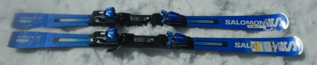
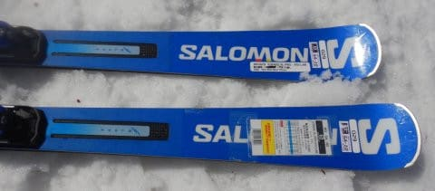
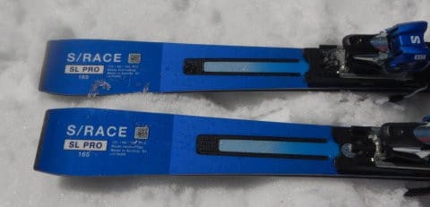
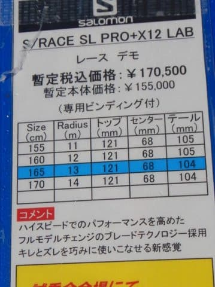

# 2023シーズンモデルのスキー板，試乗レポートその28…SALOMON S/RACE SL PRO

📅 投稿日時: 2022-07-19 05:28:16

えー．

世の中は3連休だったようですが．

なぜかこのくそ忙しい中，謎の「研修」という

ものがあり．

3日間，その課題をやっていたSkier_Sです（涙）

課題はあったものの，

土曜は睡眠不足を解消すべく，久しぶりに

ゆっくり寝ました！

金曜夜は3時ごろに寝たというのに．

土曜夕方の16時頃まで，13時間ほど寝て．

そして，翌日も昼過ぎまで9時間ほど寝て．

死んでるんじゃないか心配されました…

せっかく睡眠不足解消しようと

したのに，

「3日間も家にじっとしてると体が腐る！」

と．

なぜか月曜に，睡眠2時間で朝3時に家を出て

4時間半ほど山をさすらい．

昼に家に戻ってまた午後仕事していたという…

せっかく睡眠不足解消したのに，

また2時間睡眠って，一体何を考えているんだ？？←自分で突っ込んでどうする

ってなことで，本題へ．

今日も2023シーズンモデルのスキー板の試乗レポート．

今回はサロモン編です．

では，どうぞ～！

○SALOMON S/RACE SL PRO + X12 LAB 165cm

SL競技，基礎小回り用

この板はSALOMONの基礎・SL競技用の

小回り板のラインナップ

S/RACE PRIME SL

S/RACE PRO SL

S/RACE 12 SL

S/RACE 10 SL

の4種類の中で，上から2番目になる板です．

…厳密には，この上にFISモデルのガチ競技用

小回り板があるようですが…

履いてみたところ，結構足元に

どっしり感がある板ですが，滑ると

そこまで重さを感じないかな？

かなりしっかりした板なので，

スピードを出して行かないと

本領を発揮できない感じですね…

スピードを出さない中で滑ると，

板も回ってこないし，重い春の雪だと

板の重さで動かしにくいし，

「何じゃこりゃ？」と一瞬思います．

ただ，スピードを出していくと…

たわみも出せるし，ズレの中でも

板が回っていい方向に動いて行って

くれます！

スピードを出して板が圧をもらってくると，

ズレでもキレでもいい反応をもらって

きれいにまわって行きます．

板が強いので，板が勝手に回り

すぎちゃうことは無いですが，

積極的に板を回して行けば，

鋭いずれを使って小回りして行けます．

返りも早いし，グリップも強いし

かなり鋭い滑りができます．

ゲレンデの低速で滑りやすいかと

いうと，ちょっと疑問が残るけど．

スピードを出した中でも，ズレ・キレを

使い分けてターンをしやすいし，

結構なスピード域で滑るには快感度が

高めな板です…！

かなりのスピード域でも，

エッジに乗った中で縦目に切っていく

ミドルから，板をしっかり回す深回り

までしっかり板が反応してくれて，

粘りのエッジングで気持ちよく

板は切れていくし．

うーん．

やっぱり来シーズンのサロモン，

どれもかなりいい板を作ってきますね…

## 💬 コメント一覧

### 💬 コメント by (harutomo)
**タイトル**: Unknown
**投稿日**: 2022-07-19 09:27:28

こんにちは。

待ちに待ったレポートです。

今回のSALOMONのレポートはよくわかります。キレもズレも使えて万能だと思います。

低速では、自分から板を動かしていかないと回ってくれないかもしれませんね。

アトミックファンの私が一目惚れしてしまった本当に良い板です。

### 💬 コメント by (Skier_S)
**タイトル**: ＞harutomoさま
**投稿日**: 2022-07-20 02:10:10

私も今シーズンのSALOMONは，PRIME SL，

SL Pro，SL 12，GS Proと

結構気に入った板が多く，来シーズンのSALMONやるじゃないか…

と思いました．

でも，日本ではあんまりSALOMONの板を売る気がないのか，

ほとんど台数が入らないみたいですね…

来シーズン，SL Proで滑ったら楽しいと思いますよ！！

### 💬 コメント by (ikkun)
**タイトル**: Unknown
**投稿日**: 2022-07-20 13:18:15

スキー関係もあの国のせいでなかなか手に入らないサロモンフィッシャー辺りらしいですよね

### 💬 コメント by (Skier_S)
**タイトル**: ＞ikkunさま
**投稿日**: 2022-07-21 03:35:37

サロモン，フィッシャー以外も，ヨーロッパ製のスキー道具は

板もブーツも軒並み日本への入荷数が少ないようです…

昨年までのコロナとウクライナ情勢のダブルパンチでモノが少ないうえ，

日本では円安で値段も上がったという，トリプルパンチです（涙）

