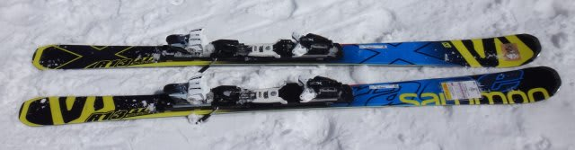
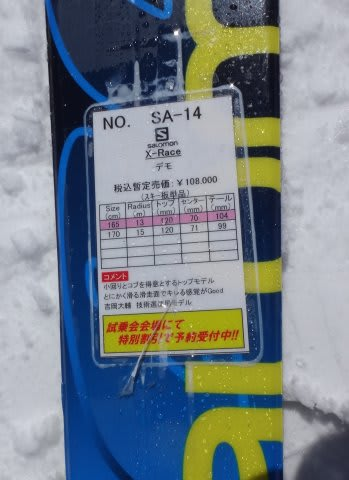
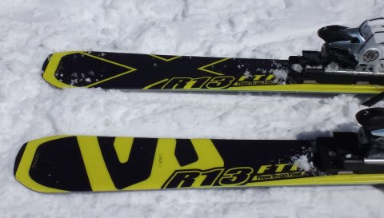
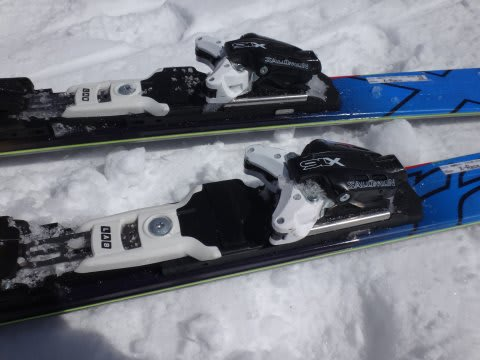
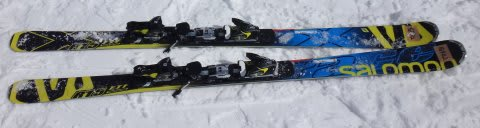
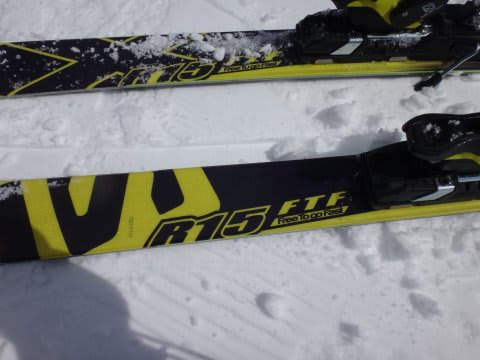
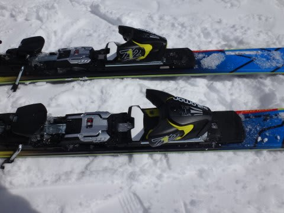

# 2015シーズンモデルのスキー試乗レポート13…SALOMON編その3

📅 投稿日時: 2014-04-23 01:26:05

えー．

2015シーズン板の試乗インプレッション，続きます．

今度はまたSALOMON編なんですが．

サロモンのX-RACE，かなりテールでコントロールする板なので．

これは，ATOMICブーツと相性がいいに違いない！

と，思い．

SALOMONブーツを履いた前回と今回で，印象が違うかどうか

履き比べてみました．

ってことで．

インプレッション，どうぞ～！

-----

SALOMON X-RACE X16 165cm

競技小回り用．

前回は，Z12ビンディングモデルだったけど，

今回は強いほう．X16ビンディング付きのモデルです．

…この板は．

トップを抑えて曲がる板ではなく，

テールを抑えて曲がっていく板なので．

おそらく，アトミックブーツとの相性

ばっちりだろう…

と，思っていましたが．

案の定．

かかと側が硬いアトミックブーツとの相性は

最高です．

すごい重いけど，軽快に感じる…

相変わらずトップのエッジが仕事しないで，

テールが利く感じで．

くるぶし下，かかとより辺りを押し込んでいくと

ありえないグリップ力でしっかりと回っていきます．

テールが異常に硬い板だけど，ATOMIC PRO 130のヒール

側の硬さで，しっかりテール部分をたわませて

行けるので．板のたわみがコントロールでき，

小回りの回転弧を作っていくことができます．

前回のSALMONブーツでは，中回りのカービングに

なっちゃったけど．

ATOMICブーツでは，しっかり小回りを作れます．

超安定感のある，ガッツリカービング小回りです．

小回り板なのに，返りはそんなに早くなく，

ビンビンした元気な板って感じでないので，

どっしり安定感を感じます．

整地では，この重さと異常なほどの

高速安定性は武器ですね．

でも．硬いし重いので，ちょっとコブはつらいかも…

SALOMON X-RACE Z12 170cm

競技大回り用．

これは，弱めのZ12ビンディング付きのモデルなんですが…

それでもしっかり重く，どっしり安定した板で．

カービング大回りスペシャルです．

エッジ方向に走って行く板です．

ずらしのコントロールとか論外です．

ATOMICブーツでヒール部分を押していくと．

ガッツリグリップして，エッジに乗って

走っていきます．

スピード耐性はむちゃくちゃ高いです．

私では，おそらくこの板の限界スピードまで

達せない感じ．

常用スピードは極めて高いです．

この板は．

ぴかぴか整地をすごーーーーいスピードで大まわりすると

その性能を発揮しますが．

普通のゲレンデでこの板のトップ性能出そうと思ったら．

周りのスキーヤー2-3人巻き込んじゃいます（笑）．

うーむ．

ちょっと，私ごときが気楽にゲレンデで履ける感じの板ではないかな～．
