# 1月21日，日曜日の志賀高原詳細モード…晴天なれどガラガラ！でもゲレンデ硬め

📅 投稿日時: 2018-01-23 00:21:52

🏷️ カテゴリ: [2018スキー滑走日記](c11b88dc181f34079ab41db74a3587646.md)

えー．

本日．

我が家の周りも結構な積雪になりましたが…

しかし．

こんな積雪路をノーマルタイヤで走るという，

いろんな意味でチャレンジャーがいっぱいいることに

驚きを感じているSkier_Sです．

ってことで．

日曜の志賀高原，詳細レポート行きます！

えー．まず．

土曜の夜は雪がちらついていたので．

日曜の朝は，ちょっと雪が積もっているかな？？？

と，思ったところ…

あり？

全然積もってませんね…（ちょっと涙）．

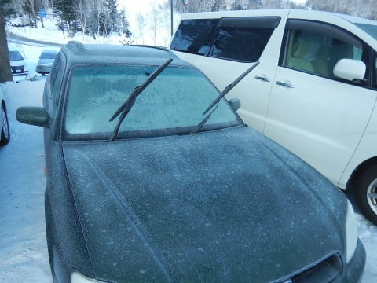

いや，そろそろ積雪がないと，

いろいろマズいんですが．

そろそろ1月らしい，柔らかい雪を滑りたいのですが…

あれですね．

ダメですね．

1月のこの時期に，

ここにアイスバーンって書かれてる

ようじゃ…（泣）．

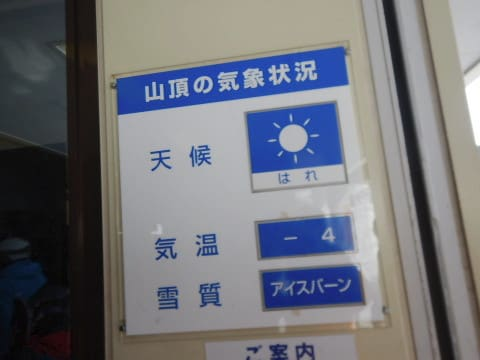

ってな感じで．

いつも通り，朝8:30の焼額第1ゴンドラオープン

待ちに並ぶのですが．

…今日も並んでいる人は少なめですな．

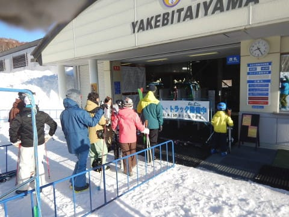

で．

朝イチゴンドラで山頂へ登ると…

ふむ．

山頂の気温は-7℃．

昨日と同じ気温ですね…

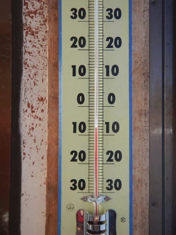

今日も放射冷却が入ったので，

-5℃の予想から2度ほど低めに

外れましたね…（残念）．

そして．

そうです．

天気は…ピカピカ晴天っ！！

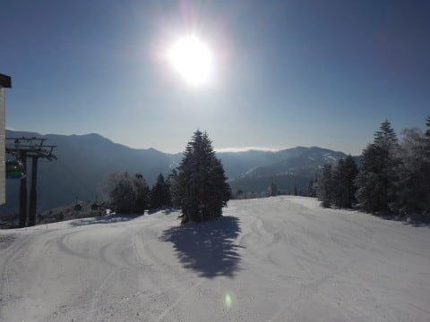

って．

いや．

ピカピカ晴天，普通なら嬉しいんだけど…

でも．

そろそろ積雪が欲しい…（ちょっと涙）

積雪がなかったので．

今日の圧雪もちょいと固めで．

表面がボソボソした感じに

なってます…

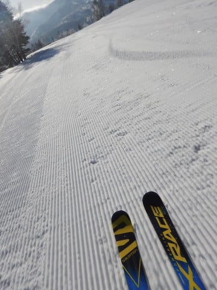

晴天なのは嬉しいんだけど．

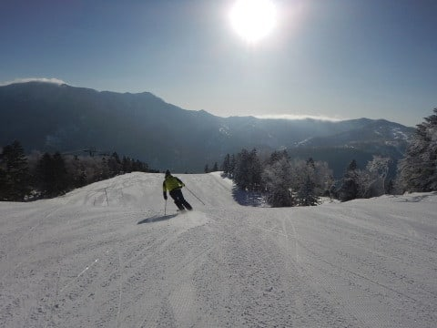

シマシマなのはうれしいんだけど．

最初の数本は楽しかったんだけど．

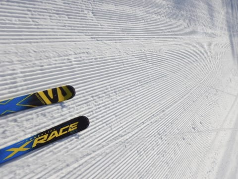

朝イチのGSコース．

数本滑ると，固まったシマシマの表面が崩れて

殺人コロコロが量産されていくという，

ちょいと残念なバーンコンディション…

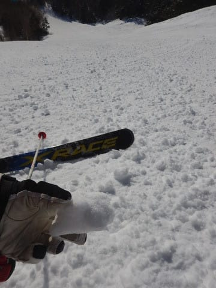

ところが．

GSコースと違って，オリンピックコースは

氷のコロコロが出ない，締まった感じのバーン

コンディション！

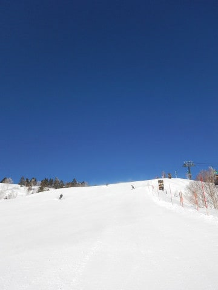

…意外と，今日はGSコースより

オリンピックコースの方が滑りやすいな！

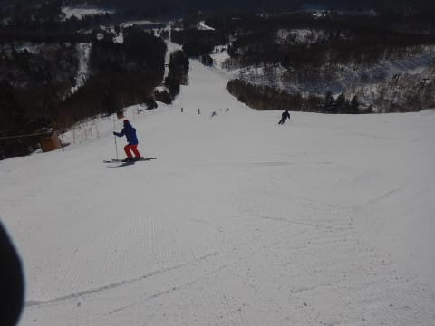

どうやらGSコースは，この時期になっても

人工降雪を打っているようで．

人工降雪が固まってコロコロになっちゃうようですね…

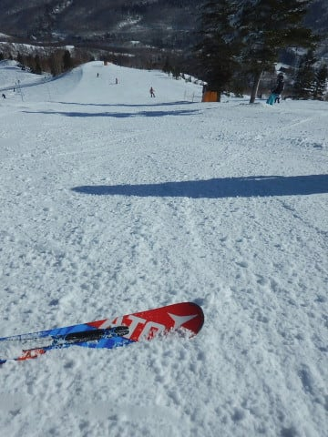

で．

1月の週末なのに，この日は意外と人が少なく．

朝10時ごろのピーク時間でも，ゴンドラ待ちは

ゲートの外に出るかどうか…

って感じ．

一人乗りレーンに並べば，搬器数台待ちで乗れる

程度だったのですが．

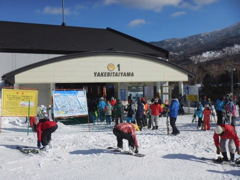

ただ，10時を過ぎると，コース上の人がちょっと増えてきて．

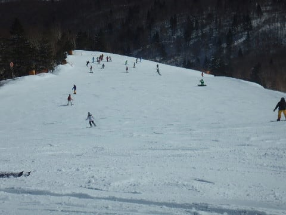

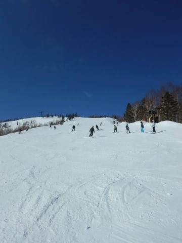

そして，コース上はこういう固いバーンやら…

スキーヤーの命を狙う刺客によってばらまかれた

殺人コロコロがあふれるバーンになってきたので．

「殺人コロコロから逃れるのだ！」

という必殺呪文を唱えると…

あら不思議！

なんと．

焼額の呪いが解けて，奥志賀にやってきているでは

ありませんか！！

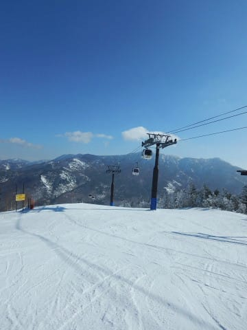

奥志賀は，今週から第6リフトの営業が始まり．

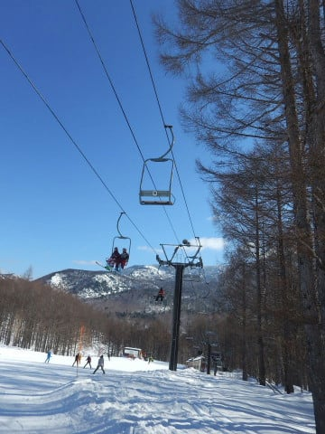

第6ゲレンデのパークが完成したようですね…

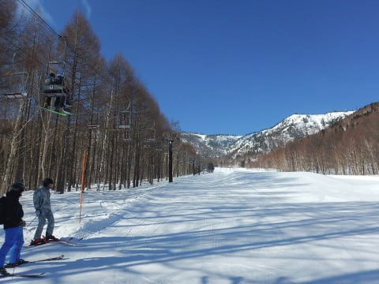

で．

普段の週末なら結構混む奥志賀ゴンドラ．

今日はそれほど混まず…

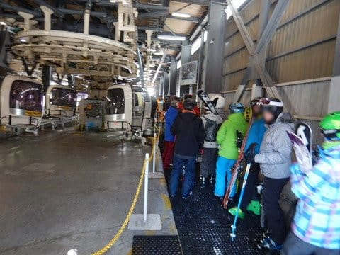

最大でもこの程度の待ちと，

ストレスの無い待ち時間！

そして，ゴンドラ側のダウンヒルコースは…

うむ！

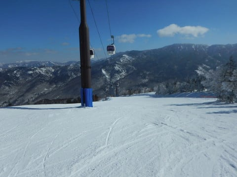

ちょいと固いところはあるものの．

ツルツルではなく，エッジの引っ掛かりはあるし．

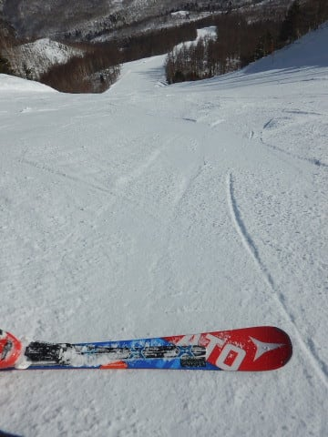

何より殺人コロコロが無くて．

結構いいよ！

これ！

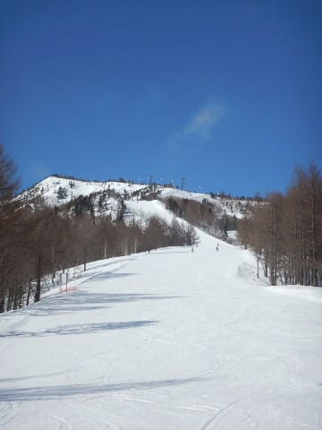

奥志賀のリフト側，エキスパートコースは…

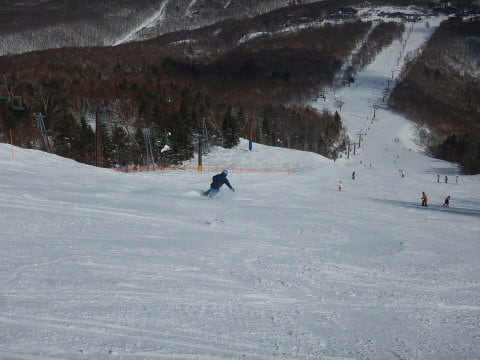

人が結構少なくて，一見良さそうだけど…

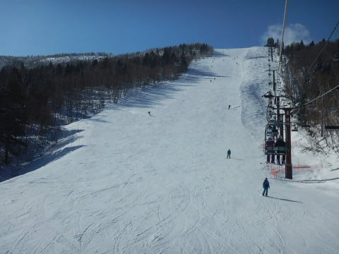

でも．

急斜面なので，大勢のエッジングで

表面の雪が磨かれてツルツルになってきていて．

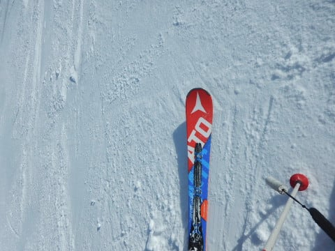

そして，ところどころにコロコロが…（涙）．

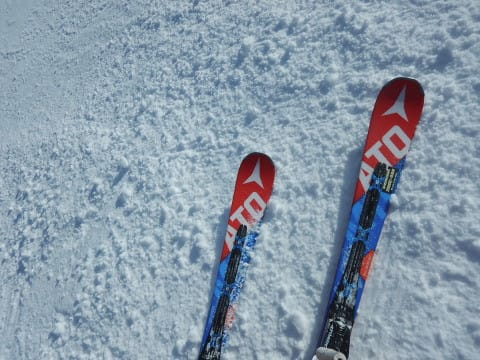

だもんで．

気持ちよく滑れるゴンドラ側，

ダウンヒルコースをグルグル！

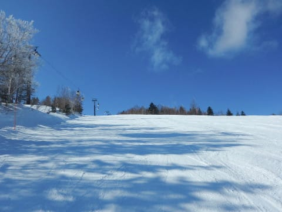

午後はほぼ無人バーンと化し．

ゴンドラも待ち時間がほとんどなくなったので…

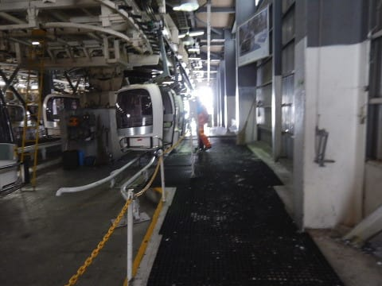

マズい．

本拠地の焼額に帰りたいが…

楽しすぎて帰れない！

…と．

奥志賀ゴンドラをグルグルして，ガラガラの

ダウンヒルコースを滑りたおしていると．

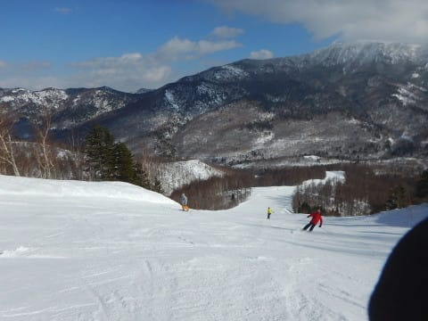

あり？？

午後3時ごろ，いきなり雲が増えてきて…

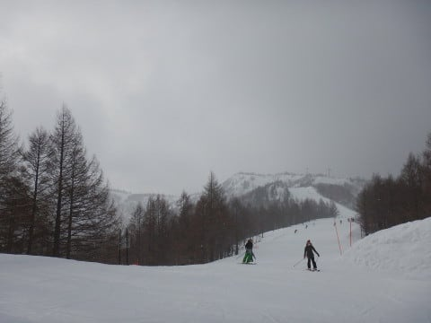

3時半にはガスが出て．

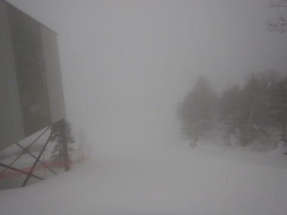

そして，雪が降り始めてきました…！

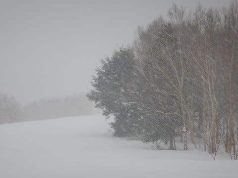

なんということだ…

…これは．

奥志賀に浮気してしまったので，

焼額の呪いによって天気が崩れてしまった

のかも！？？←んなわきゃない

ってことで．

結構な勢いで雪が積もる中．

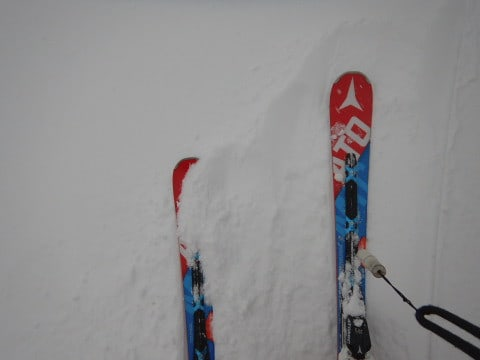

全力で焼額へ戻って．

浮気してごめんなさい～！

と，焼額の神（なんじゃそりゃ？）に謝りながら．

焼額の営業ラストまで滑ってきたのでした…

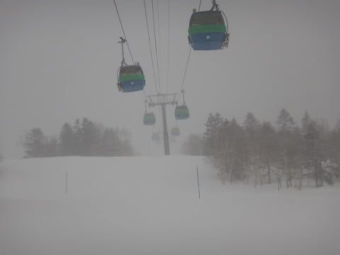

しかし．

この週末は，ツルツル＆コロコロに悩まされましたが．

24，25日と続く，すさまじい積雪で雪質はリセット

されそうですね～．

この週末は久しぶりに柔らかい雪で滑れるかなっ！！

## 💬 コメント一覧

### 💬 コメント by (つーちゃん)
**タイトル**: ご無体～
**投稿日**: 2018-01-23 02:26:07

いやはや帰宅がこんな時間になってしまいました。

（これは平日スキーを羨む誰かの呪いだっ笑）

ラストリフトまで滑ってしまったのが運のつき

もっと早めに切り上げるべきでした～

鶴ヶ島ICから先が通行止め

もこもこ積雪の一般道を走り

ガリガリガタガタのダート国道を走り

上り坂で息絶えた数々のチャレンジャーを尻目に

なんとか約8時間かけて帰宅～

帰ってこれただけ運が良かったかもしれないです！

志賀高原のコンディションはまずまず

帰る頃には積もり始めてましたよ！

### 💬 コメント by (れお)
**タイトル**: 25(木)に出撃できるかもです
**投稿日**: 2018-01-23 11:50:54

先週末は志賀行けずでしたが、その代わりに25(木)に行けるかもです～

25(木)はなんか雪凄そうですね。リフト止まらないかちょっと心配です。もし行けたらレポート入れますね。

なんか私が行くときはいつも雪のような気が… 苦笑

Sさんの青空の写真が眩しいです～

### 💬 コメント by (はっち)
**タイトル**: 今日のブログは
**投稿日**: 2018-01-23 20:35:40

自宅周辺速報モードかと期待していたんですが 笑

### 💬 コメント by (新潟のスキーヤー)
**タイトル**: 気がついたら…
**投稿日**: 2018-01-23 23:46:09

Sさまにお会いした翌日の夜には

新潟市に戻る予定だったのですが…

気がついたら、なぜか猛吹雪の妙高杉ノ原で

ゴンドラが止まるまでＸ―RACEでクルージング楽しんでました！笑

今回の志賀高原はアイスバーンばかりでしたので、今シーズン中に極上のシマシマ！

リベンジしに行きたいと思います！

### 💬 コメント by (Skier_S)
**タイトル**: 我が家の周りも積雪路
**投稿日**: 2018-01-24 00:59:33

＞つーちゃんさま

あらららら…

高速道路通行止めに嵌っちゃいましたか．

片道8時間，お疲れ様です．

私は大雪の日の帰り道に同じ目に会って，

片道12時間，月曜の朝5時ごろに帰宅した

思い出もあります…

長時間運転，お疲れ様でした．

でも．

平日スキーをうらやむ人々の恨みが詰まって

降った雪なので，仕方ないですね（笑）

＞れおさま

あら．

平日スキーですか…

いいですね．

25日は結構降ると思いますよ～．

さらに寒いので注意してください…

確かに，もしかすると風が強めかもしれませんね．

まぁ，1ゴンは動くと思います．

25日帰ってきたら，どうだったかレポートお願いします！

＞はっちさま

さすがに自宅周辺速報モードにすると，

どこに住んでるかばれちゃいそうですから（笑）

＞新潟のスキーヤーさま

あら？

あの翌日に杉ノ原に行かれたんですか…

杉ノ原はアイスバーンが隠れるほどの積雪に

なったのですね…

今週末には，ちょっと積雪があるので，

アイスバーン＆大量殺人コロコロの

悪コンディションとは，しばしお別れの感じでしょうか．

ぜひ，今シーズンのうちに志賀へのリベンジをお待ちしています！

