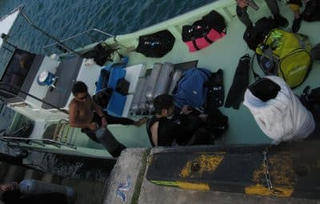

# 2010年7月，2歳の子連れで座間味でダイビング！その7…午後は2度目のカメラテスト！

📅 投稿日時: 2021-09-29 02:52:26

🏷️ カテゴリ: [ダイビング日記](ce3a7a8d424d112fce83ee85c81a0e344.md)

ということで．

午前中2本潜った妻に娘を預けて，

午後は私がダイビングの番．

午後3時を過ぎてますが，ようやっと

この日の1本目！

船の上から見ても，透明度がよさそう

ですね～！！

海底の白砂が綺麗に見えてます…

ってなことで．

待ちかねた海へエントリー！

海へ入ると…

白い砂地がきれいですねーーーー．

波照間や黒島近辺のポイントを髣髴と

させるポイント．

大好きです．こういうところ．

この，砂地での撮影．

フィッシュアイの画角がすばらしい！

…ちょっとゴーストが右下に出てるけど（涙）

砂地の広々感を出せる程度の砂を画面に入れた上で，

太陽が入る！

こういう画角が欲しかった…！

白い海底の広がり感が十分．

こういうアングルでは，文句なしの絵が

撮れるな．

…しかし，

逆光ポジションに入れると，やはり

背景が露出オーバー（涙）

なので．

今回，カメラ設定をごまかすための

小技として，

いくつか考えてきた技のひとつを

使ってみましょうか…

まずは必殺技，AEロック！！

…これは，シャッターボタン半押し時に，

上矢印ボタンを押せば，解除操作するまで

そのときのシャッタースピードと

絞り値をずーーーーとキープしたまま

撮影を続けられる，という技です．

これで，海の色がこの明るさで出るように

背景光に露出をロックして．

それからフレーミングを変えて，

サンゴや魚が入るようにしてから

撮影すればいいんだ！

…しかし．

タダでさえ半押しの感覚が分かりにくい

ハウジングに入れてるのに，

水中でのシャッター半押しと同時の

ボタン操作をしろというのは

なかなか上手くいかず…上手くいかず…

うがーーっ！

人間のストレス試験か！これは！

で，上手くいっても…

AEロック時に一旦フラッシュが発光して，

フラッシュ露出量の調整が入るようなので，

フラッシュが届く範囲に被写体があると，

結局そちら側の露出に引っ張られて背景光に

うまく露出があわせられない…

（この写真も，結局海面は真っ白になっちゃってる…（涙））

さらに，撮影してなくても，AEロックを

する時に一度フラッシュが光るので，

その後フラッシュの再チャージが

終わるまで撮影できない…

うーーーん．

だめだ…AEロックは使えないか…

では，2番目の技．

海面に向けてシャッター半押し，

シャッター半押しすると，露出値は

そこで固定されるので．

あとはそのままアングルを変えて

撮影すれば，海面の明るさに合わせた

露出になり，さっきの写真みたいに

海面が真っ白に飛ばないはず…！

(太陽に向けてシャッターを半押しすると，

このくらいの露出に固定される．

露出補正-2段，フラッシュオフ時）

よしよし．

海がこのくらいのブルーになってくれると

いい感じ…！

あとは，海がこの露出のまま撮影できれば

良いので，半押しをキープまま，

アングルを変えて望む被写体を撮影すれば

いいはず…

と，撮影してみたけど．

…しかし，太陽に向けてシャッター半押し

すると，絞り値がF9.0となってしまい，

ガイドナンバー18の大型外付け

フラッシュでも，絞り値9.0だと，

フラッシュ光が2mしか届かないよ…

だもんで．フラッシュ光量足りず…．

…フラッシュが届かないので，

珊瑚がちょっと暗い（泣）

それでも，バックは濃いブルーには

出来たので，目的は半分達成．

あとは，ISO感度をいじるか，

露出補正-1.7段をー1.3段くらいに

抑えて，何とか絞り開放状態で

望みの背景の明るさに

もっていければいいんだけど…

（ごちょごちょ）

…をを！

上手くいった．

しかし…

これで上手くいったとしても，

毎回，太陽に向けてシャッター半押しして，

絞り値がF9.0って出た場合には，

ISO感度と露出補正をちょっといじって

開放絞りに出来そうかどうか判断して，

出来そうならISOをいじって，

また太陽に向けてシャッター半押しして，

シャッター半押しのままアングル変えて，

望みのアングルになったらシャッター

全押し…

という，複雑なプロセスを経ねば

望みの写真が得られない（泣）．

…水中で写真撮るたびに，そんな

めんどくさいことができるかっ！！！

絞り優先AEがあれば，こんなめんどくさい

ことしなくて済むのに…

うーーーん．

…絞り優先AEが無い安いカメラで，

外部調光フラッシュを使おうというのが，

やっぱり無謀だったか…

ってな感じで．

残念感に打ちひしがれてエグジット．

港に戻り…

妻「どうだった？」

私「やっぱりダメだった」

妻「…だから，カメラじゃなくて…」 

…相変わらず，今日も水中では新しいカメラの

ことしか考えていなかった，Skier_Sだったのでした…
