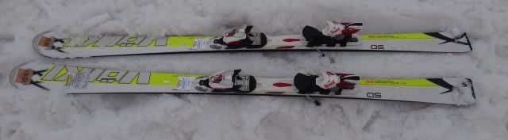
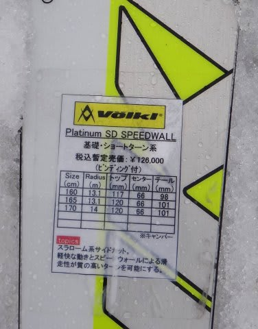

# 2014シーズンモデルのスキー試乗レポート17…VOLKL編2

📅 投稿日時: 2013-06-02 00:00:28

あー．

この週末，スキーに行かないのでネタが無い…

ってことで．

3月下旬から続いている，2014年度モデルのスキー板の

試乗インプレッションも，残すはフォルクルの2機種．

今回は，Platinum SDです．

では，どうぞ～

----

Volkl 

PLATINUM SD Speedwall 165cm

小回り基礎用．

典型的なウッドコアサンドイッチ平板の乗り心地ですね～．

完全キャンバーな板．

これは，かなり張りが強いです…．

そして…むちゃくちゃ軽い！

軽いのに，強い．

メタルが効いていて，板にエネルギーがたまるバネっぽい張りの強さというより，

コア材がしっかり硬くて強い感じ．

でも…サイドカーブに乗って，よく回ります．

スピードを出していくと，鋭い武器のようにトップから切れ込み，

板の強さから来る反動で，すばやく次の谷回りにつなげる小回りができます．

張りが強いので，かなりのスピードを出しても板のフレックスは全く窒息しません．

それどころか，私のスピードレンジではまだ十分余裕がある感じ…

実用に耐えるスピード限界はかなり高いです．

不整地では，このフレックスの硬さゆえに荒地で板が叩かれる感じがあり，

さらに，板がありえないくらい軽いので，板が叩かれるとラインが

流されちゃう感じが，ちょっと残念．

フレックスの強さもあって，コブでは結構手ごわそう．

でも．

整地ではすごいです．

整地でものすごいスピードレンジで小回りをすると，

かなり快感なんですが．

…これは，整地スペシャルかな～．

サンドイッチのSL競技用って言われても，信じそうなほど

強い板でした．
