# 2014年10月，小学生の子連れでパラオへダイビングに行ってみた，その37…パラオラストナイト

📅 投稿日時: 2015-10-03 02:01:45

🏷️ カテゴリ: [ダイビング日記](ce3a7a8d424d112fce83ee85c81a0e344.md)

ということで．

盛りだくさんの，半日シーカヤック＆シュノーケリングツアーを

終えて．

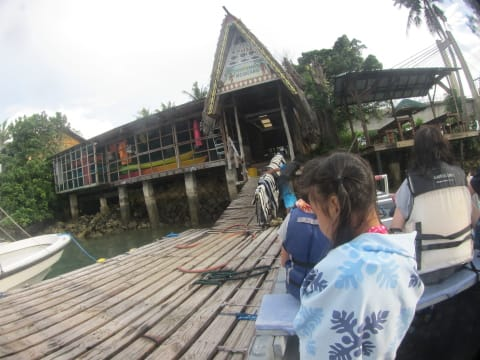

ツアーショップへ戻ってきましたが…

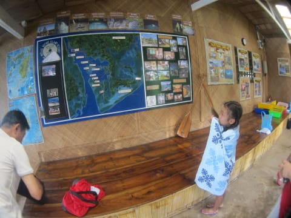

もう，午後5時近くですね～．

午後いっぱい，遊んだなぁ．

ってことで．車で送ってもらい，ホテルへ帰ります．

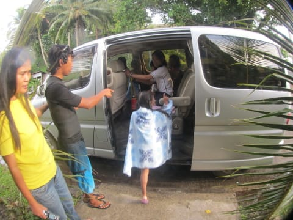

ホテルへ帰って，シャワーで塩水を洗い流して．

…ああ．

水が出るって，素晴らしい…

そして，部屋の前で海を眺めながらのビールタイム！！

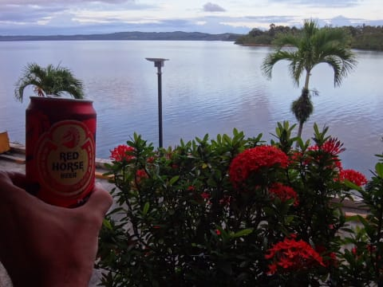

ビールがんまいっ！！！

と，そうこうしていると．

このベランダと反対方向，

ホテルの正面側の，目の前．

夕日が沈むのが見える，最高のポイントであることが

分かり…

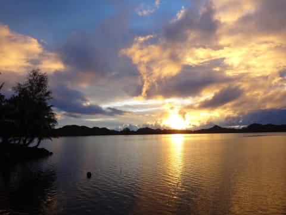

家族みんな，ホテルの道の前に座って．

沈みゆく夕日を眺めます…

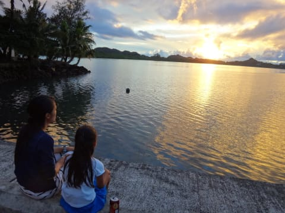

…ああ．

このパラオ旅行も，

楽しい旅行だったねぇ…

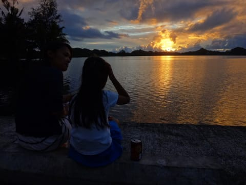

今回の旅行のいろんな出来事を思い出しつつ．

パラオ滞在最終日の，沈みゆく夕日を眺めます…

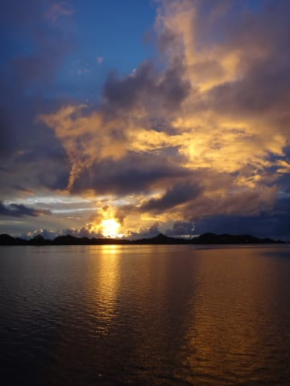

…最後に，きれいな夕日が見れて，良かった…

この夕陽を見るだけに，このホテルに泊まってもいいかも…

＃街中から遠くて不便だけど

という感じで．

夕日が沈みきってしまったので．

夕食を食べに，出かけましょうか…

本日やってきたのは，ホテルから歩いて15分ほど．

WCTCショッピングセンターの裏にある，

「Emaimerei」というレストラン．

…このレストラン，日本人向けではなく．

日本語メニューも無ければ，他に日本人客もいませんでしたが…

地元の人が多く，観光客向けと違って，

お値段も安い！

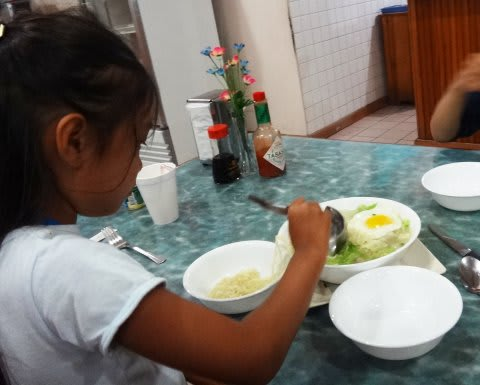

そして…1品ごとの量も多い！

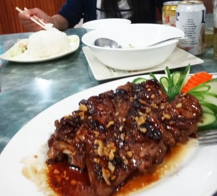

このチキン照り焼きのボリュームを見よ！

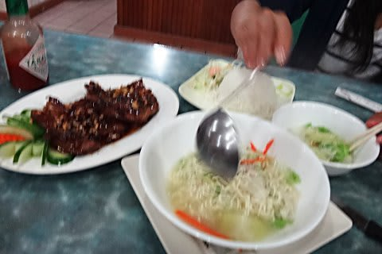

何にしろ，ビールを飲んでもすごく安く上がるので．

パラオで安く夜ご飯を食べたい人にはお勧め！

Emaimereiの，ものすごいボリュームたっぷりな夜ご飯を食べて，

おなか一杯になったら．

すぐ目の前にある，WCTCショッピングセンターで，

お土産物を買い込みましょうか…

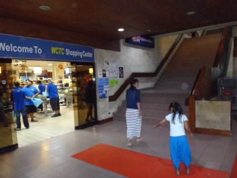

ここは，パラオ最大級のショッピングセンターなので．

見ているだけでも楽しいし．

一通りほしいお土産は揃います．

って感じで．

夕食とショッピングを終えたら．

ホテルまでは，徒歩15分．

ぶらぶらと，お散歩がてら帰ります…

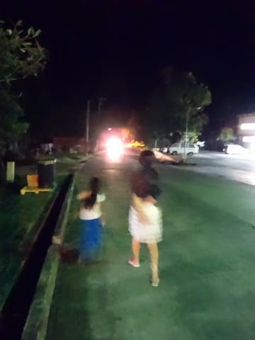

結構道は暗いので，ウェストプラザ・バイザシーに泊まる人で．

WCTCまで夜に歩いて行こうと思う人は．

懐中電灯を持って行った方がいいかも…

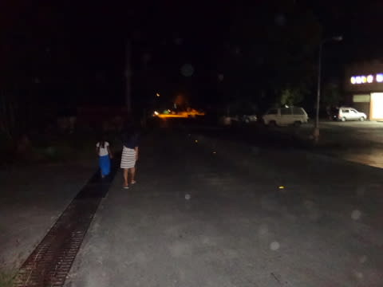

ホテルに戻ったら．

もう，夜9時ですね…

明日は朝が早いので．

（というか，深夜出発なので）

おやすみなさい…
