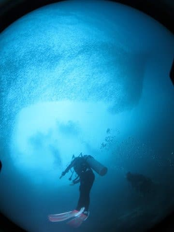

# 小学校5年生（10歳）の娘に，ジュニアオープンウォーターのダイビングCカードを取らせてみた…その１

📅 投稿日時: 2018-09-09 04:08:58

🏷️ カテゴリ: [ダイビング日記](ce3a7a8d424d112fce83ee85c81a0e344.md)

ということで．

今年，わが娘＠10歳が．

この夏にジュニアオープンウォーターの

Cカードを取得したわけですが．

…もしかすると．

読者の中にも，

「子供にCカードを取らせて，ダイバーに仕立て上げよう！」

と思っている，我が家と同じスパルタなチャレンジングな方が

いるかもしれないので．

我が娘がCカードを取るまで，どんな感じだったのかを

まとめてみようかと思います…

まず．

よく誤解されるところですが．

ダイビングのCカード．

ダイビングライセンスと言ったり

しますけど．

飛行機や車の「免許証＝ライセンス」とは違い．

ダイビングは法律上「免許」というのが存在しません．

なんの経験も無い人が好き勝手に潜っても，

法的に処罰されるものではありません．

だもんで．

「ダイビングライセンス」と広く呼ばれるものは．

法に則って，政府や役所などの公的団体が認める

資格ではなく．

あくまで民間団体が勝手に発行する，

「うちが定めた基準の講習を修了しましたよ～！」

という証明書でしかないので．

公的な「ライセンス」ではなく，

企業が発行する「受講証明書=Certification card（Cカード）」

なんです．

だもんで．

これまでの私の記事では，ライセンスと書かず，

あえて「Cカード」と記載してました…

ってことで．

Cカードというのは．

「この人はうちが定めた一定の講習を受けたから，

　ダイビングできるスキルがあるはずですよ～」

ということを示すだけの，民間企業発行の証明書であって．

ライセンスではないので．

特に更新したりする必要はありません…

ってな感じで．

Cカードを発行する企業（団体）はいっぱいありますが．

我が家は最もメジャーな「PADI」のCカードを取得

したので．

今回は，娘がPADIのCカードを取得するまでの体験談になります．

で．

PADIのCカード．

15歳未満の子供はジュニアCカードとなります．

10歳以上からCカードが取得できて，

10歳～14歳までの間に取得できるのは

・ジュニアスクーバダイバー

・ジュニアオープンウォーターダイバー

の2種類ですね…

スクーバダイバーの方は．

後で書きますが，いろいろ制限があって

本格的にダイビングをやるには全く物足りない

レベルなので．

我が家では論外．

…だもんで．

我が家では必然的にジュニアオープンウォーターを

取ることになるわけですが．

○ジュニア・オープンウォーターダイバー：

　10～11歳まで…最大12m．保護者，またはダイブマスター以上と一緒に潜ること

　12歳以上…最大18m（大人のオープンウォーターと同じ水深までOK）．成人と潜ること

って感じの認定になります．

わが娘が取った，ジュニアオープンウォーターの

カードを見てみると．

11歳までは12mまで…などの注意書き

「10-11 With Parent/PADI Pro 12m/40ft

　　12+ With Adult」

がちゃんと書かれてますね～…

で．このジュニアオープンウオーターダイバー．

15歳以上で申請すれば，講習や実習など一切なしで

成人のオープンウォーター

　最大18mまで，バディがいれば自由に潜ってよい

に切り替えできるってのが魅力です．

ちなみに，ジュニアスクーバダイバーだと．

15歳になって申請しても，

　最大12mまで＆ダイブマスター以上の同伴が必要

という制限が着くので，あまりうれしくありません．

で．

ジュニアオープンウォーターを取ったあとなら，

12歳からはジュニアアドバンス認定が取れます．

○ジュニア・アドバンスオープンウォーターダイバー

　12歳以上…最大21mまで．成人と潜ること．

　15歳以上で申請すれば，成人のアドバンスウォーター

　（最大30m）に切り替え可能．

…まぁ，このアドバンス．

わが娘が取得できる年齢になるまで

あと2年かかるので．

これは将来の宿題ですね…

ってな感じで．

10歳になったわが娘．

ジュニアオープンウォーターダイバーの

認定を受けたわけですが．

この認定を取ってしまえば，ガイドやインストラクターが

いなくても，親or保護者と子供だけで，バディダイブが

できちゃいます．

で．

我が子をダイバーにしようとしている親にとっては．

　「ジュニア」オープンウォーター認定までには，

　何をすればいいの…？

　大人のオープンウォーターダイバー認定と

　何か違うの…？

というところが，気になるところでしょうが．

実際に経験してみると．

ジュニアオープンウォーターと成人のオープンウォーターで，

講習も実習も内容は全くちっともこれっぽっちも変わらない

ということが，良く分かりました…！

まぁ，子供だからダイビングの実習の内容を

簡単にしていい…という理由は無いわけで．

安全のためには，大人と同じ知識，同じスキルが

必要なことは理解しつつも．

学科講習をやり始めてから．

ジュニア認定も大人のテキストを使っての講習で．

子供向けに分かりやすく書いてあるテキストはない

という，衝撃の事実を知って．

愕然としたのでした…

ってなことなので．

これから．

わが娘が，ジュニアオープンウォーターダイバーの

Cカードを取得するまで．

実際に講習＆実習がどんな感じで進んでいったか

（…というより，苦労していったか）

ということを，書いて行こうかと思います…

（またなんだか長く続きそうな連載が始まった…）

## 💬 コメント一覧

### 💬 コメント by (KENKEN)
**タイトル**: ボイルシャルルの法則
**投稿日**: 2018-09-09 23:00:27

以前座間味のショップのオーナーの小学生お子さんのOW講習にたまたま立ち会いましたが、座学の時に気体の体積と圧力の関係の理解は無理だったそうです。そりゃそうだと思いました(笑)。

ちなみに講習で何度も練習したのにマスククリアは未だに苦手です。

### 💬 コメント by (Skier_S)
**タイトル**: KENKENさま
**投稿日**: 2018-09-10 07:18:03

うちの娘は，体積と圧力だけで2-3日やり続けました．

おかげで，学科テストに出るような問題は完全に

解けるようになりました…

小学校5年生でも，時間をかければ理解できるようです．

しかし，学科の勉強がすべて終わるのに，週末を1か月くらい，

毎日2-3時間テキストを教え込みました…

