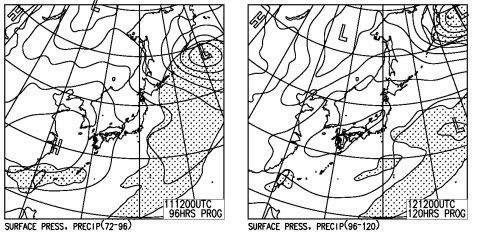

# 4月1日から首都圏高速料金が変わるけど…事実上の値上げだな…（涙）．

📅 投稿日時: 2016-03-09 01:20:06

ってことで．

どうやら，スキー板劣化加速能力を標準装備しているらしい

Skier_Sです．

＃こんな能力，要らないんだけど…

えー．

本題へ行く前に．

ここ数日の天気を見てみると…

ふむ．

金曜11日と土曜12日は平年より-5℃程度寒く．

日曜13日も，平年以下の気温になりそうです…

今週は，今シーズンとしては珍しい，

冷え冷えの週末になりそうですね～！！！

…って．

この程度の冷えは，普通の年なら当たり前レベルの

ような気がするんだけど…

今シーズンは，この程度の冷えでもありがたく

感じてしまいますね…

…が．

ところが．

ところが，だ．

この，今シーズンにしては超冷え冷えの，この11日，12日の

地上天気図を見てみると，だ．

ええ！？？

…

…

…

高気圧に覆われて．

これっぽっちもほんの少しも1mmもちょびっとたりとも，

雪が降らなさそう

なんですが…っ！！！？？（激泣）．

この前日，気温が高い10日は．

雨か雪か微妙なものが降りそうというのに…

なんてこった…

なーんてこったっ！！！！

今シーズンの定番となりつつある．

冷えると降らないの法則

が，今週末も発動するようです…（泣）．

＃いいよ…いいよ，そんなものが発動しなくても…

このままだと．

今週末．

全山ガチガチ固いバーン祭りになったりして…

…

…

いや！

そんなことは許さないぞっ！！

この私が許さないっ！！

全力で踊るっ！

踊り疲れてるけど，踊るっ！！

週末前の10日に雨とかみぞれじゃなく冷え冷え雪が降って，

そして11日に奇跡の積雪があって

週末は最高のコンディションに復活する踊りをっ！←もうなんだか正常な判断力を失っている

…踊りはいいから，一日子供と一緒にキッズパークで

そり遊びをしていて欲しい…

というリクエストが聞こえる気がするが．

それはとりあえず．

聞こえないフリをしておこう…←間違いなく，踊りよりキッズパークでのソリ遊びが効くと思うのだが？？

ってことで．

本題へ．←ここまでが本題だと思っていたのだが…

えー．

首都圏に在住のスキーヤーは．

ほとんどの方が，もう情報を手に入れていると思いますが．

…ええ．そうです．

この，4月1日から，[首都圏近辺の高速道路料金が見直されます](http://www.driveplaza.com/info/detail/syutoken_seamless/fee.html)．

これまで，首都高が安すぎたため．

外環や圏央道へ車が流れるように料金を

見直そう…

というのが趣旨で．

・首都高，第三京浜，横浜新道の料金アップ

・圏央道などの迂回ルートの値下げ

を実施する…ってことみたいですが．

…これは．

圏央道沿線に住んでいて，もともと圏央道を使っている人に

とっては，値下げなんですけど…

それ以外の人にとっては，

実質の値上げ

になるんですが…（涙）．

これまで，首都高の上限が930円だったのが，一気に1300円に

上がるので．

千葉や神奈川などから，首都高を利用して首都圏を

突っ切っていた人は，片道400円近いアップになります（泣）．

それだけではなく…

第三京浜も，260円→390円にアップ．

横浜新道も，210円→320円にアップ．

だもんで．横浜新道→第三京浜→環八で

関越にアプローチしていた人は，

片道240円のアップです…

で．

[横浜横須賀道路は値下げ](http://www.driveplaza.com/info/detail/syutoken_seamless/fee02.html)ということになってますが．

…惑わされてはいけないのだ．

値下げの代わり，休日割引，深夜割引が廃止なので．

休日にスキーに行く人にとっては，

実質かなりの値上げになります…（涙）．

とりあえず．

昨年，休日割引が半額→3割引きになり，

スキーに行く高速道路料金がかなりUPしてお財布に痛かったけど．

今シーズンも4月以降，私にとっては

またお財布に痛い改定となりそうです…

…って．

そもそも．

4月以降，雪が無くなってスキー場がクローズしてしまい．

高速道路を使わなかったりして…

という，それはそれは大変恐ろしいシナリオが頭に浮かんだけど…

いや，そんなことは起きないはず．

そんなことが起きたら死んじゃう．

とりあえず，今週末に向けて．

週末前の10日に雨とかみぞれじゃなく冷え冷え雪が降って，

そして11日に奇跡の積雪があって週末は

最高のコンディションに復活する踊り

を踊るので．

どっさり1mほど積もって，GWまで雪がもつはずなのだ…っ！！←んなわけあるか…

## 💬 コメント一覧

### 💬 コメント by (マルハバ)
**タイトル**: 11日に奇跡の積雪・・・
**投稿日**: 2016-03-10 23:24:22

期待しております！

今年は

1時間のダイヤモンドナイターのためだけに

小回り板も持参です

### 💬 コメント by (Skier_S)
**タイトル**: マルハバさま
**投稿日**: 2016-03-10 23:53:52

今週，志賀高原ですか？？

この土曜日は焼額ナイターが今シーズンの最終営業日なので，

ヤケビナイター滑る予定です…

11日，ガッツリ降ってほしいのですが．

どうやら残念ながら，うっすら積もる程度っぽいです…（涙）．

どっさり降ってくれるよう，一緒に降れ降れ踊りを

踊ってください！

### 💬 コメント by (マルハバ)
**タイトル**: ありゃ？焼額ですか・・・
**投稿日**: 2016-03-11 11:51:24

う～ん・・

焼額ナイター滑ったことないなぁ～

行ってみたいなぁ～♪

もし時間に余裕があったら伺いますので、

その際は宜しくお願いいたします！

これから出発であります♪

### 💬 コメント by (Skier_S)
**タイトル**: マルハバさま
**投稿日**: 2016-03-11 21:27:43

そうなんですよ…

今週でヤケビナイターがラストなので…

第3高速と第4ロマンスの2本が動いてますが，

私は第3高速グルグルしてます．

昼間は雪が悪くなければ

第1ゴンドラグルグルしてると思うので，

よろしくです～！

### 💬 コメント by (Skier_S)
**タイトル**: マルハバさま
**投稿日**: 2016-03-12 21:55:38

お会いできませんでしたね…

明日の昼間はいらっしゃるんですか？？

ヤケビでお会いしましょう！

