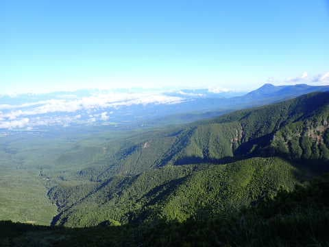

# 八ヶ岳の阿弥陀岳・赤岳ピストン登山！その3…阿弥陀岳直前はかなりハード！

📅 投稿日時: 2022-09-26 04:01:15

🏷️ カテゴリ: [登山・旅行](c1d637a11a25b457ac978d197adbdafc5.md)

この3日間．

確か，「さんれんきゅう」とか言われる，

私には全く縁のない，謎の期間だったようですが…

私はこの3日間，家から歩いて5分の

スーパーに一度行ったきりで．

それ以外，家から一歩も出ない3日間

でした（泣）

ということで．

いろいろ状況がヤバいので，

相変わらず，明け方4時ごろのこんな時間に

記事更新してますが…

昨日は記事書けなかったので今日頑張って

書いてます．

明日も日帰り某所出張なんだけど，

こんな時間にこんな事していて

大丈夫かな？？

とりあえず，今日も，阿弥陀・赤岳の

山歩きレポートです！

ーーーー

ってなことで．

スタートから1時間半ほどは，鼻歌交じりの

お気楽登山道だったのに…

そこから先は一変して，目の前にふさがる

急斜面！！

…いや．

地形図を見て，うすうす分かってはいたけど．

これ…

かなり急ですね（泣）

ここから山頂付近まで，

距離1kmちょいで500m登るという，

かなりの急登なんですが…

10分ほどひいこらこの急登を登っていると…

右手に展望台が現れました！

いや…

今日は昼から崩れる予想が，

意外といい天気じゃないですか！

これから登る先も良く見えますが…

…え？

阿弥陀岳って，あれ？？

あそこまで登るの…？？

…まだまだかなり登らないといかんな（涙）

ってなことで．

ひたすらひたすら，木立の中の

急斜面を登っていくと…

さらに展望台から20分ほどで．

森林限界を超えてきて，

周りが見渡せるようなコースに

なってきました…！

後ろを振り返ると．

いや…

今日は意外と絶好の山歩き日和では

なかろうか？？

という絶景！

これから行く先にも青空が

広がってますが…

でも．

傾斜はさらにだんだん厳しくなって

行ってる気が…

足元がガレ場の，かなりの急な坂道を

えんえん登っていきます…

ただ．

登れば登るほど，景色は良い！

南アルプスから御岳，北アルプス方面まで

見渡せて…

このコース，景色はかなりいいかも！？

とはいえ．

ルートの傾斜はさらに厳しくなり．

ザイルが張られていて．

こいつに頼らないと

厳しいような斜度になってきました…

さらに短い梯子があったり．

その後も断続的に，ザイルが張られている

斜面が続きますが…

急斜面を登り切ると．

スタートから2時間半，7:30過ぎに

「西の肩」とかいうポイントへ到着！

いや．

ここ．

結構見晴らしはいいんだけど…

ここから行く先を見ると．

…え？？

あそこを乗り越えていくの…？？

とりあえず．

今年はまだ緩やかなハイキングコースしか

歩いてなかったけど．

ここから先は，今シーズン初の

ちょっと気合が入った山歩きに

なりそうですな…
