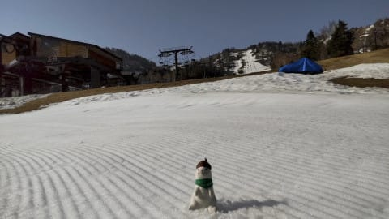
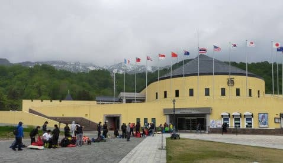

# 2021/5/9(日)の志賀高原熊の湯スキー場＆かぐら特派員情報！…志賀は高温＆昼頃ポツポツ雨，かぐらは午前混雑

📅 投稿日時: 2021-05-10 00:26:41

本日は久しぶりに，家にいるのに一日仕事を

しない日に決めて．

のんびりするぞーーー！！

と，思っていたら．

洗車やら，車内の徹底掃除，シーズンの出番が

終わった板たち4セットのワクシング，

そして車じゃないと行けないお店へ妻を

買い物に連れて行って…

とかやっていると．

一日が終わっちゃいました(涙）

…全然のんびりした感が無い…

そして，また明日から仕事(泣）

うーん．

スキーに行っていた方が良かったかも？？

ってなことで．

本日も，志賀高原特派員は熊の湯を滑って

いたようですが…

あさイチは天気も良く，シマシマ！

…ですが．

かなり朝から気温が高く，板が潜って

しまうような柔らかい雪で．

そして，貼りつき雪というほどではない

にしろ，滑りが悪い雪だったようです…

で．

朝のうちは天気が良かったものの．

10時ごろにはかなり雲が増えて行き，

…そして，11時前には，朝には全く

想像していなかった雨が！！(涙）

でも，雨はそんなひどい降りにはならず，

一瞬ぱらついた程度で，すぐに止んで

くれたようですが．

ただ，午後はかなり板の滑りが悪く

なっていったようです…

…しかし．

第3緩斜面の今日の写真を見ると．

かなり雪が減りましたね…(涙）

一応，オープンしている第2緩斜面は

まだまだ雪がありそうに見えますが…

果たして，熊の湯は来週までもつのか？？

ちなみに．

かぐらに行っていた特派員によると…

本日のかぐらは曇り~ガス．

かぐらはメインバーンはまだ雪が結構

あって，クワッド乗り場も全然

大丈夫そうだけど…

テクニカルは穴が開いて，もうそろそろ

ヤバそうですね…(涙）

ジャイアントも来週までもつか微妙な

感じになってきたようです(涙）

でも．

やっぱりかぐらは混んでますね…

すごい長い列が！

午前はクワッド7-8分待ち，

午後は待ちが無かったということですが…

かぐらまで登るのに，ゴンドラも乗車人数

制限で，待ち時間があるみたいですし．

うーん．

やっぱりかぐらは混むのか…

むしろ，

今日はアライに行った某特派員が

一番楽しそうな写真を送ってきてくれました…！

アライはまだゴンドラ上部の膳棚リフトに

まだ雪がいっぱいあり，硫安も入っていて

雪はそこそこ滑ったようです！

ただ，朝イチのゴンドラ待ちの列が

ちょっと長そうに見えますが…

でも，このくらいなら大したことないかな？

果たして．

次の週末，ベストなスキー場はどこだ？？

## 💬 コメント一覧

### 💬 コメント by (ikkun)
**タイトル**: Unknown
**投稿日**: 2021-05-10 10:48:16

おはようございます❗いや そこまで(・・;) すごいだけでは語れません 新井は……リフト料金が私しにはネック(笑)で初めて怪我をしたので 行きたくない場所でありますが

あアルペンさんの試乗会ある予定でしたね🎵行きませんが( *´艸｀)

### 💬 コメント by (ikkun)
**タイトル**: Unknown
**投稿日**: 2021-05-10 10:52:12

追伸 昨日は戸隠神社奥社に今年初お参りしまして……戸隠スキー駐車場にてゲレンデを見上げて来ました❗雪が、消えて始めた山々のとんがり部分を見上げながら「来シーズンも多分来ますので」と呟いて帰って来ました❤️

### 💬 コメント by (Skier_S)
**タイトル**: ＞ikkunさま
**投稿日**: 2021-05-11 00:37:49

Araiも春スキー時期は安くなるので，トップシーズンに比べればお安く行けますよ．

