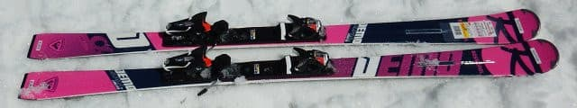
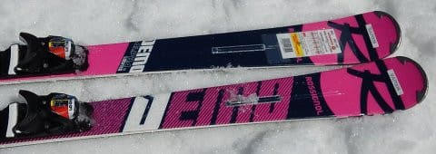
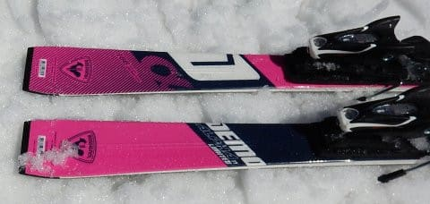
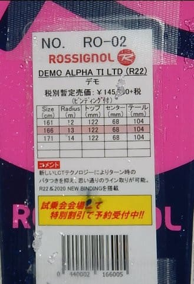
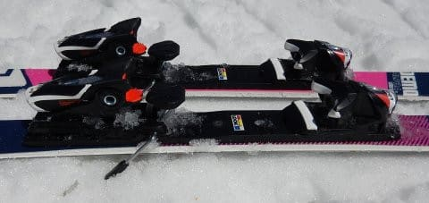

# 2020シーズンモデルのスキー板，試乗レポート…ROSSIGNOL編その2

📅 投稿日時: 2019-06-06 01:38:45

🏷️ カテゴリ: [スキー板試乗](c0bd8048615710cee890e403a36cc9a2b.md)

どうやら．

月山は今週末も，板を履いてリフトに

乗り降りできそうな感じですね…！

6月2週でもリフト乗り場・降り場に

滑りこめるってのは．

やっぱり，平年よりはちょっと雪が

多めなのかな…

でも．

今週末．

土曜は雨っぽいです（涙）

うーん．

日曜の朝には雨は止みそうなんですが…

まぁ，雨の方が混まないし，板も滑るから

いいかな！←いつもの強引なポジティブシンキング

ってな感じで．

本日も2020シーズンモデルの

スキー板の試乗レポート．

今日は，ロシニョール編です．

では，どうぞ～！

○ROSSIGNOL DEMO ALPHA TI Limited R22 166cm

基礎小回り

今シーズンから，DEMO αは3種類に増えて．

一番強いR22プレートが入ったTi LTD，

プレート無しのKONECTビンディングが着いたTi，

Tiのセンター幅を広げたTi Plusが

あるわけですが．

これは一番アグレッシブな，

R22プレートが付いたTi LTDになります．

…とりあえず．

この板のピンク色という色合い．

好き嫌いがはっきり分かれそうですね…

今回，この板は朝早めの，

比較的締まった斜面で試乗できたのですが．

固めの斜面では，かなりエッジグリップが

しっかりした感じです．

しっかりエッジグリップして，

小回り板っぽい旋回半径でカービングで

ぐっと回っていきます．

ただ，雪が柔らかくなってくると，

フレックスが結構強いので，

板がたわまなくなってきます…

春の，足元が崩れていくような雪では

小さい半径のカービングに入れるのは

フレックスの強さから難しい感じ．

意識的にズラしていき，コントロール

する必要があります．

ズラシの時は，意識して迎え角を

作っていかないと，

板が旋回を始めない感じ．

OGASAKAやHEADの板のように，

ズラシた時にもトップ側に強めに

抵抗が働いて，ずらした中でも板が

自然に旋回していく方が，

私にとっては楽に感じるかな…

でも，ここは好き好きかもしれません．

しかし．

やっぱりこの板の本領を発揮するのは硬い雪．

硬い雪であれば，左右のエッジを入れ替えるだけに

近い簡単さで，強いエッジグリップで深い

小回りに入っていけます．

板のばね感の返りで反復横飛びのように

左右に切り替わるのではなく，

しっかり板がグリップして，たわみに乗って

円く深く回っていき，反対側に板が抜けていく…

という，シュンシュンシュンと気持ちよく

板が回っていく，快感度の高い小回りができます．

硬い斜面でカービングに入っている時は，

加える圧で旋回半径をコントロールできるので，

コントロール性はいい感じ．

硬い斜面のハイスピードでは，かなり気持ちよく

中回りから小回りまで，自由にカービングの

半径をコントロールして深く回っていけるという，

快楽を感じられるカービングマシンです．

春雪や荒れた雪でも楽しめる，完全な万能板

ではないけど．

比較的しまった斜面をハイスピードで

滑っていくには，気持ちよく回っていく

快感度の高い板だと思いました．

## 💬 コメント一覧

### 💬 コメント by (NorthFox)
**タイトル**: Unknown
**投稿日**: 2019-06-07 20:02:31

こんにちは。

この板、私にはとても相性が良かったようで、試乗してすぐに物欲リミッターが壊れてしまったんですよね。。。

それにいろんな縁？もあって今季モデルの試乗板を買ってしまうという予定外の散財をしてしまった訳で。

来期モデルのピンク色ですが、“自分には無理”と思っていたんですが（だから今季モデルの購入に走った）、このところ“これはこれでアリかも”と思うようになり。。。

私、気に入ったものは予備が欲しくなる性分でして。

もうしばらくは何も買う必要は無いはずなのですが、何だか心配なんですよね～ （^^；

### 💬 コメント by (Skier_S)
**タイトル**: ＞Northfoxさま
**投稿日**: 2019-06-08 01:08:09

私の周り，今シーズンはDEMO Alphaを履いている人間が

一気に増えたので．

やっぱりこれはいい板だったんだと思います…

でも，来シーズンの色は微妙という方が多かったですね（笑）．

しかし．

性能が気に入ってしまえば，デザインなんてどうでもいいですよね．

そうです．

予備は必要ですよ！！

ぜひ，予備を3セットほど買って，

同じ板を4セットほど揃えてください．

安心できますから（笑）

### 💬 コメント by (NorthFox)
**タイトル**: Unknown
**投稿日**: 2019-06-08 13:34:23

予備がないと落ち着かない人は、“予備の予備”を求めてしまう傾向があると思います。

わたくしもその一人だと自覚しています。

しかし“予備の予備の予備”までは．．．（汗）

三郎君がデビューして残りは四郎君のみとなった今、Ｓ様が“予備の予備”を調達する機は熟したと思います！

共に頑張りましょう。（笑）

### 💬 コメント by (Skier_S)
**タイトル**: ＞Northfoxさま
**投稿日**: 2019-06-08 20:26:21

いや…そこがんばるところじゃないと思います（笑）

### 💬 コメント by (通行人)
**タイトル**: Unknown
**投稿日**: 2019-06-10 21:47:29

はじめまして。

私もスキー馬鹿ですが、同じ匂いを感じます(笑)。

ところで、ロシのアルファシリーズの板って、板の構造は同じでビンディングが違うんですか？

### 💬 コメント by (Goku)
**タイトル**: Unknown
**投稿日**: 2019-06-10 23:20:14

おっしゃる通り、硬いコンディションでは最高でした。

私のは１７１ｃｍなので、朝イチのロングターンでも気持ち良く引っ張れるし、ゲレンデの使い勝手は良かったです。

今シーズンはあの怪我で雪がザクザクになる前にシーズン終了となってしまったので、春雪ではどうなのか気になっていました。

### 💬 コメント by (Skier_S)
**タイトル**: ロシは人気あるみたいですね
**投稿日**: 2019-06-11 02:44:28

＞通行人さま

コメントありがとうございます～！

同類のスキー馬鹿ですか…

ぜひ一度，志賀高原でお会いしたいですね(笑)．

DEMO AlphaのTI LTDと普通のTI（KONECTビンディング）は，

プレート＆ビンディング違いで，板そのものはサイドカーブも幅も

全く同じなので，板自体は一緒だと思います…

ただ，TI Plusは幅が違うので板そのものが違いますが．

＞Gokuさま

締まったゲレンデは最高でした！

ただ，雪が緩むと，板が硬く感じてたわまなくなってきます…

なので，春雪の時は，柔らかい雪用の板を買えばいいんですよ！（悪魔の誘い）

### 💬 コメント by (通行人改め炎の北海道民)
**タイトル**: Unknown
**投稿日**: 2019-06-11 06:26:16

S様

私のホームゲレンデはキロロでした。志賀高原も一度行ってみたいですね。ロシの板は私も試乗しましたが、乗りやすかったです。たまにお邪魔させていただきますね〜。

### 💬 コメント by (Skier_S)
**タイトル**: ＞炎の北海道民さま
**投稿日**: 2019-06-12 01:16:13

あら！！

北海道ですか！！

…それは，志賀高原には来れませんね…

残念．

でも，スキー場が近くていいですね～．

今後もこのBlogを見てやってくださいね～！！

