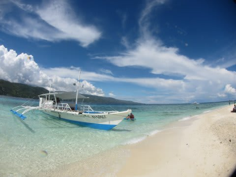
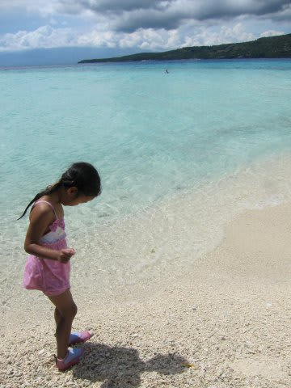
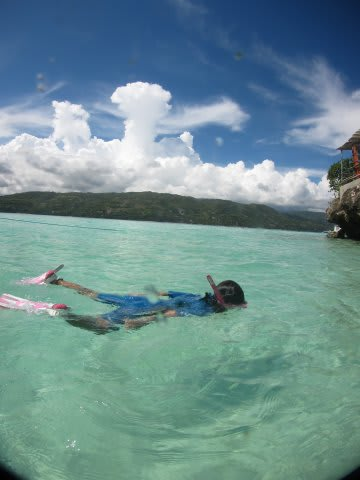

# この3連休は…

📅 投稿日時: 2013-11-05 00:10:52

ということで．

この3連休は，スキーに行かなかったわけですが．

…ちなみに，

スキーに行かなかった今日．

一体，何をしていたかといいますと．

スキーシーズンが始まって，頭はもうスキーモードに

切り替わったというのに．

なぜか，こんなところで．

こんなことしてます…

一体，どこに行ったのか．

スキーシーズンが始まったというのに，

スキーに行かずに，

なぜ，こんなところに行ったのか．

…そのあたりについては，

タイレポートが終了後，ぼちぼち報告します…

＃スキーシーズンとダイビングシーズンが完全にミックスしてしまった…

## 💬 コメント一覧

### 💬 コメント by (マーメイド)
**タイトル**: セブ？
**投稿日**: 2013-11-05 22:01:17

ボートの形をみると、フィリピン！

4日くらいでいける島はセブとみた！(^-^)/

### 💬 コメント by (Skier_S)
**タイトル**: するどい！
**投稿日**: 2013-11-06 01:00:11

…鋭い．

鋭すぎる．

…でも，マーメイドさんには優しすぎるヒントだったか

も知れませんね(笑）．

また，タイ旅行記に続いて詳細報告します～！

### 💬 コメント by (マルハバ)
**タイトル**: ・・・２枚目の画像
**投稿日**: 2013-11-06 10:59:26

見覚えのある景色・・・

手前の半島突端は・・セブ島最南端リロアン

その向こうは・・ネグロス島ドゥマゲッティ

そして、このビーチは・・スミロン島！

如何でしょうか？（笑）

・・・そう云えば

この近辺でもジンベエが狙えたような記憶が・・？

間違っていたら・・・穴に入りたい（汗）

### 💬 コメント by (Skier_S)
**タイトル**: マルハバさま
**投稿日**: 2013-11-07 00:36:38

うわーーー！

恐るべし！

バンカーボートの写真で，フィリピンまでは分かるだろうなぁ…

と思ってましたが．

まさか，スミロン島まで特定する人がいるとは…！

