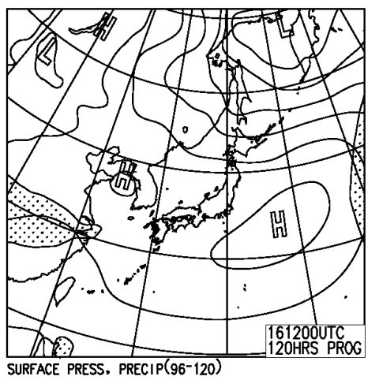

# 今週末の志賀高原は…晴れそうだけど，アイスバーン＆春の雪かな．3月後半も冷え込まなさそうだなぁ…

📅 投稿日時: 2013-03-13 01:49:41

🏷️ カテゴリ: [スキー天気予想](c6554f5c3c106093b511a8daae23757e8.md)

えー．

この週末ですが．

うーん．

あんまり冷えなさそう．

そして．

雪もあんまり積もらなさそうです…

この土日の850hpaの0度線は…

こんな感じで，信州より北に上がってますね～．

さらに，地上天気図は

こんな感じで，いかにも晴れそうな天気図．

なので．

おそらく．

土日とも，晴れ．気温はそこそこ上がって．

朝のうちはアイスバーン，昼間は春の重い雪…

って感じになるかな～．

ただ，日曜の天気はまだ流動的ですが…

んで．

これから先，この3月後半の天気を見てみると…

…なんだか．

例年よりあったかい3月になりそうですねぇ…（涙）．

これからの850hpa気温の傾向を見てみると…

2月23日あたりがものすごく冷え込んで，低温だった2月に比べると．

3月は，平年比で高めに推移しそう（涙）

下の図は，左側が3月16日～22日の，右側が3月23～4月5日までの，850hpa気温予想ですが…

赤い線で示した0度線．

ぎりぎり志賀高原近辺くらい…

で，青く記したところが，平年より1度以上，温度が上がっちゃってる部分です．

信州近辺は，平年より1度以上気温が上がるエリアに入ってます…．

うーーーむ．この週末もあったかかったけど，

3月16日以降も，例年より高い日々が続きそうですね（涙)．

ってことで．

この3月はあったかいよ～．

もう，今シーズンは冷えひえパウダーは期待できなさそう…

せめて，あと1回．

冷え冷えの週末を過ごしたいんだけどなー．

パウダー乞いの儀式をやらねばっ！

## 💬 コメント一覧

### 💬 コメント by (ひろりん)
**タイトル**: Unknown
**投稿日**: 2013-03-13 19:11:13

本当に冷えなさそうですね・・・

コブに行くしかないのか・・・orz

いつもこの時期、一発大雪あるはずなんですけどねぇ（TT)

雨が降らなきゃいいです（TT)

### 💬 コメント by (Skier_S)
**タイトル**: 冷えませんね～(涙)
**投稿日**: 2013-03-13 21:36:32

明日一瞬冷えるけど，そのあとはあったかそうです…

少なくとも，今後一週間はとても冷えてくれる状況では

なさそうです．

去年は，3月下旬に奇跡の冷え込みが続いたんですけどね～

…4月に期待でしょうか（遅いよ…)

