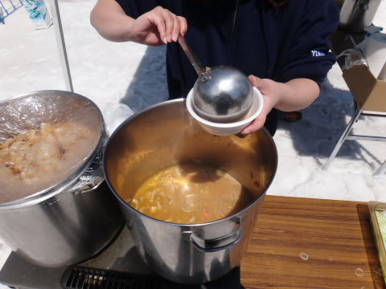
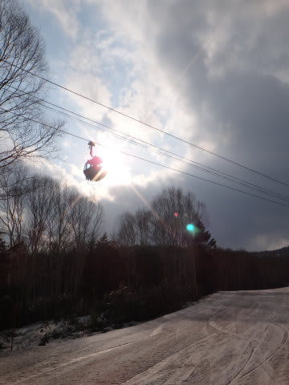

# GW最終日，5月6日の志賀高原は…焼額ラストデー．ありがとう，焼額！

📅 投稿日時: 2013-05-08 02:44:05

🏷️ カテゴリ: [2013スキー滑走日記](c91dbe557f9a69230b1600e48622fdd61.md)

えー．

ということで．

長かったGWのスキーレポートも最後になりますが．

4連休最終日の報告をば…

で．

この日も，いつもどおり朝7時の早朝スキーに出かけたわけですが…

うむ．

朝から，山頂の気温がプラス7度まで上がってますな(涙)．

でも，夜の間は氷点下だったのか，朝イチはそこそこの硬さが残っていて…

朝の数本は，適度な滑りよいバーン！

…だけど．

…なんだか

GW最終日は．

ゲレンデにまったく人がいませんな…．

怖いくらいいません．

晴天のこの日は．

朝から日差しが強かったので…

9時ごろには雪が結構やわらかくなってきましたけど…

んでも．

気温は例年より低めで，気温がプラス10度を超えることは無かったので．

致命的にザブザブにはならず，らっきー！

で．

ゲレンデにほとんど人がいないので．

時間がたっても雪はフラットなまま…

…だけど．

10時過ぎには，ちょいと粘る感じの滑りの悪い雪になって行きましたけどね～．

で．

この日は．

焼額営業最終日ということで．

無料の豚汁サービスが！

…こういうのって，だいたいフツーは，お客さんが列になって待ってたりするんだけど…

でも．今日は．

なんだか，配っているスタッフの方が手持ち無沙汰なくらい，お客さんが少なかったんですけど…

＃開始から1時間くらいたってもまだ残っていたので，3杯も食べてしまった(笑）．

んで．

豚汁でおなかを満たした後は．

第2高速リフト側の唐松コースを滑ってみますが…

うーむ．

ゴンドラコースと違って，こっちは結構土が出てきたなぁ…

まぁ，ぎりぎり最終日までもった感じかな．

ゴンドラ側は，あと1-2週間は営業できそうなほど，

雪がたっぷりあるんですけどね！

んで．

午後になると，さらに人が減った焼額．

焼額全域で，お客さん10人もいなかったんじゃないかな？？

で．人が滑らないこの時期のゲレンデって…

雪があっという間に黒くなっていくんですね…

板の走りも悪くなっていきます…(涙

人がいないんで，雪はフラットなんですけどね～…

そして，午後3時ごろになると．

なんだか想定外に．

雨が降ってきたよ…(泣）．

それも，結構な勢いなんですが(涙)．

まぁ．雨は30分もたたずに止んだのでよかったんですが．

この雨のおかげで，普通の神経の人は帰ってしまったので．

焼額を滑っているのは，残るは私だけ…？

って状態に．

…そして．

ついに．

やってきてしまった，営業終了タイム．

ああ．

これで．

12月の営業初日のゴンドラ営業開始に並んで，営業終了日の最終ゴンドラにまで乗った，

焼額の今シーズンが．

全て終わったんだ…

と，一抹の寂寥感．

…来週から，もう焼額で滑れないんだなぁ…

でも．

今シーズンも楽しませてもらったよ．

ありがとう～，焼額！

また来シーズン！！

## 💬 コメント一覧

### 💬 コメント by (komu)
**タイトル**: Unknown
**投稿日**: 2013-05-08 08:12:14

5月に焼額デビューしましたがとても良いゲレンデで生息地にしたい位（笑）

Ｓさんにはお世話になりましたm(__)m

ありがとうございました。

今週は熊か横手山に出撃予定です。

天気がイマイチかもですが…

### 💬 コメント by (gokuraku skier)
**タイトル**: Unknown
**投稿日**: 2013-05-08 19:30:44

お疲れ様でした～

焼額山から表彰されるほど滑りまくりましたね(笑)

私ももう一回くらい横手で滑る予定ですが、Ｓさんはかぐらですか？

また来シーズン焼額山でお会いしましょう。

### 💬 コメント by (Skier_S)
**タイトル**: みなさん，おつかれさまでした…
**投稿日**: 2013-05-08 23:47:29

>komuさま

ぜひ，来シーズンは焼額を生息地に！(笑）．

今週末は，横手か熊ですか…

私はかぐらの予定です．

残念ながら，今週末は天気悪そうですね～．

せめて土日のどちらか晴れてほしいんですが…

>gokuraku skierさま

今シーズンはいろいろお世話になりました～．

私は今週から，3種連続でかぐらの予定です！

また，来シーズンご一緒しましょう～！！

