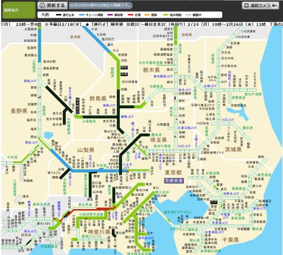
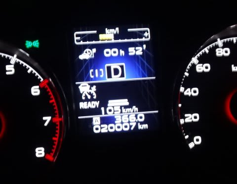
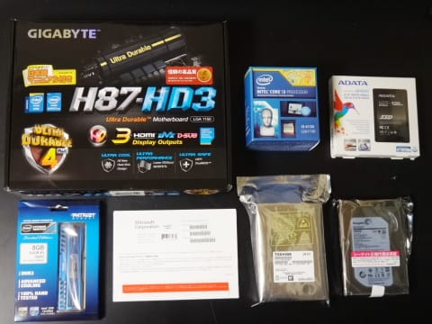
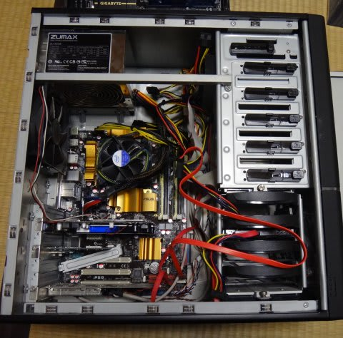

# スキーに行かなかった土日に，何をしていたのかというと

📅 投稿日時: 2014-02-18 00:33:26

えー．

あれですね．

[木曜の記事](e330e159346fcbfb597a07573775b4f9e.md)で．

土曜：朝から強風．朝のうちは湿った雪が吹き付ける．

　　ゴンドラ・リフトは動くのか？

　　昼ごろには気温も下がるが，荒れた天気が続く…

日曜：朝，昨晩からの雪がかなり積もってそうだけど…

　　すごい吹雪．この日もゴンドラ・リフトが動くのかどうか…

…って書いた，あたってほしくない天気予想が．

さらに強烈に悪い方向にモーレツに超ありえないほどパワーアップして当たってしまい．

スキーに行けなかったこの週末（涙）．

ようやっと中央道が全面開通したみたいですが．

関越・上信越はまだ一部通行止めが続いてますね～．

うーむ．

まるまる3日以上通行止めが続くとは．

私が知る限りでは，初めての事態ですね…

恐るべし．

うーん．今週末こそスキーに行きたいところだが．

いまのところ，19，20日にまた関東に雪を降らすかも？

って低気圧，当初より予想位置がだんだん南にずれて．

関東は雪にならずに済みそうな予感…

＃降ったとしても積もるほどではなさそう

とりあえず，今週末こそ．

スキーに行ける，平穏な週末であることを祈りましょう…

ってことで．

今週は．

私にとって，普通ではスキーシーズンに絶対ありえない，

スキーに行かずに過ごす週末になったわけですが．

せっかく家にいる週末なので．

時間があればやっつけたい…と思っていたことを，

一気にいろいろ片づけたんですね～．

まずは，購入後8か月目にして2万㎞走破した，わがBRレガシィ君．

このレガシィ君のオイル交換と徹底的な洗車をして…

＃普通はスキーシーズン中は水をかけて凍結防止剤を落とす

＃程度で，洗車ができないし，オイル交換する暇もない

それから．

このBlogを書くのにも使っている，我が家の

メインPCのメンテナンスをやったんですね～．

そう．

わがPC.

先月，内蔵HDD2台中，容量が大きいほうの1台がぶっ壊れ．

一部のファイルが吹っ飛んでしまい．

もう1台のHDDは容量が小さく，残容量きわきわで．

さらに，バックアップ用HDDなし…

という危険な状態に陥り．

そのうえ．

OSも，サポートが終了するWindowsXP…

という，いろいろマズい状態だったので．

これ幸いと，一気にアップグレードしてしまいました．

で．

Windows7に上げて，またサポート切れがやってくるとめんどくさいので．

一気にWindows8.1に上げちゃって．

どうせなら，システムディスクはSSD化して．

5年前のマザー＋CPUも，最新のHaswellに替えてしまえっ！

ってことで．

秋葉原を散策し．

こんな感じで，パーツを買い揃えてきました…

んで．

こいつを組み立てて，Windowsのセットアップその他をやるなんてことは．

普通のスキーシーズンではなかなかできないことなのだ．

てなわけで．

時間があるこの週末，

一気にセットアップだっ！！

（続く）

## 💬 コメント一覧

### 💬 コメント by (megalith)
**タイトル**: ナカ～マァ(^_^)
**投稿日**: 2014-02-18 10:36:59

こんにちは。

ほんと先々週から関東甲信越は大変な日々ですね。

自分のところも降りましたが、すべて一晩で30cm程度ですみ、当日の道路事情はあまりよくなくても、翌日夕方までには大体支障なく走れています。(さすがに先週の雪は湿って重い雪だったので、国道の県境少し手前でそれなりの雪崩が発生しましたが。)

また今週の木曜日に雪の予報なんですよね・・・・

自分も土曜日に街に遊びに行こうかと思っていましたが、雪次第でキャンセルして来月中旬以降にしようかと思っています。

さてSkier_Sさんって自作派だったんですね。

実は自分もデスクトップは自作派です。(^_^;

自分もサブPCのHDDがあふれかえる状況になりましたので、去年秋に買ってきたのですが、仕事が忙しくパーツ一式が塩漬け状態(^_^;だったので、今年に入ってからようやくサブPCの換装組み立てをしました。(^_^;;;

さて写真を見て一つ気がついたことは、電源は使い回しですか？

もしHaswell非対応の電源を使用する場合は、気をつけなくてはならないことがあります。

詳しくはこちらを・・・・

Haswellで非対応電源を使った場合はどうなるのか？

http://reinobasyo.livedoor.biz/archives/51944817.html

5年前の電源でしたら大分へたっていると思うので、この際一緒に換装した方がよろしいかもしれません。

また、Windows8系統は、標準のままではDVDは再生できません。

Windows 8.1 Media Center Pack をWindowsストアから購入するか、別途DVD&BD再生プレイヤーが必要になります。

DVDはフリーソフトでも対応できますが、市販BDは有料ソフトでないと基本的に再生できません。

ちなみにDVDだけならVLC Media Playerがおすすめです。

ご参考になれば・・・・

### 💬 コメント by (ひろりん)
**タイトル**: Unknown
**投稿日**: 2014-02-18 11:13:20

昔は自作しました。今はメーカー製を・・・って思ったら改造に次ぐ改造でケースだけだ、オリジナルで残ってるの・・・

私はWin7-64に昨年更新。上の方も記載されてますがVLC Player、最強です。ちょこっと作業すればBD（現物も仮想も可）再生もできますよ～♪（コンテンツだけ、メニューは表示できない）方法はGoogle先生に（汗）

### 💬 コメント by (Skier_S)
**タイトル**: 自作派です…
**投稿日**: 2014-02-18 23:50:28

＞megalithさま

ををー．

ここにも自作派が．

私はこれで5枚目のマザーボード，

6個目のCPUですか…

デスクトップは，メーカー品を買ったことがなかったりします．

HDD3台にDVD2台内蔵，さらに拡張カードをいろいろと…

とかって使い方なので．

電源は，鋭いご指摘の通り使いまわしです．

まぁ，スタンバイのC6，C7ステートは使わないので

大丈夫かな～．

BDは持ってないので，DVDはフリーソフトを使ってます．

＃自分の滑りを撮影したmp4動画再生と兼用の

＃Media player classicです

VLC Media player，試してみます～

＞ひろりんさま

なるほどー

VLC　Playerよさそうですね

使ってみます～

＃でも，BDは持っていない（汗）

