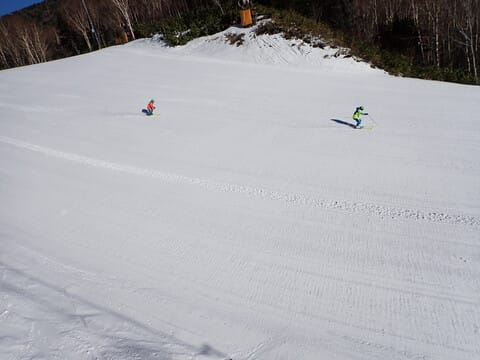
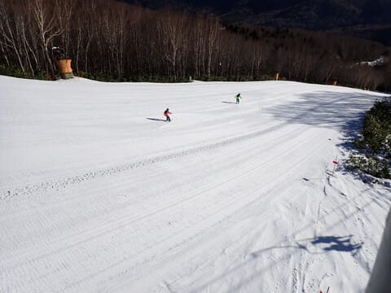

# 2023/12/9(土)の志賀高原焼額山スキー場は…終日快晴！気温が上がってゲレンデの雪は緩んだけど，リフト混雑はそれほどじゃなかったよ

📅 投稿日時: 2023-12-10 00:12:34

ということで．

本日，予告通り志賀高原の焼額山スキー場で

滑ってきました～！！

まず．

あさイチの道路はスキー場に近づくまではほぼ

ドライでしたが…

スキー場に近づくとさすがに本格雪道です！

テュルンテュルン道路ではなかったんですが，

今朝は1台，路肩のガードロープに突き刺さって

ましたね…

明日も朝は凍ってると思うので，明日来る方は

ご注意を！

で．

4ロマと2高の2本のリフトが動く本日．

ただ，第2高速側の駐車場がクローズとの案内で，

今日も8:30の営業開始前から第4ロマンスに

並びます…

列はそれほど長くなく，今日も意外と混まなさそう！

ちなみに，第2高速リフト側．

リフト券売り場が開いてないので車を誘導して

ないだけで，シーズン券を持っていて

リフト券を買わなくて人は，第2高速側の

駐車場に車を止められたらしいです…

ってなことで．

8:30営業開始のリフトに乗りますが…

今日は朝から晴天！

朝はちょっと冷えたけど，日が昇るとぐんぐん

気温が上がり，すっきり晴天の日差しもあって

朝から暑く感じるほど…

ただ…

朝の冷え込みでしっかり締まったバーンは…

見た目はかなり最高の感じ！！

リフト1番手の人たちが滑っていきますが…

うはーーー！！

気持ちよさそう！！

きれいにシュプールが残るいい雪だよ！

早く滑りたい…！！

ってなことで．

1本目のリフトを降りたら…

先週ひたすら滑って滑り飽きた第4ロマンス

沿いのサウスコースではなく，

本日オープンの第2高速側，唐松コースへ！

期待してコースに飛び込んだけど…

圧雪がかかってるところはシマシマだけど…

確かに，圧雪がかかっているのはコース幅の

1/3程度とちょいと狭め（涙）

でも，朝イチはシマシマで結構よかったけど．

コースの端っこによると，ブッシュが出てたり

ちょっと危険な感じ（ちょい涙）

でも，朝イチは全く人もいなくてガラガラだし．

今シーズン初の高速リフトでぐるぐる

できるので，シーズンインから8日間，

ひたすら低速リフトばかり滑っていた憂さを

晴らすべく，高速リフトでぐるぐるするのだ！！

…と，思っていたら．

3-4本滑ったところで…

コースのあちこちに，氷のコロコロが大量

発生（涙）

気温が高く，そこまでガチガチに凍った

コロコロじゃないので，

殺人コロコロとまではいかず，半殺しコロコロ

くらいの感じでしたが…

でも，快感度は著しくダウン（泣）

半殺しコロコロが大量発生している2高側の

唐松コースに対し，4ロマ側のサウスコースは…

コロコロの気配は全くなく，雪質も上々！！

コースでは，某都道府県の講習会をやって

いたけど，それほど人は多くなく．

雪もフラットで，気持ちよく飛ばせるよ！

そして，第4ロマンスリフトは今日は全く

混まず…

タイミングによっては完全に飛び乗り！！

ちなみに，コース幅が狭い第2高速も，

今日は全くリフト待ちがなくて…

経営が心配になるくらいの空き具合．

うーーん．経営大丈夫か？？

ただ．

ガラガラなのはいいけど…

気温が高く，日差しが強かった本日．

南斜面の第2高速側，唐松コースは…

11時にはコロコロが完全に溶けて消えた

だけじゃなく．

なんだか，完全に春みたいな重い雪に

なってしまったのですが…！？？

そして，

コース上，それほど多くはないとはいえ，

ところどころに雪が薄くなり茶色く

なってきたところも…（泣）

うーん．

ちょいと残念…

ただ，第4ロマンス側のサウスコース．

サウスといっておきながら，こちらは

かなり東向きで，そこまで強い日差しが

当たらず．

最初からしっかり人工雪をたっぷりつけて

あるので…

こっちは昼になっても快適！！

ってなことで．

せっかく高速リフトが動いているというのに…

高速リフト側は滑らず，低速のペアリフト

側ばかり滑ってました…

さすが，昼を過ぎると．

第4ロマンス側のサウスコースも

雪が緩み，ちょっと小さな凸凹が

出始めてきたけど．

それでも，午後はさらにコンディションが

ひどくなった第2高速側の唐松コースが，

こんな感じで…

雪は重いし．

土が出てくるところもあったりと．

ちょっと厳しい感じだったので…

それに比べれば，雪がたっぷりで新しい板を

履いても石ころを踏んづける心配もなく．

そこまで雪も重くなく，コースも広く．

比較的滑りやすいのに，コースが混んで

ないという，第4ロマンス側をひたすら

滑り続けたのでした…

ってなことで．

第4ロマンス側のコースは，終日空いて

いてバーンを幅いっぱい滑ることができ，

日が暮れかける夕方ラストまで，

結構楽しく滑ることができたのでした…

しかし．

あともう少し積雪が欲しい…（切実な願い）

今日穴があきかけた第2高速側の

唐松コース，今晩は気温が高くて人工雪が

打てない可能性が高いけど…

明日までに，回復するのかな？？

また明日も志賀高原で滑ってます～！！

## 💬 コメント一覧

### 💬 コメント by (かわ)
**タイトル**: Unknown
**投稿日**: 2023-12-10 07:23:36

昨日の朝、駐車場で声をかけた者です。このブログが始まった頃から、ずっと拝見していたので、たぶんあの方が徒然さんだなと認識していたのですが、私のスキーは下手くそでゲレンデをご一緒できるわけもなく、また1ゴンでお見かけしても、いつも板を外してからダッシュでゴンドラへ行かれるため、声をかけられずでありました。ステッカー、ありがとうございました。また、お見かけしたときにごあいさつができればと思います。

### 💬 コメント by (アリス)
**タイトル**: Unknown
**投稿日**: 2023-12-10 08:06:13

S様

昨日は挨拶が出来ず失礼しました。

四ロマでリフト待ちしている時に、せっせとスキーを運んでいる人を発見🎵

その数4本😯

唐松は確かに荒れていましたね～

途中Sさんの置いてあるスキーをじっくり眺めていましたら、リフト上から手を振っているSさんを発見🎵

3日間短い距離でしたが、スキーが出来る環境に感謝です。

次はゴンドラ営業を楽しみにしています。

### 💬 コメント by (Skier_S)
**タイトル**: これから1週間の天気が怖い…
**投稿日**: 2023-12-11 02:18:50

＞かわさま

お声がけありがとうございます～！

またコメントもありがとうございます．

このBlogが始まったころからって，かなり長い間読んでらしたんですね…

そして，いつもゴンドラダッシュで声をかけられなかったんですね（笑）．

また今度は遠慮せず，ゴンドラ前でも声かけてください！

＞アリスさま

土曜はお話しできず残念でした…

板のところにいらっしゃったのがわかったので，手は降ったのですが，

その直後に帰られたんでしょうか…

ゴンドラ営業は18日以降になりそうです（涙）

また志賀高原でお会いしましょう！

