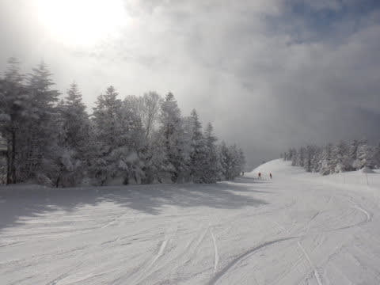
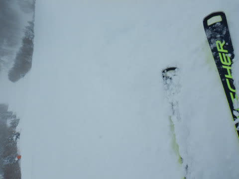
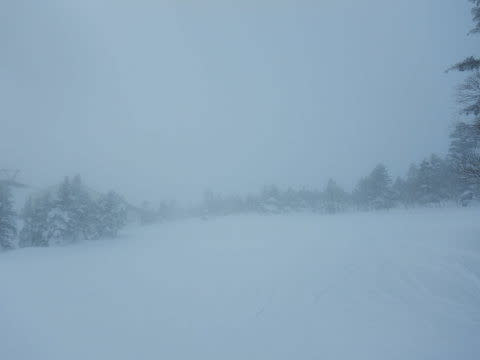

# 2022/1/30(日)の志賀高原焼額山スキー場，詳細レポート…久しぶりに晴れない週末の日だったけど，雪は良くて混まなかったよ

📅 投稿日時: 2022-02-01 00:07:06

🏷️ カテゴリ: [2022スキー滑走日記](cc9cb73e4320f6a97af6fccc37587a61a.md)

なんということか！！！

…2月が…

2月がやってくる！！

信じられないことに，この世界は，

早くも2月という時空に突入して

しまったようです！！

私は許可していないのに，勝手に2月に

なるなんて…！！

許せん！！！←だから，あなたは何様なの？？？

早くもスキーシーズンももう折り返し地点に

なってしまったじゃないですか！！！

…これからは2022シーズンも

後半戦．

トップシーズンと呼ばれるのも，あと1か月

程度となってしまいました…

早い…早すぎる．

どこかで時空がゆがんでないか？？？

ってなことで．

時空がゆがんでいるのか，

今日は，とても月曜だと思えないほど

疲れているのですが…

どうやら今日はまだ月曜で，

昨日の日曜はスキーを滑っていた

ようなので．

日曜の焼額山の詳細レポートです～！！

えー．

まず，昨晩遅くから雪が降り始め，

昨晩から5-10㎝ほど積もった感じの

朝でしたが…

焼額に向かう途中，一の瀬近辺は晴れて

いたので．

「今日も予想外れて，晴れてくれそう…！」

と，このころは期待していたんだけど…

通常営業8:30スタートのころには…

焼額山頂は，うっすら日が射すものの

曇り空でした(涙)

そして，山頂の気温は…-11℃と，

予想の-12～13℃よりはわずかに高め

ながらも，そこそこの冷え込み！

で，あさイチのゲレンデは…

これも金曜の修正予想の

　あさイチは圧雪の上にうっすら

　軽い新雪．

という通り…

しっかり締まってエッジが食い込む

圧雪の上に，ホントに軽いふわふわ雪が

5-10㎝積もってます！！

あさイチは，この柔らかい雪を

蹴散らして滑っていく感じで，

冷え冷えの新雪はそれ程抵抗なく

滑れます…！！

で．

朝9時ごろになると…

やったー！！

日が射し始めて来ましたよ！！

ゲレンデに日が射して，

いい感じになってきたよ！！！

…と，思ったのも一瞬．

すぐに曇り空に戻ってしまい…

残念ながらこの日は，この後一度も

日が射すことはありませんでした…(涙)

…というより．

昼前になると，雪もぱらつく天気になり．

そして，お昼になっても，2ゴン山頂の

屋外の温度は-9℃と激冷え．

ゴンドラならいいけど，リフトに

乗っているとかなりの寒さを感じる

天気に…(涙)

ただ，今日は午前のピークでも

ゴンドラ待ちはゲートの外に出る程度

だったし．

昼になると一気に人が減り，

第1ゴンドラは飛び乗り状態！

第2ゴンドラも午後はずっと

ほぼ待ちなしの飛び乗り状態でした…！

人が少なかったからか．

午後になってオリンピックコースに

突っ込んでみても…

（そういえば，先週から焼額のコース

　案内バナーが，コース記号(オリンピック

　コースはA4，GSコースはA1など…）

　表記のものに新しくなりました）

朝の新雪が完全に踏まれきってなく，

ところどころモサモサした新雪が

溜まっている感じだったので．

うーん．今日は滑る人が少なかったん

だろうなぁ…

ってなことで．

残念ながら，雪降り～曇りの，

日が射さない午後でしたが．

それでも，ガラガラだったのもあり，

営業終了の時間までバーンは荒れず，

まっ平の好きなラインで大回りしたい

放題の快楽バーンを滑り続けられたの

でした…

ってな感じで．

日曜は日が射さなかったとはいえ．

この週末も雪はいいし，トップシーズンらしい

いい感じの圧雪シマシマバーンを

滑れる週末が3週間続きましたが．

今週末は…

今日の予想天気図を見ている限り，

久々のパウダーパフパフ週末に

なりそうです…！！

## 💬 コメント一覧

### 💬 コメント by (m&t m)
**タイトル**: Unknown
**投稿日**: 2022-02-01 00:43:24

我らがホーム　アサマ2000より悲報が・・・

２月中の火水曜日は休業、メインゲレンデの旧第２ステージにある第２リフトが期間中運休だそうです😭

ヤケビも平日第１ゴンドラが運休なんて事にならない事を祈ります🙏

と、言っても平日に滑れる事は、まぁありませんが・・・

### 💬 コメント by (かず)
**タイトル**: Unknown
**投稿日**: 2022-02-01 10:06:27

若杉さん今シーズン早あがりですね？？今シーズン土日奥ゴンスタートも無くなりました？今週末パウダーいつスタートにするか悩み中です…

### 💬 コメント by (新米パパ)
**タイトル**: Unknown
**投稿日**: 2022-02-01 10:33:50

今週末は試練の天気になりそうですね、、、

また、Sさんの水曜の天気予報、参考に。

どうしよっかなー、、

娘の検定ですが、デモやってる検定員さんでしたが70点でジュニア1級合格いただきました。

私の物欲はないのですが、早速、娘の道具をもっとアップグレードするよう指南いただき、この先レッスンもプライベートになっていくと私の懐が吹雪そうです、、、

### 💬 コメント by (真美子)
**タイトル**: Unknown
**投稿日**: 2022-02-01 13:05:33

日曜日は楽しい独り占め時間を作っていただきありがとうございました。

お仲間に、いいのかな➰と思いながら、スキー指南を受けられ、次回は今までよりもスピードが出している姿を見ていただきたいなと、思っています。

それにしても、皆さん、あっという間に山頂から姿がなくなりますね。速すぎ！

### 💬 コメント by (レインボー74)
**タイトル**: Unknown
**投稿日**: 2022-02-01 14:56:16

火曜日の志賀高原情報

朝の上林-6℃　蓮池-12℃。寒いけどまさに爽やかな晴天。

パノラマ、カラマツ、GSは、まさに快適勘違いバーン。

オリンピックは新雪があったため、すでにぼこぼこ。

圧巻は奥志賀エキスパート。まさにやけび並みのフラット快適バーン。こんなことは年に何回もない。夢中でひたすらここばかり滑って終了。

ただ、リフトから思わず息をのむシーンを目撃しました。

某スクールがエキスパで、端から端までトレインプルークをしていました。危ないよ！コースを全部ふさいでる。逃げ場がないよ。

と思っていると、コース外の非圧雪から猛スピードでボードの人が進入！危ない！

結局またコース外に弾き出されたものの、何とか事なきをえました。

ボードの人の視野は狭いので、後ろが完全には見えてないはず。だったらスピードを出すなとの意見もありますが、現実には難しいかと。

コース幅いっぱいに広がって、コースを全部ふさいで逃げ場を無くする某スクールの指導法に、憤りを感じている人は多いはずです。こういう事態は必然的に起こりうるのだから、スキーを教える側こそが、それも含めた指導をしてほしいと思います。

せめてコース端を少しはあけてやってほしいと思います。

### 💬 コメント by (Skier_S)
**タイトル**: 今週土日はパウダーのはず！
**投稿日**: 2022-02-02 00:07:35

＞m&t mさま

えええ！！

ステージ2運休？

一番のメインバーンのリフトを止めるってのは，それはどうなんだろうか…？？

他のスキー場でも，リフト係員がコロナのため運転ができなくなった…

というのがありそうです．

ヤケビはそうならないように願うばかり…

＞かずさま

今週は…金曜朝には結構積もってそうです…！

＞新米パパさま

ジュニア1級，合格おめでとうございます～！

これで娘さんと共に，物欲沼にはまって行けますね（笑）．

＞真美子さま

土日はご一緒ありがとうございました～！！

次回はまた練習して，グレードアップしてきてください！

楽しみに待ってます…

＞レインボー74さま

今日も良かったんですね…

しかし，幅いっぱいのトレーンはちょっと危ないですね…

まぁ，後ろから滑るスキーヤーに注意義務があって，

こういうのは抜かないように後ろからついていくってのが

教科書的対応なんでしょうが…

でも，幅いっぱい滑る危なさ（コース端いっぱいまでよると，後ろから突っ込まれる可能性）

は，スクールで教えてもいいんじゃないかな，と思います…

