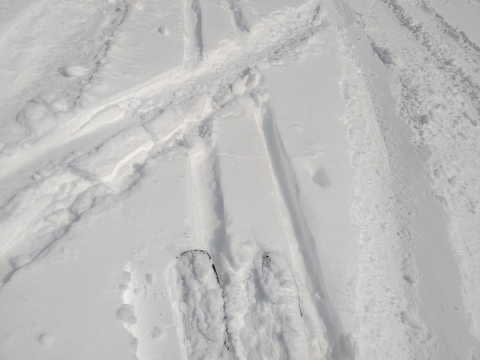

# 2月のスキー場の天気は冷えるのか？一か月予想図を読み解いてみた

📅 投稿日時: 2023-02-03 03:09:37

えー．

本日も志賀高原特派員からゲレンデ

写真が送られてきましたが…

今日はいつも癒しを与えてくれる，

おこみん特派員からのおこみん写真は

なかったのですが．

志賀高原に忠誠心の高い他の特派員の

方が写真を送ってくれました～！！

（しかし，今日写真を送ってくれた人たちは

平日仕事を抱えている人ばかりのような気が…）

ってなことで．

特派員によると…

今日は朝は結構激しい雪降りでスタート

したみたいで…

昨晩からの積雪は10cmほどと，

私の予想よりは多めに積もったようです…

で．

朝のうちは視界が悪かったものの．

　早朝は雪がぱらつき，朝は曇りか…

　昼には晴れていくかな？

という昨日の予想が見事に当たり．

だんだん雲が切れて青空が覗いて…

午後はいい感じに晴れていったようです…！！

昼からは晴れたけど，気温は低く，

雪質はよく…

コース脇は10cm程度の新雪が楽しめた

ようです…！

午後になっても，まだ新雪が残っているのが

平日らしくて，いいですね…

うらやましい…

あぁ…私も平日にスキーがしたい．

…というより，今週末は土日ですら

スキーがヤバい状況なのですが…（涙）

ってなことで，本題へ．

本日木曜日は，気象庁から一か月予報（[FCCX92](https://www.sunny-spot.net/chart/FCXX92.pdf))が

発表される日です～！！

だもんで．

果たしてこの2月は冷えるのか？

2月にドサドサ積もって，今シーズンも

GWまで安心して滑れるのか？？

スキーヤーの皆さんは気になって

夜しか寝られないと思うので←それは普通でしょ

この一か月予報を読み解いてみましょう…

まず．

気温傾向を見ると…

…

…

なぬ！！？？

東日本，平年より気温が高い確率が

60％？？？

え？？

ラニーニャなのに，2月に平年より

気温が上がるの？？

そして，日本海側は降水量も積雪量も

平年より少ないの！！？？（激涙）

まさか…

雪の降り始めが遅かっただけだと

信じたかったけど，2月に雪が少ないと

なると…

今シーズン，春スキはヤバいかも…（涙）

とりあえず，1週目，2週目共に，

気温が高い確率が70％って…

終わってますね（泣）

ただ．

せめてもの救いは．

赤矢印で書いた2月3日から20日ごろまで．

気温が高めになりそうとはいえ，

せいぜい平年比+2度程度に収まっていて．

そこまですごい高温にはならなさそう．

大雪が降る可能性は低いけど．

雨が降ったりする可能性も低そう…

で．

第1週，2/4～2/10の200hpa流線関数を見ると．

ぐおおぉぉ！！

日本が見事に赤で記された高圧性循環の

中心にあり．

これだと，水色矢印で書いたように

ジェット気流は日本の北を蛇行して，

寒気が南下しないパターン…（涙）

そのため，やはり日本には寒気が降りてこず．

2/4～2/10の850hpa図では，平年より気温が

低い網掛けエリアは北海道までにとどまり．

志賀は水色の平年比+2℃の線がかかってます…

まぁ，赤い0℃線は志賀よりもかなり南に

あるので，雨になったりする確率は低いと

信じたい…

で．第2週の2/11～2/17を見ても．

これもまた，平年比+2℃の水色線が

志賀にかかっていて．

気温は平年より上がりそうです…（涙）

でも，この時も赤い0℃線は太平洋沿岸～

四国程度と，志賀よりずっと南なので．

冷え冷え2月なら，2℃くらいなら気温が

上がっても，志賀は雨になる危険は低いかな…

そして．

第3，4週の2/18～3/3の200hpa流線関数を見ると．

赤丸の日本付近の高気圧性循環偏差は弱まり，

さらに日本より西にずれたので…

水色で描いた，日本付近の偏西風の北への

蛇行は第1週より弱まりますね．

だもんで．

2/18～3/3の850hpa図を見ると．

志賀高原は平年より気温が低い網掛けには

入ってないけど．

平年比0℃～+1℃までの範囲内に入って

いるので．

だいたい平年並みに戻りそうで．

この期間の方が，本来1年で一番冷える

2月上旬よりも，赤い0℃線が南側にある

という不思議さ…

まぁ，2月下旬は平年並みに冷えてくれそう．

…ってなことで．

2月上旬の，1週目から2週目にかけては．

激冷え大雪パウダーはあんまり期待でき

なさそう…

うーん．

今シーズン，まだ太板を2回しか履いて

ないんだけど．

このまま太板の出番がなく終わって

しまうのか…

まぁ，とりあえず．

今週末はそれほど気温が上がらなさそうだし．

まぁ，それ以降も気温が上がっても平年比+2℃

くらいで，そこまでひどく暖まらないみたいだし．

2月で平年比+2℃なら，そこまで雪は悪く

ならないかな～．

…とはいえ．

やっぱり2月は冷えて，パウダーが積もって

ほしかった…

## 💬 コメント一覧

### 💬 コメント by (レインボー75)
**タイトル**: Unknown
**投稿日**: 2023-02-03 16:38:09

木曜日の志賀高原情報

朝の蓮池-10℃。小雪がぱらついている。

なんか雪が予想より多い。私だけGS板で失敗です。

白樺は圧雪に4cm位。唐松も然り。

オリンピックは夕方圧雪なのか30cmふっかふか。仲間はみんな太板で大はしゃぎ。私だけ四苦八苦。快感が得られない。いかに道具に頼っているかを実感させられました。

### 💬 コメント by (レインボー75)
**タイトル**: Unknown
**投稿日**: 2023-02-03 16:38:53

金曜日の志賀高原情報

朝の蓮池-8℃。今日も良さそう。昨日の新雪が圧雪されて、焼額はどこもふんわり快楽バーン。オリンピックは特筆ものでした。

今日は久々に三高が稼働。来週も週末だけは動くとのこと。それからずっと閉鎖だった寺子屋が動いたけど、ガスで断念。高天が原ホテルでピザ食べて終了しました。昨夜の夜更かしの代償で疲れました。

### 💬 コメント by (アリス)
**タイトル**: Unknown
**投稿日**: 2023-02-03 20:22:12

S様

天気予想ありがとうございます🎵

とても参考になります☺️

今日から志賀高原参戦しました🎵

ヤケビやはりいいですね‼️

GS、オリンピック、白樺どこも最高です✨

好き放題楽しめました☺️

とても幸せ気分です🙆

今シーズン初の寺子屋に行きましたが、荒れ放題、ボコボコ、レストハウスは営業なしで感動なしです😅

### 💬 コメント by (Skier_S)
**タイトル**: 今週末滑りに行けず
**投稿日**: 2023-02-04 02:22:27

＞レインボー75さま

金曜は良かったみたいですね～！！

うらやましいです…

今週末はいけませんが，土日ともコンディションいいと思いますよ！

私の分も滑ってきてください…（涙）

＞アリスさま

今日から参戦ですか！これからしばらくコンディションいいと思いますよ～！！

