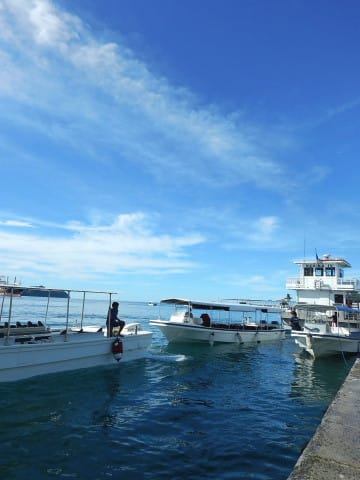
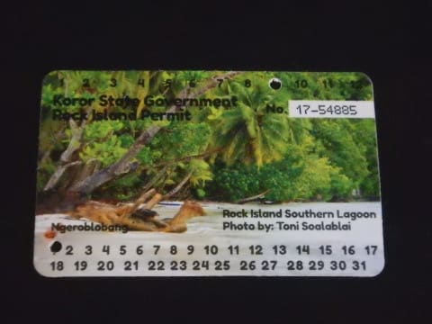

# 2017年8月，小学生の子連れでパラオ再訪！その3…ダイビング初日，スタート！

📅 投稿日時: 2018-08-31 01:02:02

🏷️ カテゴリ: [ダイビング日記](ce3a7a8d424d112fce83ee85c81a0e344.md)

ってことで．

昨日はダイビング旅行から帰宅後，器材を片づけて

即落ちしてしまいましたが．

夏休み明けの本日．

…3日間で溜まった仕事が山盛りてんこ盛りで．

いきなり朝からフルスロットルで働かされて

脳みそがオーバーヒートしそうなSkier_Sです．

ってな感じで．

座間味から帰ってきたばかりですが．

本日はパラオ旅行記です．

では，どうぞ～！

---

到着日から一夜明けて…

ダイビング初日の朝．

ホテルの部屋に差し込む晴天の日差しで

目覚めます…

うーむ．

今日は天気が良さそう！

朝ごはんとして，昨日買っておいたパンを食べて．

ダイビングショップのピックアップを

ホテルロビーで待ちます…

うむ．

このホテル．

お値段の割にいい感じ．

ってなことで．

定刻の朝8時．

ダイビングショップのお迎えがやってきましたが…

ピックアップに来たのは，前回お世話になったガイドさん．

ガイドさん「あ，お久しぶりです～！」

なんと．前回訪問から3年経つというのに，

我々を覚えていてくれていたようです！←何かよっぽど強烈な

印象を残したのか…？と思ったけど．子連れで来る人は他にいないから覚えていたみたい

ってな感じで．

やってきたのは，前回利用したのと同じダイビングショップ，

DayDreamさん．

いやーー．

3年ぶりですね～，ここも…

前回ここに来たときは．

娘もまだ，小学校1年生だったよな…（昔を懐かしむ目）

各種書類を記入した後は．

ボートに乗り込んで．

器材セットの後，出発～！

いや，今日もいい天気だわ…

ってことで．

晴天ピカピカの中，パラオのきれいな海を

ボートは進んで行きます…

いやーーー．

この景色も3年ぶり．

相変わらずきれいだの～！

…娘も，もらったばかりのカメラを使って．

嬉しそうに写真を撮っていたところ…

なぜか，いきなり自分たちのボートに横付けしてくる，

不審なボートがっ！！！

なに？一体，なにごと！？？

ってこれ，ダイビングパーミットをちゃんと

所持しているかチェックする，コーストガードの

ようです…

パラオでダイビングするためには，ダイビング

ショップで，有効期限10日間のこういう許可証を

＄50で買わないといけないんですが．

それをちゃんと持っているか，抜き打ちで

チェックしているようです…

全員がパーミットを持っていることを確認したら，

ボートは立ち去っていきましたが…

パーミットの抜き打ちチェック．

パラオ訪問4回目にして，初めての経験でした…

ボートの出発前に，ガイドさんから

「許可証はもちましたか～？？」

と，必ず聞かれるのですが．

ちゃんとこんな風にチェックしてるんだなぁ…

ってなこともあったけど．

ボートは無事に，1本目のポイントへ到着したようです…

## 💬 コメント一覧

### 💬 コメント by (yama)
**タイトル**: 夏休みも終わり
**投稿日**: 2018-08-31 20:59:23

あと２日で娘さんの夏休みも終わりますね。９月３日が来なければ良いのにと思うのは、こちらも同じです。S市では来年から小中校の始業式が２６日になります。この時期にダイビングには行けなくなります。座間味まで行けて良かったですね。

　PS　今年は柚子の数が少ないです。その代わり昨年より大きくなりそうです。１０月のイエティのオープンまであと１ヶ月ですね。

### 💬 コメント by (MAE)
**タイトル**: Unknown
**投稿日**: 2018-08-31 21:04:17

ペリリューやジェリーフッシュレイクでも入海料？が必要になったようで、昔、25年以上前、良く通った時にはそんなの無かったのに、結構な料金ですね。

１日ダイブするだけでも必要になるのかな？

パーミットはショップで強制的？に支払う仕組みだと思ってましたが、なぜ、海上で抜き打ちチエックが必要なんでしょうかね？

### 💬 コメント by (Skier_S)
**タイトル**: 夏も終わり…
**投稿日**: 2018-09-01 03:16:52

＞yamaさま

長いようで短かった夏休みも終わりです…

で，来年から夏休みが短くなるんですか！？？

かわりにどこかで休みが増えるとかはないんでしょうか…

うーん．娘と潜りに行く日程がかなり制限されてしまいますね（涙）

柚子，今年も娘が楽しみにしています．

というより，柚子胡椒にも異常にはまっていて，

ホントになんにでも柚子胡椒を山盛りつけて食べてます(笑)．

また今年も柚子＆柚子胡椒，楽しみにしています～！

＞MAEさま

1日でもダイビングするには＄50が必要です．

パーミットは基本的にショップで強制的に買わせますが，

それを懐に入れてしまうショップもあったりするので，

実際に現地でチェックするのではないでしょうか…

ジェリーフィッシュレイク＆ダイビングのパーミットは＄100と

ありえないお値段ですが，確か一昨年あたりにクラゲがほぼいなくなって，

ジェリーフィッシュレイクは今は観光客を入れていないはずです．

ペリリューも確か別パーミットが必要だったかと…

出国税もパーミットも，ここ数年で大体倍に値上がりしています（涙）

### 💬 コメント by (yama)
**タイトル**: 休みは
**投稿日**: 2018-09-01 05:50:10

残念ながら休みは減ります。教育過程が変わるので授業数が、足りなくなるようです。すでに高校は昨年から実施しています。長野県あたりは、前から夏休みはこのくらいだったと思います。お盆休みを避けて、夏休みを早取りするしかないです。

### 💬 コメント by (Goku)
**タイトル**: 羨ましかった
**投稿日**: 2018-09-02 08:23:23

私の子供の頃は3週間位しかありませんでした(T_T)

従兄弟が40日と聞いて羨ましかった思い出が・・・

でもその頃長野は、田植え休み、稲刈り休み、寒中休みがあったので救われましたが、今はそれもなくなり、夏が都会並みに暑くなった長野の子供はかわいそうです。

### 💬 コメント by (Skier_S)
**タイトル**: 夏休み
**投稿日**: 2018-09-02 09:06:14

＞yamaさま

あら…完全に休みが減っちゃうんですか．

今の子供は大変ですね…

K奈川県全域でそうなるのでしょうか？

＞Gokuさま

3週間は短いですね…！

北海道は冬休みが長かったですが，長野は田植え休み，

稲刈り休みがあるんですね…

しかし，今はそれもないのに休みが3週間しかないんですね．

### 💬 コメント by (yama)
**タイトル**: 夏休み2
**投稿日**: 2018-09-03 21:26:29

K奈川県全体で実施すると思います。Y市など２学期制で秋休みがあるとさらに夏休みを減らさないといけなくなります。T京都などは１０年前からやっているのでこれ以上減らないと思います。

　半日を５日間で給食は出ないようです。全国そうなるようです。

### 💬 コメント by (Skier_S)
**タイトル**: yamaさま
**投稿日**: 2018-09-04 00:57:08

あら．K奈川県全域でそうですか…

ってか，全国でその方向性なんですね．

高いお盆を外して，娘の夏休み期間で，私も休みが取れて…

となると，さらに選択肢が狭まりそうです（涙）

来年の夏休み，どうしようかな…

