# 2023/1/14(土)の志賀高原スキー場特派員レポート！…終日ほぼ曇り空の高温で春の雪(涙），夕方ちょっと雨が降ったみたい．

📅 投稿日時: 2023-01-15 02:17:56

ってなことで．

スキーに行けず，一日家で過ごした

本日．

おそらく特派員から，

志賀高原にミサイルが降り注ぐ写真

が送られてくるに違いない

と，期待して待っていたところ．

残念ながら，スキー場全面にミサイルが

降り注ぐ写真は送られてきませんでした(涙)←期待するものが間違っている

ってなことで，今日は多くの特派員が

写真を送ってくださったので．

現地に行かずとも，志賀高原の状態が

手に取るように分かるというこの状況．

ありがたいんだけど，目の毒でもある…(涙)

とりあえず．

本日の志賀高原ですが．

天気が悪い予報だったからか．

あさイチの焼額第1ゴンドラは，

それほど並ばなかったようですね．

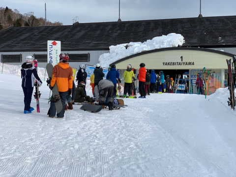

んで，あさイチの山頂の気温は+3℃

だったらしく．

朝からプラス気温ですか…(涙)

ただ，この気温は予想ぴったりだったので．

喜んでいいのか悪いのか…

この写真はあさイチの写真ではないですが，

昼間は山頂でも+5℃以上まで上がった

みたいですね…

とても1月の志賀高原と思えない(泣)

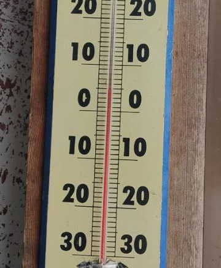

あさイチバーンはシマシマながら，

昨日の夜中にちょっと雨が降ったのもあり．

雨で解けた雪が固まった，硬めの

スピードバーンだったようです…

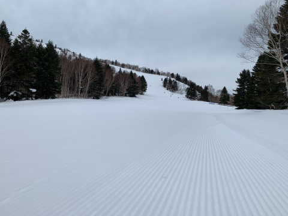

ただ，焼額GSコースは硬いながらも

圧雪状況はよく．

フラットで滑りやすかったようですが…

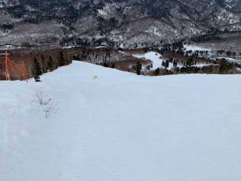

朝の奥志賀エキスパートコースは，

硬くガタガタでかなり手ごわかった

ようです…

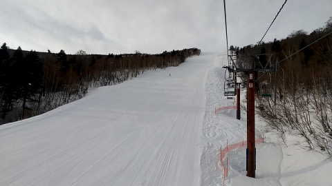

で．天気は朝から曇り空ながらも．

雲はそれほど厚くなく，明るめでバーンは

見やすかったようで…

それどころか，一瞬青空が覗けるタイミングも

あったみたいで．

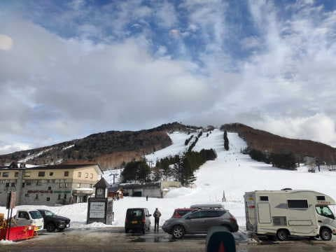

それでいて，焼額は全てのゴンドラ，リフトで

ほぼ待ちなしのガラガラの一日だったみたい

です…

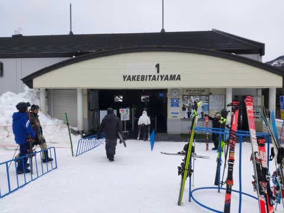

で．

朝からプラス気温でしたが，昼間も気温が

高いままだったせいで．

雪は10時ごろには緩んで，春の雪になっていった

ようですが…

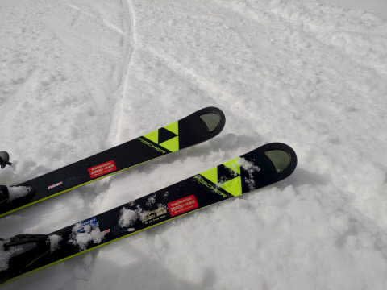

湿ってきたものの，ザブザブ春の雪ではなく

水気が多いながらもエッジが効く締まった雪

だったみたいで．

気温が高い割にはコンディションは良かった

みたいですね…

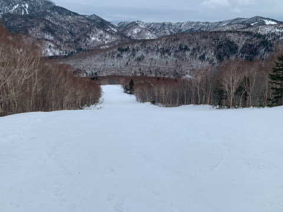

で．

ただでさえ志賀高原は雪が少ない今シーズン．

この雨と高温で，雪が融けてブッシュや

小石がいっぱい出たんじゃないかと

心配したんですが…

GSコースのゴンドラをくぐる最後の

急斜面がごく一部薄くなっていたけど．

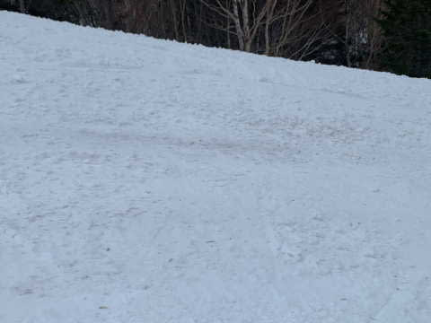

ここ以外はブッシュもなく．

雪解けは心配するほどではなかったみたいです…

良かった…！！

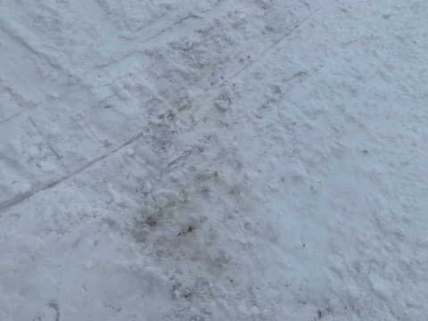

ただ．

西舘の迂回コースは一部派手に土が出て

いたりしたみたいですが．

全体的に，そんなにひどく雪は解けて

ないみたいで一安心．

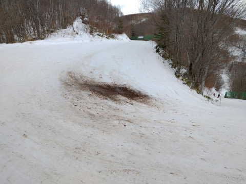

…ってなことで．

残念ながら鑓もミサイルも降らず．

雨もほとんど降らずに済んで

良かったね…

と思ったところ．

なぜか午後4時前に，ちょっと雨が

降り始めたみたいで．

この写真，上の方はかなりガスってますね…

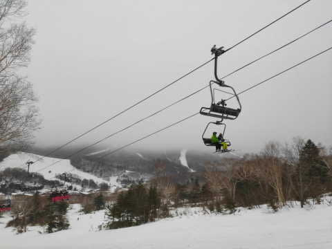

ただ，それほどひどい降りでは

なかったようなので．

だいたい，

朝は曇り．終日曇り．

　朝から気温は+3℃程度．

　気温は午後に向けて下がっていくが，

　基本昼間はプラス気温のまま．

　運が悪ければ，時折液体が

　ぽつぽつと落ちてくる．

という予想が，かなりいい精度で当たった

みたいですね…

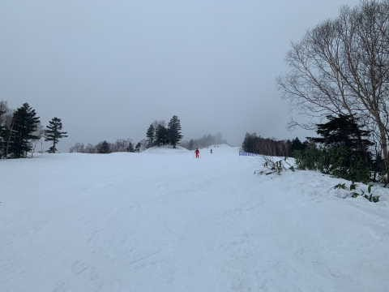

とりあえず，異常高温で低気圧が

接近する状態の中では，奇跡的に被害が

最小限で済んだ天気だったみたいですが…

でも．

雨と高温で雪が融けた，この水が，

明日はカチカチに凍ってアイスバーンに

なります．

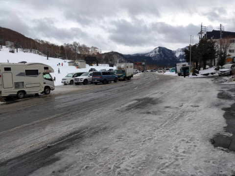

明日，志賀高原に行く方は，登り坂が

ツルツルだと思うので，気を付けて

行ってください…

そして．

明日の天気ですが．

明日の朝までに積雪は無いです(涙)

で，朝から気温が低いので．

朝からカリカリの，あずきバーくらいに

硬いバーンになります．

昼間も気温が低いままなので，雪は

緩まないです．

覚悟のほどを…

…天気は終日曇りだけど．

夕方に雪が降り始めるかな？

雪が積もってくれれば，バーンコンデションは

改善しそうだけど．

降り始めが夕方なので…

あまり期待しない方がよさそう．

うん．

槍やミサイルは降らなかったけど．

全面ガリガリ硬い斜面＆アイスバーンなら，

滑れなくても悔しくないな．

うん…悔しくない．

明日は全面ガリガリバーンだ！！！

と，呪いをかけようとしている，

Skier_Sなのだった…

## 💬 コメント一覧

### 💬 コメント by (レインボー75)
**タイトル**: Unknown
**投稿日**: 2023-01-15 16:14:36

日曜日の志賀高原情報

朝の上林0℃　蓮池-2℃。エス様の呪い通り道路は恐ろしく危ない。でもゲレンデはさほどでなく、硬めだけどストレスは感じないレベル。天気も意外と悪くない。だけどGSの下の壁(通称しんちゃんバーン)ではついに地肌が！

それでも日曜なのに意外と空いていて快適。

ただ、先日倒してあるネットを避けて転倒した仲間の膝が芳しくないため、２時間滑って終了。明日からはもっと働かないと！

午後４時現在の湯田中は、しとしと雨が。

雪を降らしてくださいな！

### 💬 コメント by (アリス)
**タイトル**: Unknown
**投稿日**: 2023-01-15 18:43:16

S様

日曜日でゴンドラ、リフト待ちがない志賀高原ヤバいです😅

経営大丈夫かな❗️

一の瀬スタートで、どこも恐怖の絶叫カリカリアイスバーン❗️

何故かヤケビだけ別世界🎵

午後はガスで視界不良‼️

アイスバーンより怖かった😅

### 💬 コメント by (Skier_S)
**タイトル**: 滑りに行きたかった…
**投稿日**: 2023-01-16 03:49:25

＞レインボー75さま

やっぱり，私の呪いで道路は危なかったですか！

…でも，ゲレンデにはそこまで私の呪いがかかってなかったみたいですね…

まとまった雪は，20日まで待ってください．

金曜日に降って，来週末は良くなるはず！

＞アリスさま

今日はガラガラだったみたいですね…

そして，ヤケビはコンディション良かったみたいですね！！

明日からもしばらく雪は積もらなさそうなので，こんな感じのコンディションが

続きそうです…

