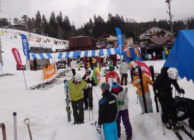
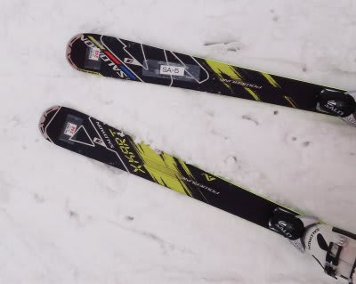
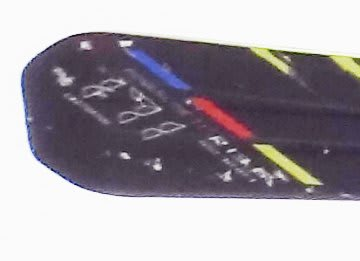
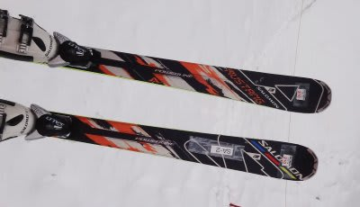
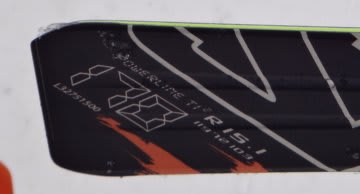
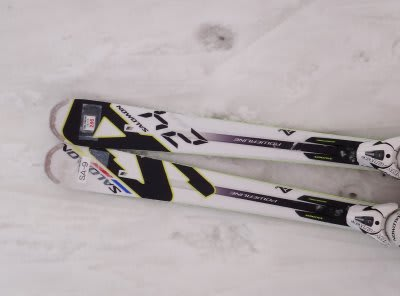
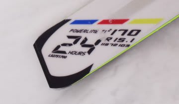

# お待ちかね！　2012/2013シーズンモデルのスキー試乗レポート　SALOMON編

📅 投稿日時: 2012-03-15 00:46:15

🏷️ カテゴリ: [スキー板試乗](c0bd8048615710cee890e403a36cc9a2b.md)

えー．

お待たせしました．

先日．全日本技術選の観戦がてら，

ICI石井スポーツ主催の試乗会に参加してきました．

そのレポートをば…

当日参加OK，参加費用1000円という試乗会で，

なかなかコストパフォーマンス高かったですね～．

さてさて．

この日の雪質は…

リーゼン上部はアイスバーン，ウスバから下部は最低のドボ雪．

午後はひどいコブになるなど，せっかくの3月上旬の試乗会なのに，

雪質には恵まれず…

とりあえず，こんな雪質の中でしたので，トップスピード耐性などは

試せませんでしたが，アイスバーンや重い雪での安定度，コブでの

取り回しなど，いろんなシチュエーションでの乗り心地を確認

できたので，良かったのかも…

いやー．しかし．4シーズンぶりの久しぶりの試乗会でしたが．

試乗会はやっぱり楽しいですね～．

で．

とりあえず．

いつもの注意書きを書いておくと．

…あくまでこの試乗レポートは，テク・クラも，指導員

資格も持っていない，レジャースキーヤーが自分の

フィーリングを記したものです．

私に合わなくて「うーん．イマイチ」と書いてあるような

板でも，「これはすばらしい！」と思う人がいるでしょうし，

逆に私が絶賛した板でも「なんじゃこりゃ？」と思う人が

いると思います．

板の良し悪しを言っているんじゃなく「そこら辺にいる

レジャースキーヤーが，自分に合うか否かを書いている」

だけですので，そのところを理解して，参考程度に読んで

やってください…．

ということで，2012/ 2013シーズンのスキー板の試乗レポート，

行ってみよう！

------

○SALOMON

SALOMON X-KART 171cm

フルロッカーの小回りベースオールラウンド板ですね．

今年は164cmまでで，こんな長いモデルなかったようですけど…

来年は171cmが一押しの長さになるのかな？

171cmなのに，サイドカーブはR13m.

長さはロング向けなのに，サイドカーブはショート板的なラディウスという，

スペックを見ただけではどんな乗り味の板か想像がつきませんでしたが…

履いてみるとびっくり．

かなり予想外の乗り味．

ミドル～ショートが得意な感じですが．

普通のショート系のラディウスが小さい板って，どっちかって言うと

トップが食いこむ，あるいはトップが雪面をとらえて板がたわんで小さく回る…

という感じで，まずトップがグリップすることで旋回力がでますが．

この板は違います．

テールが利く．

ブーツより後ろしか板がない感じ．

テールで曲がっていきます．

普通のショート板…っていうか，これまでのスキー板全般は．

ターン後半にテールに乗っても，ニュートラルから次の谷回りで

トップ方向に荷重を戻していかなくてはなりませんが．

この板は戻さなくてもいいです．

荷重は常にテール．

というか，くるぶし下からかかと間での間の荷重．

腰からかかとに向かっての軸をしっかり作って板を踏み続けていれば，

トップが浮き上がっていくような感じでターンしていきます．

171cmなのに，160cmの板くらいの感覚で回ります．

新鮮．面白い．

これがロッカー板の乗り心地なのか…

トップを押さえなくてもいいので，荒れた斜面でトップが詰まることなく，

すごく安定して滑っていけます．

荷重の前後動が全くいらないので，無駄な動作なくターンの切り替えが

できる感じで，切り替えも早い．

荷重の前後動に伴う圧変動がなく，一定の圧で板を押さえ続けたまま，左右に

ターンが連続できます．

圧変動が無いということは…板がぐっとたわんで，それが開放される

ということもないので，雪の状態によって板からの予想外の反動を受けて

しまうこともなく，荒れた斜面を非常に安定して滑れます．

ハイスピードでもしっかり安定．かなりのハイスピードで，荒れた斜面をまっすぐ落ちていけます．

こ，これは．

今までになかった，全く新しい乗り味だ…

長さ171とか，R13mとか，そういうスペックを超えた次元．

ということで．

この日の衝撃No.1の板でした．

SALOMON　MUSTANG　170cm

万能オールラウンド板．

うーん．今シーズンの24hours S5に匹敵するクラスですかね．

R15.1mというラディウス，119-72-103というプロポーション共に，S5と同じですね．

ロッカーかどうかは見てないのですが…

センターはキャンバーでした．トップはロッカーかも．

履いた感じは，今年のS5に比較的近いかな．

トップからテールまで，しっかりとエッジがグリップします．

メタルが効いた張りのある感じのフレックスで，

エッジのラインが作るカーブに沿って曲がる感じ．

X-KARTと違って，普通にセンター荷重，切り替えはトップよりを抑えて

普通に滑る感じの板．

あー．山回りの荷重ポイントは比較的後ろかな．

得意分野はミドルターン．

感覚的には，今年のS5の方が，もう少しトップがグリップして方向付け

して行ってくれる感じでしたが，そこまで強烈なトップの方向付けは

感じなかったですね～．

スピード耐性はそこそこあります．

結構スピードを出してもガッツリエッジがグリップして板が走って行きます．

面で滑る板じゃなく，エッジの線で滑る板なので，深いコブに入ると

ちょっと手ごわい感じがするかな．

うーん．本来は整地でハイスピードで滑る板なんだろうな．

ちょっと今日はきれいな整地がなかったので，本領を発揮

できなかった感．

まぁ，これまでのSALOMONの乗り味をキープした板ですね．

SALMON 24hours 170cm

上～中級者向け万能板．

24hoursは，来シーズンはこの1モデルだけになるようです…

R15と，何でもできるサイドカーブ．

MUSTANGよりグリップは弱いです．

マイルド．

今年のS3か，あるいはそれよりわずかに弱いかな～．

トップスピードを出して荷重すると，じりじりとずれていきます．

基本的に，エッジグリップはそれほど強烈でなく，比較的あっさりと

ずらしに入れられます．

マイルドで，体に優しそうな板ですね．

あんまり攻める感じの板ではありません．

どんな雪質でも使えそうな適度なグリップとズラシのコントロール性を

もっていて，素直な感じの板です．

体力のない人，ハイスピードでがんがん攻めない人にはいいかも．

という感じで．

SALOMONは以上3機種．

まだまだレポートは続きます…

## 💬 コメント一覧

### 💬 コメント by (雪上の翁)
**タイトル**: ロッカー
**投稿日**: 2012-03-15 09:21:38

試乗会、楽しいですよね^^;

私もK2のロッカー板履いてますが、

トップの食いつきがゆるいのに、

センターがしっかりグリップします。

最初は半信半疑だったロッカー効果ですが、

いまではロッカーの方が好きになっちゃいました。

明日、志賀高原に行ってきます！

日帰りで（笑）

### 💬 コメント by (Skier_S)
**タイトル**: 雪上の翁さま
**投稿日**: 2012-03-15 23:13:03

来シーズンはロッカーがブレークしそうですね～．

やっぱり，ロッカー板はロッカーにあった滑りをしなくてはならないので，これまで

積み上げた滑りを捨てないといけないかも．

カービングスキー普及期みたいに，指導者はロッカー板を履いているかそうじゃないかで

教え方を変えないといけなくなりそうな…

日帰り志賀，楽しんできてください．

明日はコンディション・天気・雪質全て最高ですよ！

### 💬 コメント by (雪上の翁)
**タイトル**: 最高です！
**投稿日**: 2012-03-16 12:15:13

今、奥志賀でランチ中ですが、

快晴無風、どこもクリーミースノーの完全圧雪で最高のカービング日和です^^;

日帰り強行して良かったです。

明日の雨が残念ですね、。

### 💬 コメント by (Skier_S)
**タイトル**: 雨ですね…
**投稿日**: 2012-03-16 22:30:44

今日は最高だったと思います．

いいなぁ…

明日からあめ．

ショックです…(泣）

